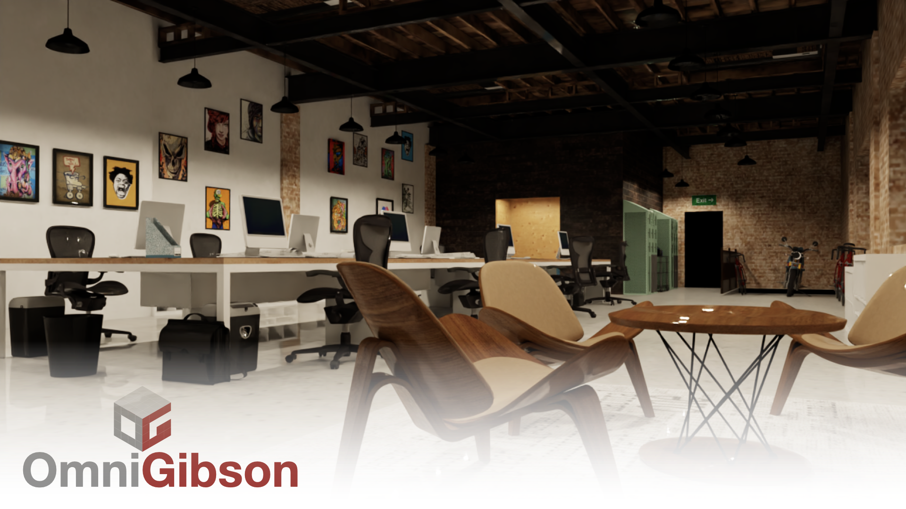
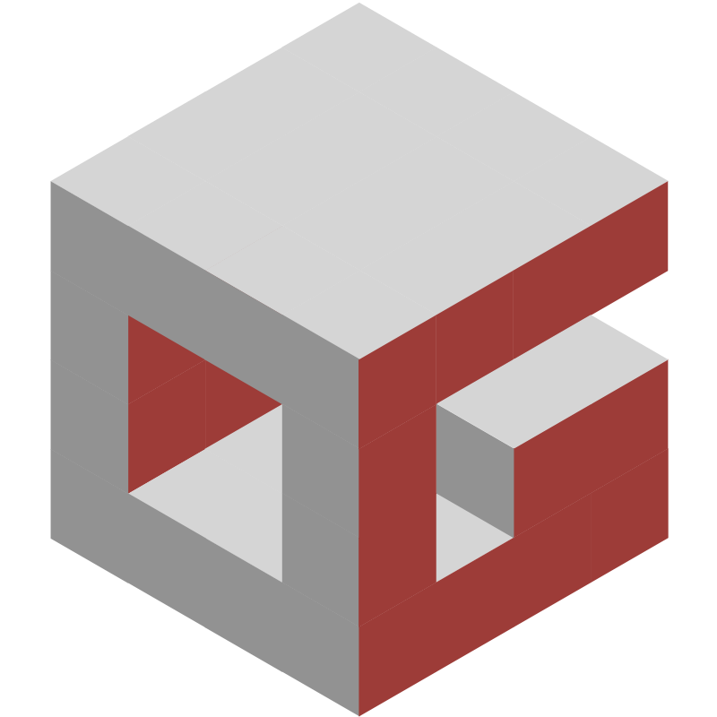

# <h1> OmniGibson</h1>

### 

-------

## Latest Updates
- [08/04/23] **v0.2.0**: More assets! 600 pre-sampled tasks, 7 new scenes, and many new objects 📈 [[release notes]](https://github.com/StanfordVL/OmniGibson/releases/tag/v0.2.0)

- [04/10/22] **v0.1.0**: Significantly improved stability, performance, and ease of installation :wrench: [[release notes]](https://github.com/StanfordVL/OmniGibson/releases/tag/v0.1.0)

-------

**`OmniGibson`** is a platform for accelerating Embodied AI research built upon NVIDIA's [Omniverse](https://www.nvidia.com/en-us/omniverse/) platform, featuring:

* 📸 Photorealistic Visuals and 📐 Physical Realism
* 🌊 Fluid and 👕 Soft Body Support
* 🏔️ Large-Scale, High-Quality Scenes and 🎾 Objects
* 🌡️ Dynamic Kinematic and Semantic Object States
* 🤖 Mobile Manipulator Robots with Modular ⚙️ Controllers
* 🌎 OpenAI Gym Interface

Check out [**`OmniGibson`**'s documentation](https://stanfordvl.github.io/OmniGibson/getting_started/installation.html) to get started!

### Citation
If you use **`OmniGibson`** or its assets and models, please cite:

```
@inproceedings{
li2022behavior,
title={{BEHAVIOR}-1K: A Benchmark for Embodied {AI} with 1,000 Everyday Activities and Realistic Simulation},
author={Chengshu Li and Ruohan Zhang and Josiah Wong and Cem Gokmen and Sanjana Srivastava and Roberto Mart{\'\i}n-Mart{\'\i}n and Chen Wang and Gabrael Levine and Michael Lingelbach and Jiankai Sun and Mona Anvari and Minjune Hwang and Manasi Sharma and Arman Aydin and Dhruva Bansal and Samuel Hunter and Kyu-Young Kim and Alan Lou and Caleb R Matthews and Ivan Villa-Renteria and Jerry Huayang Tang and Claire Tang and Fei Xia and Silvio Savarese and Hyowon Gweon and Karen Liu and Jiajun Wu and Li Fei-Fei},
booktitle={6th Annual Conference on Robot Learning},
year={2022},
url={https://openreview.net/forum?id=_8DoIe8G3t}
}
```
