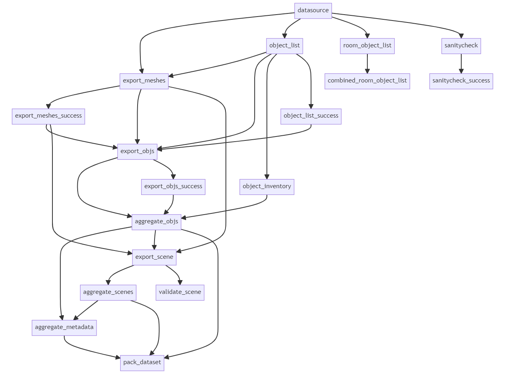

# ig_pipeline
This repository contains a DVC-based pipeline for converting 3ds Max assets into OmniGibson assets, as well as the data pointers to fetch the 3ds Max files from Stanford clusters or Google Cloud.

## Setup
Currently, this pipeline requires:

* A computer running Windows 10 or 11 with at least 32gb (preferably 64gb) of memory
* 3ds Max 2022 installed (can be downloaded with a Student license on Autodesk's website)
* V-Ray 5 installed (can be downloaded with a Free Trial from Chaos's website)
* Git and conda installed

To start working with this pipeline, clone this repository to the `D:\ig_pipeline` path on the Windows computer. This path is currently hardcoded in a number of places and will be removed later.

Then, set up the conda environment `pipeline` by running the below command in Powershell:
```powershell
conda create --file environment.yml
```

Also download the necessary packages into the 3ds Max Python environment by running the below command (updating the 3ds Max installation path as necessary):
```powershell
& 'C:\Program Files\Autodesk\3ds Max 2022\Python37\python.exe' -m pip install -r requirements_3dsmax.txt
```

## Pulling Raw BEHAVIOR-1K 3ds Max Files
While it can be run on arbitrary 3ds Max files, this pipeline is designed to run on the 3ds Max files that are part of the BEHAVIOR-1K project. **Unfortunately, due to licensing issues, we are unable to release these raw model files to non-Stanford-affilliated users.**

As a Stanford-affilliated user, you can pull the BEHAVIOR-1K raw files from the SAIL cluster. You first need to set up DVC to correctly attempt ssh connections only with your CSID username (this is the username you use to log into GIN and/or the SAIL cluster, **not necessarily the same as your SUID**). To do this, create a file named `config.local` in the `.dvc` directory (this file will automatically be gitignored) and add the below contents:

```
['remote "cvgl"']
    user = YOUR_CSID_USERNAME_HERE
    jobs = 4
```

Then, when you run the `dvc pull` command, it should pull all of the raw files from the `scdt.stanford.edu` server.

## Repository Structure
This repository has the below structure:

```
ig_pipeline/
├─ b1k_pipeline/                -> Scripts that power the pipeline. See `scripts` section.
│  ├─ max/                      -> Scripts that must be run within 3ds Max.
├─ artifacts/                   -> Pipeline output directory.
│  ├─ pipeline/                 -> Outputs from pipeline processes & things that won't be included in dataset.
│  ├─ aggregate/                -> Outputs that will be included in final dataset (objects, scenes, metadata).
│  ├─ b1k_dataset.zip           -> Final dataset ZIP file for publication.
├─ cad/                         -> Directory containing raw 3ds Max files
│  ├─ scenes/                   -> Directory containing raw 3ds Max files for scenes
|  |  ├─ {scene_name}           -> Directory containing data for each scene.
|  |  |  ├─ artifacts/          -> Directory containing pipeline outputs for just this scene.
|  |  |  |  ├─ TBD
|  |  |  ├─ textures/           -> Directory containing texture etc. files that are required by the .max files.
|  |  |  ├─ raw.max             -> (Optional) 3ds Max file containing raw/original scene.
|  |  |  ├─ processed.max       -> 3ds Max file containing scene with annotations (Main Input of Pipeline)
│  ├─ objects/                  -> Directory containing raw 3ds Max files for objects, same format as scenes.
├─ metadata/
├─ notebooks/                   -> Notebooks for examining repo state, analyzing metadata, etc - see Notebooks section.
├─ render_presets/              -> Render presets for 3ds Max to render baked textures, 
├─ dvc-tmpl.yaml                -> Template for dvc.yaml file, used by generate_params script to generate dvc.yaml.
├─ dvc.yaml                     -> DVC pipeline configuration with all stage definitions, generated by script.
├─ dvc.lock                     -> Lockfile containing the dependency hashes for each current file in the repository.

```

## Stages

TBD

## Important scripts
TBD

## Running pipeline
TBD

## Contributing
TBD