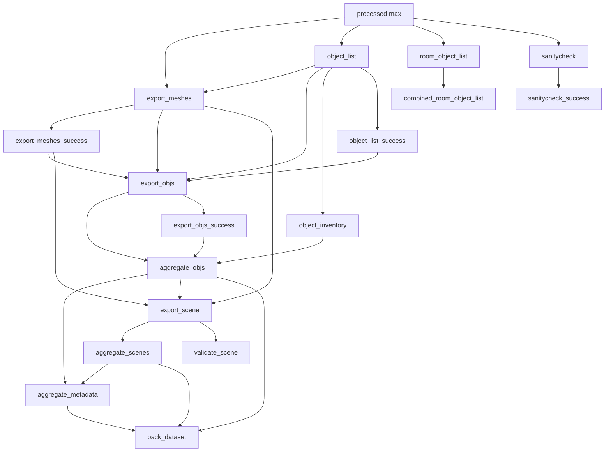

# ig_pipeline
This repository contains a DVC-based pipeline for converting 3ds Max assets into OmniGibson assets, as well as the data pointers to fetch the 3ds Max files from Stanford clusters or Google Cloud.

## Setup
Currently, this pipeline requires:

* A computer running Windows 10 or 11 with at least 32gb (preferably 64gb) of memory
* 3ds Max 2022 installed (can be downloaded with a Student license on Autodesk's website)
* V-Ray 5 installed (can be downloaded with a Free Trial from Chaos's website)
* Git and conda installed

To start working with this pipeline, clone this repository to the `D:\ig_pipeline` path on the Windows computer. This path is currently hardcoded in a number of places and will be removed later.

Then, set up the conda environment `pipeline` by running the below command in Powershell:
```powershell
conda env create --file environment.yml
```

Also download the necessary packages into the 3ds Max Python environment by running the below command (updating the 3ds Max installation path as necessary):

```powershell
& 'C:\Program Files\Autodesk\3ds Max 2022\Python37\python.exe' -m ensurepip
```

```powershell
& 'C:\Program Files\Autodesk\3ds Max 2022\Python37\python.exe' -m pip install -r requirements_3dsmax.txt
```

Finally, import our 3ds Max export settings by copying the `configs/gw_objexp.ini` file into `%LocalAppData%\Autodesk\3dsMax\2022 - 64bit\ENU\en-US\plugcfg` on your machine, overwriting any existing file if necessary (if the folder doesn't exist, launch 3ds Max).

## Pulling Raw BEHAVIOR-1K 3ds Max Files
While it can be run on arbitrary 3ds Max files, this pipeline is designed to run on the 3ds Max files that are part of the BEHAVIOR-1K project. **Unfortunately, due to licensing issues, we are unable to release these raw model files to non-Stanford-affilliated users.**

As a Stanford-affilliated user, you can pull the BEHAVIOR-1K raw files from our private Google Cloud Storage. You first need to log in with your Google account using the below command:

```
gcloud auth application-default login
```

Then, when you run the `dvc pull` command, it should pull all of the raw files from the Google Cloud Storage server.

## Repository Structure
This repository has the below structure:

```
ig_pipeline/
├─ b1k_pipeline/                -> Scripts that power the pipeline. See `scripts` section.
│  ├─ max/                      -> Scripts that must be run within 3ds Max.
├─ artifacts/                   -> Pipeline output directory.
│  ├─ pipeline/                 -> Outputs from pipeline processes & things that won't be included in dataset.
│  ├─ aggregate/                -> Outputs that will be included in final dataset (objects, scenes, metadata).
│  ├─ b1k_dataset.zip           -> Final dataset ZIP file for publication.
├─ cad/                         -> Directory containing raw 3ds Max files
│  ├─ scenes/                   -> Directory containing raw 3ds Max files for scenes
|  |  ├─ {scene_name}           -> Directory containing data for each scene.
|  |  |  ├─ artifacts/          -> Directory containing pipeline outputs for just this scene.
|  |  |  |  ├─ TBD
|  |  |  ├─ textures/           -> Directory containing texture etc. files that are required by the .max files.
|  |  |  ├─ raw.max             -> (Optional) 3ds Max file containing raw/original scene.
|  |  |  ├─ processed.max       -> 3ds Max file containing scene with annotations (Main Input of Pipeline)
│  ├─ objects/                  -> Directory containing raw 3ds Max files for objects, same format as scenes.
├─ metadata/
├─ notebooks/                   -> Notebooks for examining repo state, analyzing metadata, etc - see Notebooks section.
├─ render_presets/              -> Render presets for 3ds Max to render baked textures, 
├─ dvc-tmpl.yaml                -> Template for dvc.yaml file, used by generate_params script to generate dvc.yaml.
├─ dvc.yaml                     -> DVC pipeline configuration with all stage definitions, generated by script.
├─ dvc.lock                     -> Lockfile containing the dependency hashes for each current file in the repository.

```

## Stages


Here is a description of all stages:
| Stage Name                | Description                                                                                                                                                                | Requirements             |
|---------------------------|----------------------------------------------------------------------------------------------------------------------------------------------------------------------------|--------------------------|
| sanitycheck               | Runs a suite of tests against the 3ds Max file and outputs results in JSON file.                                                                                           | 3ds Max                  |
| sanitycheck_success       | Checks if sanitycheck was successful, outputs an empty .success file.                                                                                                      |                          |
| object_list               | Outputs a list of meshes (3ds Max objects) and objects (in the iGibson sense) that aare found in the 3ds Max file.                                                         | 3ds Max                  |
| object_list_success       | Checks if object_list was successful, outputs an empty .success file.                                                                                                      |                          |
| object_inventory          | Aggregates object list files, makes a list of what objects are provided by which file, and checks if all required objects are provided, there are no name collisions, etc. |                          |
| generate_object_images    | Renders images of each individual object in the 3ds Max file.                                                                                                              | 3ds Max                  |
| export_meshes             | Runs UV unwrapping and texture baking and exports OBJ and MTL files for each mesh in 3ds Max file.                                                                         | 3ds Max                  |
| export_meshes_success     | Checks if export_meshes was successful, outputs an empty .success file.                                                                                                    |                          |
| export_objs               | Processes the meshes exported from 3ds Max and generates URDF objects with properly organized joints, links, metadata, etc.                                                |                          |
| export_objs_success       | Checks if export_objs was successful, outputs an empty .success file.                                                                                                      |                          |
| validate_objs             | Runs validation checks on the exported URDF objects. Currently not active.                                                                                                 |                          |
| aggregate_objs            | Aggregates objects produced by each "target" into a single "objects" directory.                                                                                            |                          |
| usdify_objs               | Converts objects into USD from URDF.                                                                                                                                       | Docker, WSL2, Windows 11 |
| generate_scene_images     | Generates images of scenes from a number of fixed perspectives. Deprecated - use camera images.                                                                            | 3ds Max                  |
| generate_camera_images    | Generates images of scenes from the camera viewpoints they contain.                                                                                                        | 3ds Max                  |
| room_object_list          | Exports a room-based object list (e.g. which rooms contain which objects).                                                                                                 | 3ds Max                  |
| combined_room_object_list | Combines the room object lists (and combines any requested partial scenes' contents) and converts them into WordNet synset format.                                         |                          |
| export_scene              | Using the exported meshes, creates a scene URDF file that references the appropriate objects.                                                                              |                          |
| validate_scene            | Runs validation checks (e.g. physics stability) on scene files.                                                                                                            |                          |
| aggregate_scenes          | Aggregates objects produced by each "target" into a single "scenes" directory.                                                                                             |                          |
| aggregate_metadata        | Aggregates certain metadata produced by each "target" into a single "metadata" directory.                                                                                  |                          |
| usdify_scenes             | Converts scenes into USD from URDF.                                                                                                                                        | Dpcker, WSL2, Windows 11 |
| pack_dataset              | Packs the dataset into a ZIP file for distribution.                                                                                                                        |                          |
| upload_dataset            | Uploads the dataset ZIP file onto Google Cloud Storage.                                                                                                                    |                          |

## Scripts
For details on the provided scripts, visit the [README of the b1k_pipeline module directory](./b1k_pipeline).

## Running pipeline
TBD

## Contributing
To contribute, changes need to be put on a PR and sent to Cem Gokmen (cgokmen) for review. For Stanford affilliates, any relevant data needs to be pushed onto the cvgl storage. For external users, instructions for access to your remote needs to be provided for us to be able to fetch the data.
