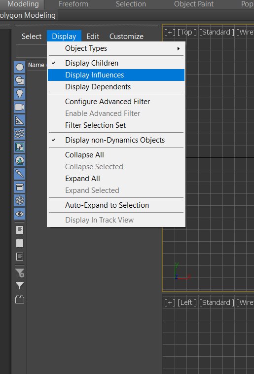
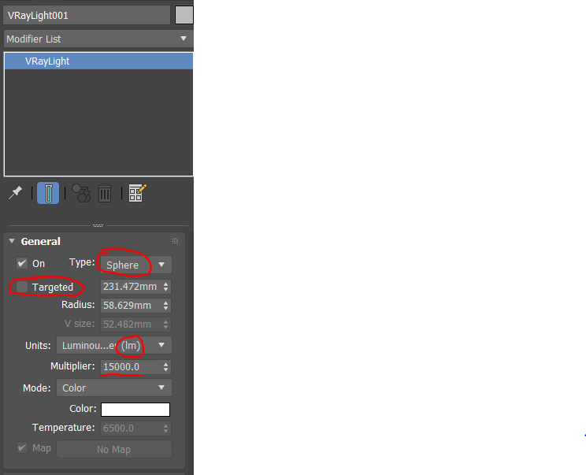
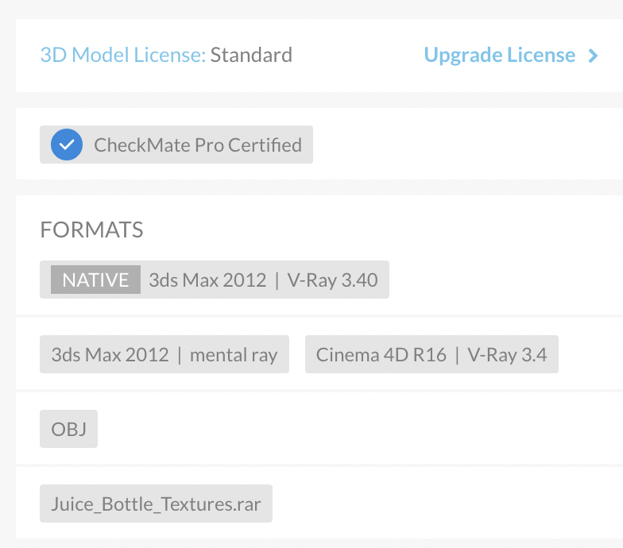
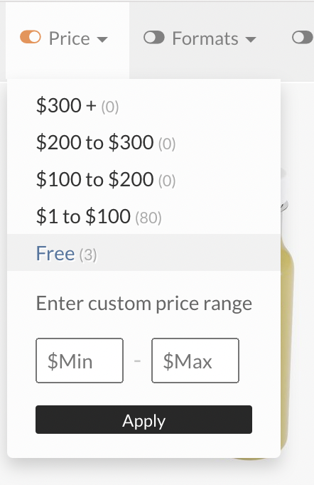

# **B1K Scene & Object Annotation Guide**

# A. Things To Learn How To Do

This section consists of a list of things you should know how to do. Watch the videos first and refer back as needed.

If you think you prefer a general tutorial covering some of the below stuff and general familiarity with 3ds Max, take a look at this [50-min video](https://www.youtube.com/watch?v=YM9spHSNPpM). We have also curated a set of shorter videos for things that we think are important:

1.  Intro to the 3ds Max interface: [7min video](https://www.youtube.com/watch?v=D7LaYg5-pB0) 
2.  Moving / rotating camera: [4min video](https://www.youtube.com/watch?v=yZcJGej-pf0) 
    1.  We recommend that you set up your viewports such that you have 4 viewports: perspective, top, one of (left, right), one of (front, back). You can switch the “one of” options as needed. Use the viewport cube to easily rotate the viewports.
    2.  Our scenes are large and complicated, and thus it’s hard to work with the left/right/front/back views since many objects will be stacked. To help with this, we recommend the use of Viewport Clipping, which lets you define two planes to act as bounds of the rendering area (e.g. anything that’s not between the two parallel planes will not be rendered). This way you can see slices of the scene cleanly. [See here](https://knowledge.autodesk.com/support/3ds-max/learn-explore/caas/sfdcarticles/sfdcarticles/Viewport-Clipping.html) for more info.
3.  Moving / rotating objects: [6min video](https://www.youtube.com/watch?v=0Mz56Br2tIw) 
4.  Different selection modes (edge / border / element): You will need to use these especially when splitting / joining / etc objects. [Brief read](https://knowledge.autodesk.com/support/3ds-max/learn-explore/caas/CloudHelp/cloudhelp/2021/ENU/3DSMax-Modeling/files/GUID-409D36AC-1D17-4B24-851D-1C49C7E0B79D-htm.html).
5.  Merging objects (Attach tool): [5min video](https://www.youtube.com/watch?v=0iSsUfzxy6o) 
6.  Splitting objects (Detach tool, when the object already consists of separate elements): [1min video](https://www.youtube.com/watch?v=eTbIs1vcaWY) 
7.  Cutting objects (Slice Plane tool): [3min video](https://www.youtube.com/watch?v=Z8Z_BM5Z6Uw) 
8.  Closing gaps: select the border of the gap, either using the Border or the Edge selection mode. Then click on the Cap button if in the Border mode or the Bridge button if in the Edge mode.
9.  Setting pivots: [2min video](https://www.youtube.com/watch?v=Gd2B29CeZEg) 
10. Using the snap-to-grid settings (TODO: Add details/link) 

# B. Scene / Object Annotation Process

## 0\. Starting

First, move into a branch: run `git checkout -b scene-name` where scene-name is the name of the scene you will be working on. Mark the scene name in the [spreadsheet](https://docs.google.com/spreadsheets/d/10L8wjNDvr1XYMMHas4IYYP9ZK7TfQHu--Kzoi0qhAe4/edit?usp=sharing) and track your progress. Since we are sharing these computers with other students, make sure you use the correct branch (your branch!) before you start working, and also save progress (save, git commit, etc) at all times.

We don’t want to overwrite the raw scene file (`raw.max`). As soon as you open it, click **File > Save As** and save it as `processed.max` in the same directory. All your work should be done on `processed.max`.

**You should `dvc add` and then `git commit` your file after *every* numbered step below.** 

## 1\. Apply required scene modifications

Any required modifications to the scene need to be applied first. This involves ensuring all of the following are true:

* Any scene combination/edits have been completed in advance. For the B-1K dataset scenes, please chat with area leads for any particular requirements for your particular scene.
* The scene overall contains a natural boundary (e.g., walls) that is properly closed.
* The scene floor is flat, generally at Z=0.
* We should only include objects that are useful for our environment. E.g., if an object seems like it should be usable (e.g., a stack of pans) but cannot be used (because you cannot unstack them), we should remove this object.

## 2\. Check if all objects are properly segmented

Check that each “object” is correctly identified as an object in the object list. This means you need to be able to select in the object list all the parts of that object. Some rules:

* Every object needs to be matched to an object category in the iGibson object [category list](https://docs.google.com/spreadsheets/d/1JJob97Ovsv9HP1Xrs_LYPlTnJaumR2eMELImGykD22A/edit#gid=2141444742) (“Object Category B1K” tab, the “object” column) and be interchangeable with all other objects in the same category. If the right category exists for all of the objects in your scene, great, use that. Otherwise, talk to Cem and Eric about adding the categories. You can look inside the [iGibson dataset](https://github.com/StanfordVL/ig_dataset/tree/master/objects) online to see the other objects that fall into that category, to check if your object is roughly interchangeable.
* If you end up creating a new category, please find an appropriate [WordNet synset](http://wordnetweb.princeton.edu/perl/webwn) for it and add it to the spreadsheet.
* Consider object randomization: one of the goals of iGibson is to be able to replace any object of a given type (e.g., “sink”) with any other object of that same type.
* Consider movement: any moving parts (e.g., a door frame vs the door leaf) should be separated.
* Consider repetition: if there are 5 stalls in a restroom, they should be annotated as 5 objects rather than 1 object covering all 5.
* To achieve this segmentation state, some objects might need to be split into parts (e.g., object already has the parts as separate “elements” and you just need to move the elements into their own objects using the **Detach** tool) or cut (e.g., the parts are by default a single mesh that needs to be cut using the **Slice Plane** tool), and others might need to be combined (using the **Attach** tool). Use your knowledge from Part A to do this. You might also need to fill gaps.

### **Special Case: Walls, Floors and Ceilings**

There are some specific requirements about the annotations of walls, floors and ceilings that need to be addressed.

Each wall object needs to consist of a flat wall segment, e.g., there should not be any corners within the object. This is important because the tool we use to convert visual meshes to collision meshes (VHACD) has a tendency to cut corners within each object, potentially causing unreachable areas and collision issues. **Wall objects currently do not need to be assigned into a room.** 

Floor and ceiling objects are expected to be watertight meshes, with a thickness of at least 30cm, and floors need to have a flat top surface at a height of Z=0. Ideal floor meshes should consist of very few vertices (<20, exactly 8 for a cuboid shape, etc). This will mean some floors may need to be remeshed from scratch. **Floors and ceilings need to be assigned to rooms, and each room should have its own floor/ceiling objects. The floor objects will be used to compute the room map and determine the robot's room.** 

## 3\. Perform vertex reduction

One of the goals of iGibson/OmniGibson is to provide fast simulation. Objects should not be overly complex geometrically. The pipeline's sanity check enforces a limit (currently **~100,000 vertices**, with a warning above 20,000). If an object exceeds this limit, you need to apply vertex reduction.

To do this, select the object, go to the **Modifiers** tab, and from the modifier dropdown add the **ProOptimizer** modifier. Experiment with reducing the vertex count (e.g., try target counts like 20000, 10000, 5000). Ideally, pick the lowest count where the object still looks reasonably good. Ensure the **Keep Textures** option is checked. If in doubt, ask area leads.

Don’t forget to merge/collapse this modifier as part of the next step.

## 4\. Flatten modifiers, convert to Editable Poly

3ds Max supports multiple object types and non-destructive "modifiers". For our pipeline, all final geometry objects must be of type **Editable Poly**, and all modifiers must be merged ("flattened") into the mesh. For each object whose modifier stack isn't just a single "Editable Poly" entry, follow these steps:

* Go to the **Modifiers** tab (right-hand panel, 2nd tab).
* Using the dropdown, add an **Edit Poly** modifier.
* Make sure the **Edit Poly** modifier is at the **top** of the modifier stack.
* Right-click on the **Edit Poly** modifier and click **Collapse To**.
* If a warning dialog pops up, click Yes.
* Confirm in the **Scene Explorer** (left-hand panel) that instances of your object are still instances (check for italicized names). The collapse operation should preserve instancing if done correctly.

  

## 5\. Replace object copies with instances

When multiple copies of the same model exist, they should be **instances**, not independent copies, for efficiency.

Enable **Display > Display Dependents** in the Scene Explorer (object list).

 

Click on each object used multiple times. If its copies are true instances, they will also be highlighted (and likely have italicized names). If not, they are separate copies and must be replaced.

Use the **Tools > Align > Clone and Align** tool or the provided `Clone and Align` script/button. Pivots must be identically positioned and oriented (relative to the object's local frame) for this to work correctly.

1.  Select the object to use as the source/base copy.
2.  Use the **Pick List** option in the Clone and Align tool to select all the copies you want to replace.
3.  Choose **Instance** mode and click **Clone**.
4.  Close the tool.
5.  Verify in the Scene Explorer that the new objects are instances of the source.
6.  Carefully delete the original copies, ensuring the new instances perfectly match their positions and orientations.

## 6\. Annotate moving parts (“links”)

Articulated objects (like doors with moving leaves, drawers) have multiple rigid parts (links) connected by joints. Our pipeline computes joint details automatically if you provide the **lower** (closed) and **upper** (open) positions for each moving part. Ensure fixed and moving parts are separate objects (from step 2).

For each moving part:

1.  Position the moving part exactly at its **closed** state. This defines the **lower** position for naming.
2.  Create a copy using **Edit > Clone** (choose **Instance** type).
3.  Determine the joint type: **prismatic** (sliding) or **revolute** (rotating). Move the copy *only* along the correct axis/rotation.
    1.  **Prismatic:** Translate the instance copy to its fully **open** ("upper") position. Ensure movement is purely along the joint's axis.
    2.  **Revolute:** Rotate the instance copy to its fully **open** ("upper") position.
        1.  Set a temporary pivot point for the rotation using **Hierarchy > Affect Pivot Only**. Choose the pivot carefully (e.g., the hinge center) so the part rotates naturally without intersecting the fixed part.
             
        2.  Use the **Rotate** tool. You can often enter exact angles (e.g., 90 degrees).
        3.  **CRITICAL:** Do not apply rotations greater than 180 degrees. The pipeline interprets the shorter arc. If >180 degrees is needed, adjust the "lower" position definition or consult leads.

## 7\. Annotate local coordinate frames (Pivots)

Objects in OmniGibson use a standard coordinate frame: **X-axis forward, Z-axis upward** (right-handed system). We use the **Pivot** in 3ds Max to define this local frame for each object part (link).

For each link (including fixed parts and both lower/upper copies of moving parts):

* Select the object(s). You can select all instances of a model or both lower/upper copies of an articulated link.
* Go to the **Hierarchy** tab (right-hand toolbar).
* Enable **Affect Pivot Only**.
* Click **Center To Object** and **Align to Object** for a reasonable starting point.
* Use the **Rotate** tool (while Affect Pivot Only is active) to orient the pivot gizmo so the **Red (X) arrow points forward** and the **Blue (Z) arrow points up** relative to the object's natural orientation.
* Disable **Affect Pivot Only** when done.

## 8\. Rename objects

Use the following naming scheme, separating tokens with hyphens (`-`):

* Optional `B-`: Prefix for **bad models** (e.g., non-functional drawers). Requires a valid replacement model ID.
* Optional `F-`: Prefix for objects that should be **fixed** in the scene and **not randomized** (e.g., unique shelves).
* Optional `L-`: Prefix for **loose** (movable) objects. Applies only to the **base link**. Furniture is typically fixed; smaller objects are loose. Ask if unsure.
* `category`: Object category (lowercase, `_` separator, e.g., `bottom_cabinet`).
* `model_id`: **Unique 6-character lowercase ASCII string** identifying this specific model. Different models of the same category need different IDs. For `B-` objects, use the ID of the intended replacement model.
* `instance_id`: Integer instance number (0-indexed). Use consecutively for multiple instances of the same model.
* Optional `-link_name`: Name of the link if not the base (e.g., `-drawer`, `-leaf`). If base link, omit or use `-base_link`.
* Optional `-parent_link_name`: Name of the parent link if this is a moving link. Use `base_link` if parent is the base.
* Optional `-JointType`: `P` (prismatic), `R` (revolute), or `F` (fixed). Required for moving or fixed-but-separate links.
* Optional `-JointSide`: `lower` (closed state) or `upper` (open state). For `F` joints, only `lower` is needed. Required for articulated links.
* Optional `-L{light_id}`: For lights attached to this link (e.g., `-L0`, `-L1`).
* Optional `-M{meta_type}`: For meta links (see step 10).
* Optional `_{meta_id}`: Optional ID for grouping meta links (e.g., `_left`). Alphanumeric, no `_`. Defaults to `_0` if sub-ID exists but ID doesn't.
* Optional `_{meta_subid}`: Optional sub-ID (integer, 0-indexed) for multi-part meta links. Alphanumeric, no `_`.
* Optional `-T{tagname}`: Tags (multiple allowed, e.g., `-Topenable-Tglass`).

Examples:

* `B-L-bottom_cabinet-qwerdf-0` (Bad, loose cabinet instance 0)
* `L-soap_dispenser-tyuigh-0` (Loose soap dispenser)
* `sink-asdfgh-1` (Fixed sink instance 1)
* `door-zxcvbn-0-base_link` (Base link of door)
* `door-zxcvbn-0-leaf-base_link-R-lower` (Lower pose of door leaf, revolute joint from base)
* `door-zxcvbn-0-handle-leaf-R-lower` (Handle fixed to door leaf, lower pose)
* `cabinet-poiuyt-0-drawer-base_link-P-lower-Topenable` (Openable drawer, lower pose)
* `F-sink-lkjhgf-0-Mfluidsource_left` (Fixed sink, fluid source meta link with ID `left`)
* `bottle-mnbvcx-0-Mfillable_0_1` (Fillable meta link part 1 for bottle)

### **NEW: Tags**

Add tags by appending `-Ttagname`. Supported tags:

* **Tsoft:** Needs soft body simulation (cloth, towels). Object mesh must be default-unfolded.
* **Tglass:** Simulate as glass. Segment object if only partially glass.
* **Tlocked:** (Apply to base link) Locks object articulation in this scene.
* **Topenable:** This moving link contributes to the object's open/closed state.
* **Topenable_both_sides:** For objects like two-pane sliding doors where fully open means "closed" semantically.
* **Tsubpart:** Part replaces the whole upon interaction (e.g., slicing). Must be a child object.
* **Textrapart:** Part added with the whole but moves independently (e.g., bed pillow). Must be a child object.
* **Tconnectedpart:** Part added with the whole and connected via a breakable attachment (e.g., bottle cap). Must be a child object.

### **NEW: Container Category / Synset Considerations**

Containers (bottles, cans, etc.) holding substances need specific naming:

* **Category:** `substance_container` (e.g., `lemon_juice_bottle`).
* **Synset:** `substance__container.n.01` (e.g., `lemon_juice__bottle.n.01`) **(Note the double underscore)**.

Common container types: `bag`, `box`, `bottle`, `jar`, `can`. Ask leads for others. This reserves substance-only synsets (e.g., `lemon_juice.n.01`) for the actual substance simulation.

## 9\. Annotate lights

Validate properties and name lights correctly.

* **Type:** Must be **VrayLight**. Convert others or ask for help.
* **Properties:** (See  )
    * **Type:** Sphere, Plane, or Disc.
    * **Targeted:** MUST be **DISABLED**. Delete any associated `VrayTarget` objects.
    * **Units:** Must be **Luminous Power (lm)**. Change if needed; multiplier should auto-convert.
    * **Multiplier:** Should be roughly **500-1000 lm** (e.g., 800 for an 80W bulb). Adjust or ask if far off.
* **Naming:** `{parent_object_full_name}-L{index}`.
    * Example for light on `bottom_cabinet-asdfgh-0`: `bottom_cabinet-asdfgh-0-L0`.
    * Example for light on `cabinet-poiuyt-0-drawer-base_link-P-lower`: `cabinet-poiuyt-0-drawer-base_link-P-lower-L0`.
    * Use consecutive indices (0, 1, ...) for multiple lights on the same link.
    * Attach lights only to the **lower** pose copy of articulated links.

## 10\. NEW: Annotate Parts and Meta Links

Meta links define functional areas for simulation (e.g., water sources, buttons). Parts handle slicing or included-but-separate items (e.g., bottle caps).

**Both meta links and parts MUST be children of their parent object in the Scene Explorer.** Drag-and-drop to set parentage.

**Meta Links:** Must be primitive objects (Point, Box, Cylinder, Sphere, Cone).

### **Dimensionless Meta Links (Point Helpers)**

Use **Create > Helpers > Point** for these. The exact position and orientation matter.

* **Mfluidsource:** Where fluid originates (faucets, shower heads).
* **Mattachment:** Attachment points. Needs Meta ID matching attachment type list + Gender (M/F), e.g., `Mattachment_bikerackM_0`. Pose matters if type is marked `pose` in list.
* **Mheatsource:** Where heat originates (stove burner, lighter). Not needed for enclosed heaters like microwaves.
* **Mcom:** Center of Mass override (optional, rarely needed).

### **Volumetric Meta Links (Geometric Primitives)**

Use **Create > Geometry > Standard Primitives** (Box, Cylinder, Sphere, Cone). Volume definition matters.

* **Mtogglebutton:** Area robot interacts with to toggle state.
* **Mparticleapplier:** Volume for particle emission (e.g., spray cone).
* **Mparticleremover:** Volume for particle removal (e.g., vacuum intake).
* **Mfluidsink:** Volume for fluid removal (e.g., sink drain).
* **Mslicer:** Volume defining the cutting area of a slicing object.
* **Mfillable:** Volume used to check if container is filled. Generated automatically or manually refined.
* **Mcollision:** Defines collision geometry. Usually generated automatically, can be manually created/edited.

### **Meta IDs**

Use `_id` suffix to group related meta links (e.g., `_left` for a left faucet/button pair). Example: `Mtogglebutton_left`, `Mfluidsource_left`. Default ID is `_0` if not specified but a sub-ID exists.

### **Meta Sub-IDs**

Use `_subid` suffix (integer, 0-indexed, consecutive) for meta links composed of multiple primitives. Example: `Mfillable_0_0`, `Mfillable_0_1`. Primarily used for `Mfillable`.

### **Primitive-specific considerations**

* **Cone:** Must have `Radius1 = 0` and `Radius2 > 0`. Create like a cylinder then adjust radii in Modify panel.

### **Parts**

Must be **Editable Poly** objects, children of their parent. Can be `B-` if imported from another file. Do **not** include meta link info in their names. Apply one tag:

* **-Tsubpart:** Replaces parent on interaction (e.g., slicing).
* **-Textrapart:** Added with parent, moves independently (e.g., bed pillow).
* **-Tconnectedpart:** Added with parent, connected via breakable attachment (e.g., bottle cap).

## 11\. NEW: Assign rooms

In **scene files**, assign objects (including floors, ceilings, lights, cameras) to rooms using **Layers**.

* **Room Types:** Use one from the approved list (bar, bathroom, ..., utility_room).
* **Layer Naming:** `{room_type}_{index}` (e.g., `living_room_0`, `bathroom_3`).
* **Assignment:** Create layers with these names in the Layer Manager and drag objects onto the appropriate layer.
* **Multi-Room Objects:** (e.g., doors, windows) Assign to a layer named with a comma-separated list: `room1_idx,room2_idx` (e.g., `corridor_0,living_room_0`).
* **Floors/Ceilings:** MUST belong to exactly one room layer.
* **Exceptions:** Walls, exterior cameras/lights can remain in the default `0` layer.

## 12\. Verify you are passing the sanity check

Run the `new_sanity_check.py` script (via the toolbar button "Run Sanity Check"). Address all **ERRORS** reported. Review **WARNINGS** and fix if appropriate. The pipeline will fail if errors exist.

## 13\. Commit

Save the `processed.max` file. Commit the changes using `dvc add cad/your/object/or/scene/processed.max` followed by `git commit`.

## 14\. Thank you!

We are now one step closer to a very realistic household robotics simulator! 

# C. Object Acquisition Process

## 0\. Shop

Find 3ds Max models on TurboSquid for task-relevant object categories listed in the [spreadsheet](https://docs.google.com/spreadsheets/d/1fWrP4DC4WSqgTEdRjXiIHO_ipmbT_HsEZ3CYvlgx0Wc/edit#gid=363727863).

* Use **Column A** for search terms.
* Note **Column F** for special types (Fluid, Particle, Cloth) - find appropriate containers.
* Fill in **Column H** (Purchase link) and **Column I** (Is Branded).
* **Add the object to the TurboSquid shopping cart.** 

Requirements:

* High quality (check renders).
* **Native Format:** Must be **3ds Max** (V-Ray, Scanline, Arnold renderers okay; **NO Corona**). Verify the "NATIVE" format on the product page, not just the file format filter.
      
* Affordable (Prioritize Free, soft cap $20). Ask leads if >$20.
     
* **No Editorial or Branded** if possible. If unavoidable, mark `1` in Column I; you'll need to remove branding later.
     

## 1\. Import files Into `asset_pippeline/cad/objects`

Import the raw model into the repository correctly:

1.  **First time only:**
    1.  `git checkout main`.
    2.  `git status` (ensure clean working directory).
    3.  `git pull`.
    4.  `git checkout -b yourname-objects` (Create your personal branch for all object additions). E.g., `cem-objects`.
2.  Ensure you are on your branch (`git checkout yourname-objects`).
3.  Download the model from TurboSquid:
    1.  Use link from spreadsheet.
    2.  Add to cart.
    3.  Download via cart.
    4.  **Remove from cart**.
    5.  Save download to a folder **outside** the repository (e.g., `Downloads/objects`).
    6.  Extract files to the same **external** folder.
4.  Open the `.max` file in 3ds Max. Check for texture/plugin errors. Report errors.
5.  Go to **Utilities tab** (wrench icon) > **More... > Resource Collector**.
6.  Check **Collect Bitmaps**, **Copy**, **Update Materials**. Click **Browse**, navigate to the *external* folder where you extracted the files, create a `textures` subfolder, and select it. (Alternative if this fails: use **File > Archive**, save somewhere, unzip, find textures in the unzipped archive, and copy them manually to the external `textures` folder).
7.  Click **Begin** in Resource Collector.
8.  Go to **File > Save As...**:
    1.  Navigate to `asset_pipeline/cad/objects/`.
    2.  Create a new folder: `{category}-{xy}` where `{category}` is from the spreadsheet and `{xy}` is a random 2-char string (just to avoid folder name clashes at this stage). Use a combined name if multiple categories, e.g., `raw_meats-xy`.
    3.  Enter the new folder.
    4.  Save as `raw.max`.
9.  After Resource Collector finishes, **Save** again (CTRL+S).
10. **IMPORTANT: Commit Raw File:**
    1.  `git status` (Check only your new folder is listed).
    2.  `git add -A`.
    3.  **IMPORTANT:** `git lfs status` (Ensure all texture files are tracked by LFS). (If not, ensure `.gitattributes` is set up correctly and potentially run `git lfs track "cad/objects/{category}-{xy}/textures/**"` and re-add). 
    4.  `git commit -m "Add raw model {category}-{xy}"`.
11. **IMPORTANT**: Update spreadsheet: Mark `1` in **“Raw File Added”** column.
12. In 3ds Max: **File > Save As...** `processed.max` in the *same* object folder.
13. Ready to annotate `processed.max`.

## 2\. Annotate the objects in the file

Follow steps 2-10 from the Scene Annotation Process (Section B) for all objects in the `processed.max` file. If multiple distinct objects are in the file, annotate them all as separate objects within this file.

**IMPORTANT:** For the `model_id` part of the name, use a **random 6-character lowercase string**, not just `0`.

## 3\. Commit the Processed File

1.  Save `processed.max`.
2.  `git status` (Should show only `processed.max` modified).
3.  `dvc add cad/objects/{category}-{xy}/processed.max`
4.  `git add cad/objects/{category}-{xy}/processed.max.dvc cad/objects/{category}-{xy}/.gitignore` (Add the DVC file and potentially a gitignore if DVC created one).
5.  `git commit -m "Process object {category}-{xy}"`.
6.  `git push` (Push your branch).
7.  **IMPORTANT**: Update spreadsheet: Mark `1` in **“Processing Completed”** column.

## 4\. Repeat

Continue acquiring and processing objects assigned to you.