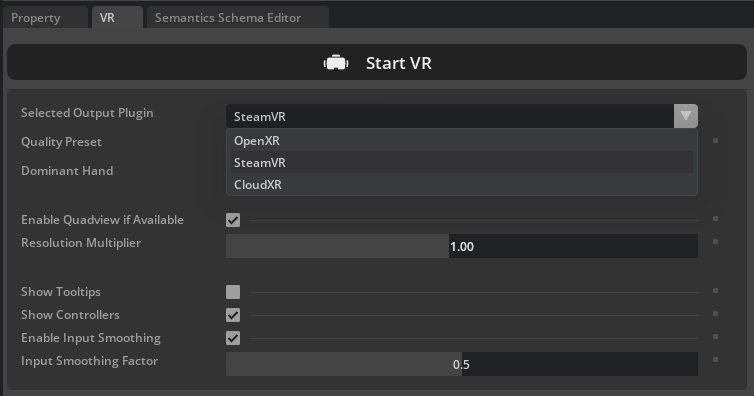

# :fontawesome-solid-vr-cardboard: **VR Setup Guide**

## Prerequisites

Before beginning, make sure you have access to:

 - A Meta Quest headset (we tested with Meta Quest 3 and 3S)
 - Wi-Fi network access
 - Steam account credentials

---

## Step 1: Steam and SteamVR Installation

### Install Steam

**Windows**: Download and install Steam from the [official Steam website](https://store.steampowered.com/).

**Linux**: Install Steam using the package manager:
```bash
sudo apt install steam
```

### Configure Steam and SteamVR

1. Launch Steam and log in using your credentials.
2. Navigate to the Store and search for "SteamVR".
3. Click "Play Game" to install SteamVR.

## Step 2: Headset Setup

Perform the initial headset setup (required only once for new headsets):

1. Follow the on-screen setup instructions for adjusting straps and focus.
2. When prompted for Wi-Fi setup, select "choose a network".
3. Connect to the same Wi-Fi network as your PC.

## Step 3: Platform-Specific Configuration (**Linux only**)

Linux users need to install ALVR to bridge the connection between the simulator and SteamVR.

#### Install ALVR

Install ALVR following the [official installation guide](https://github.com/alvr-org/ALVR/wiki/Installation-guide).

#### Configure ALVR Launcher

1. Open the ALVR Launcher.
2. Click the "Launch" button to start the installation wizard.
3. Click "Next" through all wizard steps and select "Finish" at completion.
4. Click "Launch" again, then select "Launch SteamVR" when prompted.

#### Configure SteamVR Launch Settings (Mandatory Fix)

Apply the mandatory fix from the [ALVR Linux Troubleshooting guide](https://github.com/alvr-org/ALVR/wiki/Linux-Troubleshooting) to prevent black screen issues:

1. In Steam, right-click on SteamVR and select "Properties".
2. Navigate to General → Launch Options.
3. Add the following line (adjust path if your Steam installation differs):
   ```
   ~/.local/share/Steam/steamapps/common/SteamVR/bin/vrmonitor.sh %command%
   ```
4. The yellow warning message in ALVR can help you determine the correct path for your system.

#### Establish Headset Connection

1. Install ALVR on your Quest headset: Download and install the ALVR app from the Meta Quest Store.
2. Re-open the ALVR launcher on your PC.
3. On the headset, open ALVR from the app tray (blue circles on white background logo).
4. When prompted with "open ALVR on your PC and click trust", click "Trust" on your PC.
5. The headset should automatically connect and display mountains in the background, indicating successful SteamVR connection.

## Step 4: Running VR Robot Control Demo

### Configure Demo Settings

Edit settings in `omnigibson/examples/teleoperation/vr_robot_control_demo.py` as needed:

- Disable controller visibility if needed
- Set camera limits according to your requirements

### Launch VR Demo

Execute the VR robot control demonstration:

```bash
python -m omnigibson.examples.teleoperation.vr_robot_control_demo
```

Upon successful loading, the simulation should display "VR headset ready", indicating that VR robot control is now active.

---

## Troubleshooting

### SteamVR Black Screen

If you encounter a black screen when launching SteamVR, try the following:

1. Close SteamVR and restart it.
2. Check if the yellow warning message in ALVR indicates the correct path for your system.
3. If the issue persists, refer to the [ALVR Linux Troubleshooting guide](https://github.com/alvr-org/ALVR/wiki/Linux-Troubleshooting).

### VR Runtime

On some machines, this pipeline performs more reliably with system="SteamVR", while on others it works better with system="OpenXR". You can specify this by passing system="SteamVR" or system="OpenXR" to the OVXRSystem constructor, or by selecting the option directly in the GUI as shown below:

```python
vrsys = OVXRSystem(
    robot=env.robots[0],
    show_control_marker=CONTROLLER_VISIBLE,
    system="SteamVR", # or "OpenXR"
    eef_tracking_mode="controller",
    align_anchor_to="camera",
    view_angle_limits=None,
)
```



### Camera orientation does not align with the VR headset

When the VR system starts, a canonical head transformation is registered to enable free camera movement. If the robot head orientation becomes misaligned with your headset, focus the simulator GUI window and press R to reset and update the head orientation.