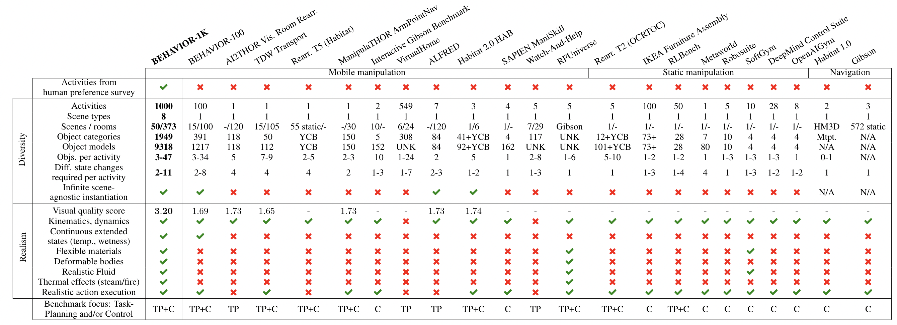

# 🏡 **BEHAVIOR-1K**

<figure markdown="span">
  { width="100%" }
</figure>

BEHAVIOR-1K is a comprehensive simulation benchmark for human-centered robotics. Compared to its predecessor, BEHAVIOR-100, this new benchmark is more grounded on actual human needs: the 1,000 activities come from the results of an extensive survey on "what do you want robots to
do for you?". It is more diverse in the type of scenes, objects, and activities. Powered by [**NVIDIA's Omniverse**](https://www.nvidia.com/en-us/omniverse/), BEHAVIOR-1K also achieves a new level of realism in rendering and physics simulation. We hope that BEHAVIOR-1K's human-grounded nature, diversity, and realism make it valuable for embodied AI and robot learning research. 

  
<h4 class="display-4 text-default">What makes BEHAVIOR-1K different?</h4>

   

  
 
    
<h5 class="display-6 text-default">Comparison with existing benchmarks: human needs, diversity, and realism</h5>

        

    
  
  
    

  
 
    
<h5 class="display-6 text-default">1,000 household activities that people prefer more help with</h5>

     
        

    
  
  
    

  
 
    
<h5 class="display-6 text-default">1,000 activities, instantiated in 50 fully interactive scenes with 9,000+ objects</h5>

    

    

      

        
      

    

    
    

      

        <video autoplay loop muted height="280">
          <source src="../assets/b1k_features/objects.mp4" type="video/mp4">
          Sorry, your browser doesn't support embedded videos. 
          </video>            
      

    

  
  
   
    
    

    
<h5 class="display-6 text-default">OmniGibson: Realism in perception, physics, and interactions</h5>

    

      

        

          <video autoplay loop muted>
            <source src="../assets/b1k_features/water.mp4" type="video/mp4">
            Sorry, your browser doesn't support embedded videos. 
          </video> 
            
<h5 class="display-6 text-white">Fluids</h5>

        

      

      
      

        

          <video autoplay loop muted>
            <source src="../assets/b1k_features/deformable.mp4" type="video/mp4">
            Sorry, your browser doesn't support embedded videos. 
          </video> 
            
<h5 class="display-6 text-white">Deformables</h5>

        

      

      

        

          <video autoplay loop muted>
            <source src="../assets/b1k_features/fire.mp4" type="video/mp4">
            Sorry, your browser doesn't support embedded videos. 
          </video> 
            
<h5 class="display-6 text-white">Thermal effects</h5>

        

      

      

        

          <video autoplay loop muted>
            <source src="../assets/b1k_features/transition.mp4" type="video/mp4">
            Sorry, your browser doesn't support embedded videos. 
          </video> 
            
<h5 class="display-6 text-white">Transition machines</h5>

        

      

      

        

          <video autoplay loop muted>
            <source src="../assets/b1k_features/glass.mp4" type="video/mp4">
            Sorry, your browser doesn't support embedded videos. 
          </video>             
          
<h5 class="display-6 text-white">Transparency</h5>

        

      

      

        

          <video autoplay loop muted>
            <source src="../assets/b1k_features/light.mp4" type="video/mp4">
            Sorry, your browser doesn't support embedded videos. 
          </video>             
          
<h5 class="display-6 text-white">Lighting effects</h5>

        

      

      
        

          

            <video autoplay loop muted>
              <source src="../assets/b1k_features/rigid-grasp.mp4" type="video/mp4">
              Sorry, your browser doesn't support embedded videos. 
            </video>            
                
<h5 class="display-6 text-white">Grasp rigid objects</h5>

          

        

        

          

            <video autoplay loop muted>
              <source src="../assets/b1k_features/cloth-grasp.mp4" type="video/mp4">
              Sorry, your browser doesn't support embedded videos. 
            </video>            
              
<h5 class="display-6 text-white">Grasp deformable objects</h5>

          

        

        

          

            <video autoplay loop muted>
              <source src="../assets/b1k_features/fluid-scoop.mp4" type="video/mp4">
              Sorry, your browser doesn't support embedded videos. 
            </video>            
              
<h5 class="display-6 text-white">Interact with fluids</h5>

          

        

    

  

