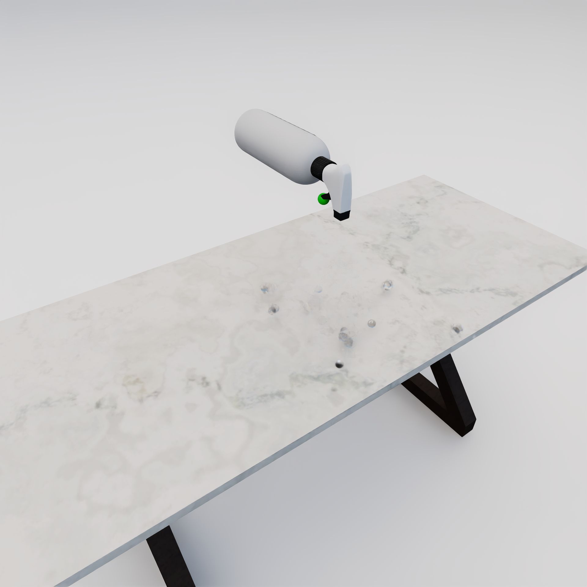

# 🌡️ **Object States**

## Description

In **`OmniGibson`**, `ObjectState`s define kinematic (such as `OnTop`, or `Inside`) or semantic (such as `Temperature` or `Saturated`) states for a given `StatefulObject`. These states enable finer-grained description of the scene at hand not captured by the raw simulation state (such as object and joint poses).

Every `StatefulObject` owns its own dictionary of states `obj.states`, which maps the object state _class type_ to the object state _instance_ owned by the object.

Object states have a unified API interface: a getter `state.get_value(...)`, and a setter `state.set_value(...)`. Note that not all object states implement these functions:

- Some states such as `Temperature` implement both `get_value()` and `set_value()` as a simple R/W operation, as this is merely an internal variable that is tracked over time.
- Other states implement more complex behavior such as `OnTop`, which infers spatial relationships between different objects during `get_value()` and additional samples poses in `set_value()` such that the spatial relationship is true.
- Some states such as `NextTo` only implement `get_value()`, since setting these states are non-trivial and unclear to sample.
- Finally, `IntrinsicObjectState`s such as `ParticleApplier` (which describes an object that can generate particles, such as a spray bottle) describe an intrinsic semantic property of the object, and therefore do not implement `get_value` nor `set_value`.

**`OmniGibson`** supports a wide range of object state types, and provides an extensive example suite showcasing individual object states. For more information, check out our [object state examples](../getting_started/examples.md#object-states).

!!! info annotate "Object States must be enabled before usage!"

    To enable usage of object states, `gm.ENABLE_OBJECT_STATES` (1) must be set!

1. Access global macros via `from omnigibson.macros import gm`


## Usage

### Adding Object States

Object states are intended to be added when an object is instantiated, during its constructor call via the `abilities` kwarg. This is expected to be a dictionary mapping ability name to a dictionary of keyword-arguments that dictate the instantiated object state's behavior. Normally, this is simply the keyword-arguments to pass to the specific `ObjectState` constructor, but this can be different. Concretely, the raw values in the `abilities` value dictionary are postprocessed via the specific object state's `postprocess_ability_params` classmethod. This is to allow `abilities` to be fully exportable in .json format, without requiring complex datatypes (which may be required as part of an object state's actual constructor) to be stored.

By default, `abilities=None` results in an object's abilities directly being inferred from its `category` kwarg. **`OmniGibson`** leverages a crowdsourced [knowledgebase](https://behavior.stanford.edu/knowledgebase/categories/index.html) to determine what abilities (or "properties" in the knowledgebase) a given entity (called "synset" in the knowledgebase) can have. Every category in **`OmniGibson`**'s asset dataset directly corresponds to a specific synset. By going to the knowledgebase and clicking on the corresponding synset, one can see the annotated abilities (properties) for that given synset, which will be applied to the object being created.

Alternatively, you can programmatically observe which abilities, with the exact default kwargs, correspond to a given category via:

```python3
from omnigibson.utils.bddl_utils import OBJECT_TAXONOMY
category = "apple"      # or any other category
synset = OBJECT_TAXONOMY.get_synset_from_category(category)
abilities = OBJECT_TAXONOMY.get_abilities(synset)
```

??? warning annotate "Not all object states are guaranteed to be created!"

    Some object states (such as `ParticleApplier` or `ToggledOn`) potentially require specific metadata to be defined for a given object model before the object state can be created. For example, `ToggledOn` represents a pressable virtual button, and requires this button to be defined a-priori in the raw object asset before it is imported. When parsing the `abilities` dictionary, each object state runs a compatibilty check via `state.is_compatible(obj, **kwargs)` before it is created, where `**kwargs` define any relevant keyword arguments that would be passed to the object state constructor. If the check fails, then the object state is **_not_** created!

### Runtime

As mentioned earlier, object states can be potentially read from via `get_state(...)` or written to via `set_state(...)`. The possibility of reading / writing, as well as the arguments expected and return value expected depends on the specific object state class type. For example, object states that inherit the `BooleanStateMixin` class expect `get_state(...)` to return and `set_state(...)` to receive a boolean. `AbsoluteObjectState`s are agnostic to any other object in the scene, and so `get_state()` takes no arguments. In contrast, `RelativeObjectState`s are computed with respect to another object, and so require `other_obj` to be passed into the getter and setter, e.g., `get_state(other_obj)` and `set_state(other_obj, ...)`. A `ValueError` will be raised if a `get_state(...)` or `set_state(...)` is called on an object that does not support that functionality. For more information on specific object state types' behaviors, please see [Object State Types](#object-state-types).

It is important to note that object states are usually queried / computed _on demand_ and immediately cached until its value becomes stale (usually the immediately proceeding simulation step). This is done for efficiency reasons, and also means that object states are usually not automatically updated per-step unless absolutely necessary (1). Calling `state.clear_cache()` forces a clearing of an object state's internal cache.
{ .annotate }


## Object State Types
**`OmniGibson`** currently supports X object states, consisting of X `AbsoluteObjectState`s, X `RelativeObjectState`s, and X `InstrinsicObjectState`s. Below, we provide a brief overview of each type:

### `AbsoluteObjectState`
These are object states that are agnostic to other objects in a given scene.

<table markdown="span">
    <tr>
        <td valign="top" width="60%">
            [**`AABB`**](../reference/object_states/aabb.html)<br><br>  
            The axis-aligned bounding box (AABB) of the object in the world frame.<br><br>
            <ul>
                <li>`get_value()`: returns `aabb_min`, `aabb_max`</li>
                <li>`set_value()`: Not supported</li>
            </ul>
        </td>
        <td>
            
        </td>
    </tr>
    <tr>
        <td valign="top" width="60%">
            [**`VerticalAdjacency`** / **`HorizontalAdjacency`**](../reference/object_states/adjacency.html)<br><br>  
            The nearby objects that are considered adjacent to the object, either in the +/- global Z axis or +/- global XY plane.<br><br>
            <ul>
                <li>`get_value()`: returns `AxisAdjacencyList`, a namedtuple with `positive_neighbors` and `negative_neighbors` each of which are lists of nearby objects</li>
                <li>`set_value()`: Not supported</li>
            </ul>
        </td>
        <td>
            
        </td>
    </tr>
    <tr>
        <td valign="top" width="60%">
            [**`Burnt`**](../reference/object_states/burnt.html)<br><br>  
            Whether the object is considered burnt or not. Note that if `True`, this object's visual appearance will also change accordingly. This corresponds to an object hitting some `MaxTemperature` threshold over the course of its lifetime.<br><br>
            <ul>
                <li>`get_value()`: returns `True / False`</li>
                <li>`set_value(new_value)`: expects `True / False`</li>
            </ul>
        </td>
        <td>
            
        </td>
    </tr>
    <tr>
        <td valign="top" width="60%">
            [**`ContactBodies`**](../reference/object_states/contact_bodies.html)<br><br>  
            The nearby rigid bodies that this object is currently in contact with.<br><br>
            <ul>
                <li>`get_value(ignore_objs=None)`: returns `rigid_prims`, a set of `RigidPrim`s the object is in contact with, optionally with `ignore_objs` filtered from the set</li>
                <li>`set_value(new_value)`: Not supported</li>
            </ul>
        </td>
        <td>
            
        </td>
    </tr>
    <tr>
        <td valign="top" width="60%">
            [**`Cooked`**](../reference/object_states/cooked.html)<br><br>  
            Whether the object is considered cooked or not. Note that if `True`, this object's visual appearance will also change accordingly. This corresponds to an object hitting some `MaxTemperature` threshold over the course of its lifetime.<br><br>
            <ul>
                <li>`get_value()`: returns `True / False`</li>
                <li>`set_value(new_value)`: expects `True / False`</li>
            </ul>
        </td>
        <td>
            
        </td>
    </tr>
    <tr>
        <td valign="top" width="60%">
            [**`Folded`** / **`Unfolded`**](../reference/object_states/folded.html)<br><br>  
            A cloth-specific state. Determines whether a cloth object is sufficiently un / folded or not. This is inferred as a function of its overall smoothness, total area to current area ratio, and total diagonal to current diagonal ratio.<br><br>
            <ul>
                <li>`get_value()`: returns `True / False`</li>
                <li>`set_value(new_value)`: Can only set `unfolded.set_value(True)`. All others are not supported.</li>
            </ul>
        </td>
        <td>
            
        </td>
    </tr>
    <tr>
        <td valign="top" width="60%">
            [**`Frozen`**](../reference/object_states/frozen.html)<br><br>  
            Whether the object is considered cooked or not. Note that if `True`, this object's visual appearance will also change accordingly. This corresponds to an object hitting some `MaxTemperature` threshold over the course of its lifetime.<br><br>
            <ul>
                <li>`get_value()`: returns `True / False`</li>
                <li>`set_value(new_value)`: expects `True / False`</li>
            </ul>
        </td>
        <td>
            
        </td>
    </tr>
    <tr>
        <td valign="top" width="60%">
            [**`HeatSourceOrSink`**](../reference/object_states/heat_source_or_sink.html)<br><br>  
            Whether the object is considered a heat source or sink. This is a boolean state that is set to `True` if the object is a heat source or sink, and `False` otherwise.<br><br>
            <ul>
                <li>`get_value()`: returns `True / False`</li>
                <li>`set_value(new_value)`: expects `True / False`</li>
            </ul>
        </td>
        <td>
            
        </td>
    </tr>
    <tr>
        <td valign="top" width="60%">
            [**`Heated`**](../reference/object_states/heated.html)<br><br>  
            Whether the object is considered heated or not. Note that if `True`, this object's visual appearance will also change accordingly. This corresponds to an object hitting some `MaxTemperature` threshold over the course of its lifetime.<br><br>
            <ul>
                <li>`get_value()`: returns `True / False`</li>
                <li>`set_value(new_value)`: expects `True / False`</li>
            </ul>
        </td>
        <td>
            
        </td>
    </tr>
    <tr>
        <td valign="top" width="60%">
            [**`MaxTemperature`**](../reference/object_states/max_temperature.html)<br><br>  
            The maximum temperature that the object can reach. This is a scalar value that is set to the maximum temperature that the object can reach.<br><br>
            <ul>
                <li>`get_value()`: returns `max_temperature`</li>
                <li>`set_value(new_value)`: expects a scalar `max_temperature`</li>
            </ul>
        </td>
        <td>
            
        </td>
    </tr>
    <tr>
        <td valign="top" width="60%">
            [**`OnFire`**](../reference/object_states/on_fire.html)<br><br>  
            Whether the object is considered on fire or not.<br><br>
            <ul>
                <li>`get_value()`: returns `True / False`</li>
                <li>`set_value(new_value)`: expects `True / False`</li>
            </ul>
        </td>
        <td>
            
        </td>
    </tr>
    <tr>
        <td valign="top" width="60%">
            [**`Open`**](../reference/object_states/open.html)<br><br>  
            Whether the object is considered open or not.<br><br>
            <ul>
                <li>`get_value()`: returns `True / False`</li>
                <li>`set_value(new_value)`: expects `True / False`</li>
            </ul>
        </td>
        <td>
            
        </td>
    </tr>
    <tr>
        <td valign="top" width="60%">
            [**`Pose`**](../reference/object_states/pose.html)<br><br>  
            The pose of the object in the world frame.<br><br>
            <ul>
                <li>`get_value()`: returns `pose`</li>
                <li>`set_value(new_value)`: expects a `pose`</li>
            </ul>
        </td>
        <td>
            
        </td>
    </tr>
    <tr>
        <td valign="top" width="60%">
            [**`IsGrasping`**](../reference/object_states/is_grasping.html)<br><br>  
            Whether the object is currently being grasped by a robot.<br><br>
            <ul>
                <li>`get_value()`: returns `True / False`</li>
                <li>`set_value(new_value)`: expects `True / False`</li>
            </ul>
        </td>
        <td>
            
        </td>
    </tr>
    <tr>
        <td valign="top" width="60%">
            [**`ObjectsInFOVOfRobot`**](../reference/object_states/objects_in_fov_of_robot.html)<br><br>  
            The objects that are currently in the field of view of a robot.<br><br>
            <ul>
                <li>`get_value()`: returns `objects_in_fov`</li>
                <li>`set_value(new_value)`: Not supported</li>
            </ul>
        </td>
        <td>
            
        </td>
    </tr>
    <tr>
        <td valign="top" width="60%">
            [**`Temperature`**](../reference/object_states/temperature.html)<br><br>  
            The temperature of the object.<br><br>
            <ul>
                <li>`get_value()`: returns `temperature`</li>
                <li>`set_value(new_value)`: expects a scalar `temperature`</li>
            </ul>
        </td>
        <td>
            
        </td>
    </tr>
    <tr>
        <td valign="top" width="60%">
            [**`ToggledOn`**](../reference/object_states/toggled_on.html)<br><br>  
            Whether the object is considered toggled on or off. This is a boolean state that is set to `True` if the object is toggled on, and `False` otherwise.<br><br>
            <ul>
                <li>`get_value()`: returns `True / False`</li>
                <li>`set_value(new_value)`: expects `True / False`</li>
            </ul>
        </td>
        <td>
            
        </td>
    </tr>
</table>


### `RelativeObjectState`
These are object states that are computed with respect to another object in a given scene.

<table markdown=span>
    <tr>
        <td valign="top" width="60%">
            [**`AttachedTo`**](../reference/object_states/attached_to.html)<br><br>  
            Whether the object is considered attached to another object or not.<br><br>
            <ul>
                <li>`get_value(other_obj)`: returns `True / False`</li>
                <li>`set_value(other_obj, new_value)`: expects `True / False`</li>
            </ul>
        </td>
        <td>
            
        </td>
    </tr>
    <tr>
        <td valign="top" width="60%">
            [**`Contains`**](../reference/object_states/contains.html)<br><br>  
            Whether the object contains another object or not.<br><br>
            <ul>
                <li>`get_value(other_obj)`: returns `True / False`</li>
                <li>`set_value(other_obj, new_value)`: expects `True / False`</li>
            </ul>
        </td>
        <td>
            
        </td>
    </tr>
    <tr>
        <td valign="top" width="60%">
            [**`Covered`**](../reference/object_states/covered.html)<br><br>  
            Whether the object is considered covered by another object or not.<br><br>
            <ul>
                <li>`get_value(other_obj)`: returns `True / False`</li>
                <li>`set_value(other_obj, new_value)`: expects `True / False`</li>
            </ul>
        </td>
        <td>
            
        </td>
    </tr>
    <tr>
        <td valign="top" width="60%">
            [**`Draped`**](../reference/object_states/draped.html)<br><br>  
            Whether the object is considered draped over another object or not.<br><br>
            <ul>
                <li>`get_value(other_obj)`: returns `True / False`</li>
                <li>`set_value(other_obj, new_value)`: expects `True / False`</li>
            </ul>
        </td>
        <td>
            
        </td>
    </tr>
    <tr>
        <td valign="top" width="60%">
            [**`Filled`**](../reference/object_states/filled.html)<br><br>  
            Whether the object is considered filled with another object or not.<br><br>
            <ul>
                <li>`get_value(other_obj)`: returns `True / False`</li>
                <li>`set_value(other_obj, new_value)`: expects `True / False`</li>
            </ul>
        </td>
        <td>
            
        </td>
    </tr>
    <tr>
        <td valign="top" width="60%">
            [**`Inside`**](../reference/object_states/inside.html)<br><br>  
            Whether the object is considered inside another object or not.<br><br>
            <ul>
                <li>`get_value(other_obj)`: returns `True / False`</li>
                <li>`set_value(other_obj, new_value)`: expects `True / False`</li>
            </ul>
        </td>
        <td>
            
        </td>
    </tr>
    <tr>
        <td valign="top" width="60%">
            [**`NextTo`**](../reference/object_states/next_to.html)<br><br>  
            Whether the object is considered next to another object or not.<br><br>
            <ul>
                <li>`get_value(other_obj)`: returns `True / False`</li>
                <li>`set_value(other_obj, new_value)`: expects `True / False`</li>
            </ul>
        </td>
        <td>
            
        </td>
    </tr>
    <tr>
        <td valign="top" width="60%">
            [**`OnTop`**](../reference/object_states/on_top.html)<br><br>  
            Whether the object is considered on top of another object or not.<br><br>
            <ul>
                <li>`get_value(other_obj)`: returns `True / False`</li>
                <li>`set_value(other_obj, new_value)`: expects `True / False`</li>
            </ul>
        </td>
        <td>
            
        </td>
    </tr>
    <tr>
        <td valign="top" width="60%">
            [**`Overlaid`**](../reference/object_states/overlaid.html)<br><br>  
            Whether the object is considered overlaid on another object or not.<br><br>
            <ul>
                <li>`get_value(other_obj)`: returns `True / False`</li>
                <li>`set_value(other_obj, new_value)`: expects `True / False`</li>
            </ul>
        </td>
        <td>
            
        </td>
    </tr>
    <tr>
        <td valign="top" width="60%">
            [**`Saturated`**](../reference/object_states/saturated.html)<br><br>  
            Whether the object is considered saturated with another object or not.<br><br>
            <ul>
                <li>`get_value(other_obj)`: returns `True / False`</li>
                <li>`set_value(other_obj, new_value)`: expects `True / False`</li>
            </ul>
        </td>
        <td>
            
        </td>
    </tr>
    <tr>
        <td valign="top" width="60%">
            [**`Touching`**](../reference/object_states/touching.html)<br><br>  
            Whether the object is considered touching another object or not.<br><br>
            <ul>
                <li>`get_value(other_obj)`: returns `True / False`</li>
                <li>`set_value(other_obj, new_value)`: expects `True / False`</li>
            </ul>
        </td>
        <td>
            
        </td>
    </tr>
    <tr>
        <td valign="top" width="60%">
            [**`Under`**](../reference/object_states/under.html)<br><br>  
            Whether the object is considered under another object or not.<br><br>
            <ul>
                <li>`get_value(other_obj)`: returns `True / False`</li>
                <li>`set_value(other_obj, new_value)`: expects `True / False`</li>
            </ul>
        </td>
        <td>
            
        </td>
    </tr>
</table>


### `IntrinsicObjectState`
These are object states that describe an intrinsic semantic property of the object.

<table markdown=span>
    <tr>
        <td valign="top" width="60%">
            [**`ParticleApplier`**](../reference/object_states/particle_applier.html)<br><br>  
            Whether the object is considered a particle applier or not. This is a boolean state that is set to `True` if the object is a particle applier, and `False` otherwise.<br><br>
            <ul>
                <li>`get_value()`: Not supported</li>
                <li>`set_value(new_value)`: Not supported</li>
            </ul>
        </td>
        <td>
            
        </td>
    </tr>
    <tr>
        <td valign="top" width="60%">
            [**`ParticleRemover`**](../reference/object_states/particle_remover.html)<br><br>  
            Whether the object is considered a particle remover or not. This is a boolean state that is set to `True` if the object is a particle remover, and `False` otherwise.<br><br>
            <ul>
                <li>`get_value()`: Not supported</li>
                <li>`set_value(new_value)`: Not supported</li>
            </ul>
        </td>
        <td>
            
        </td>
    </tr>
    <tr>
        <td valign="top" width="60%">
            [**`ParticleSource`**](../reference/object_states/particle_source.html)<br><br>  
            Whether the object is considered a particle source or not. This is a boolean state that is set to `True` if the object is a particle source, and `False` otherwise.<br><br>
            <ul>
                <li>`get_value()`: Not supported</li>
                <li>`set_value(new_value)`: Not supported</li>
            </ul>
        </td>
        <td>
            
        </td>
    </tr>
    <tr>
        <td valign="top" width="60%">
            [**`ParticleSink`**](../reference/object_states/particle_sink.html)<br><br>
            Whether the object is considered a particle sink or not. This is a boolean state that is set to `True` if the object is a particle sink, and `False` otherwise.<br><br>
            <ul>
                <li>`get_value()`: Not supported</li>
                <li>`set_value(new_value)`: Not supported</li>
            </ul>
        </td>
        <td>
            
        </td>
    </tr>
</table>
