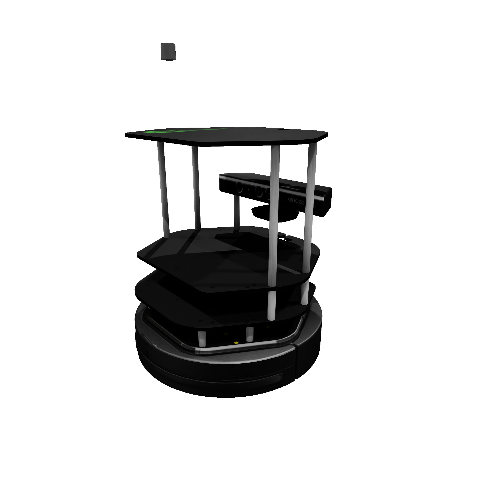
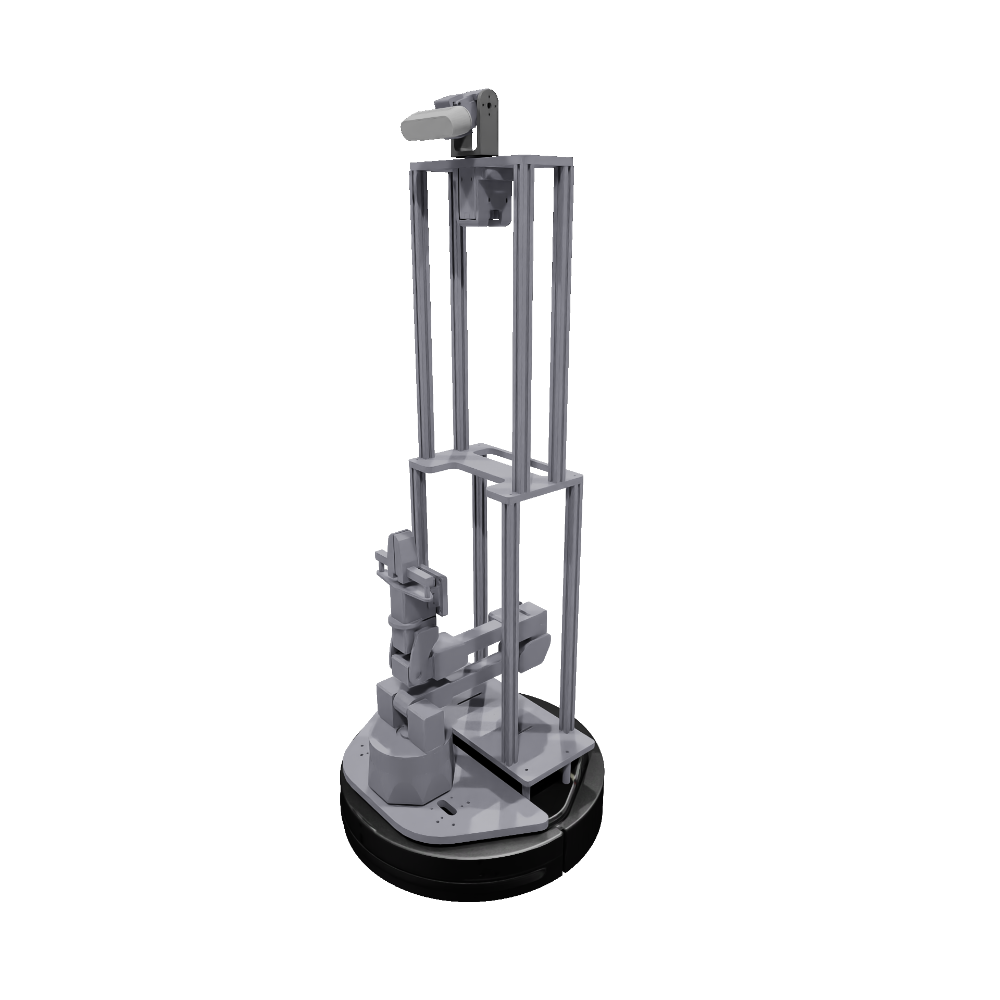
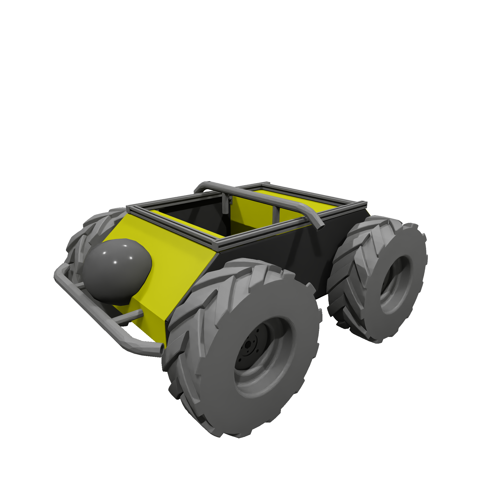
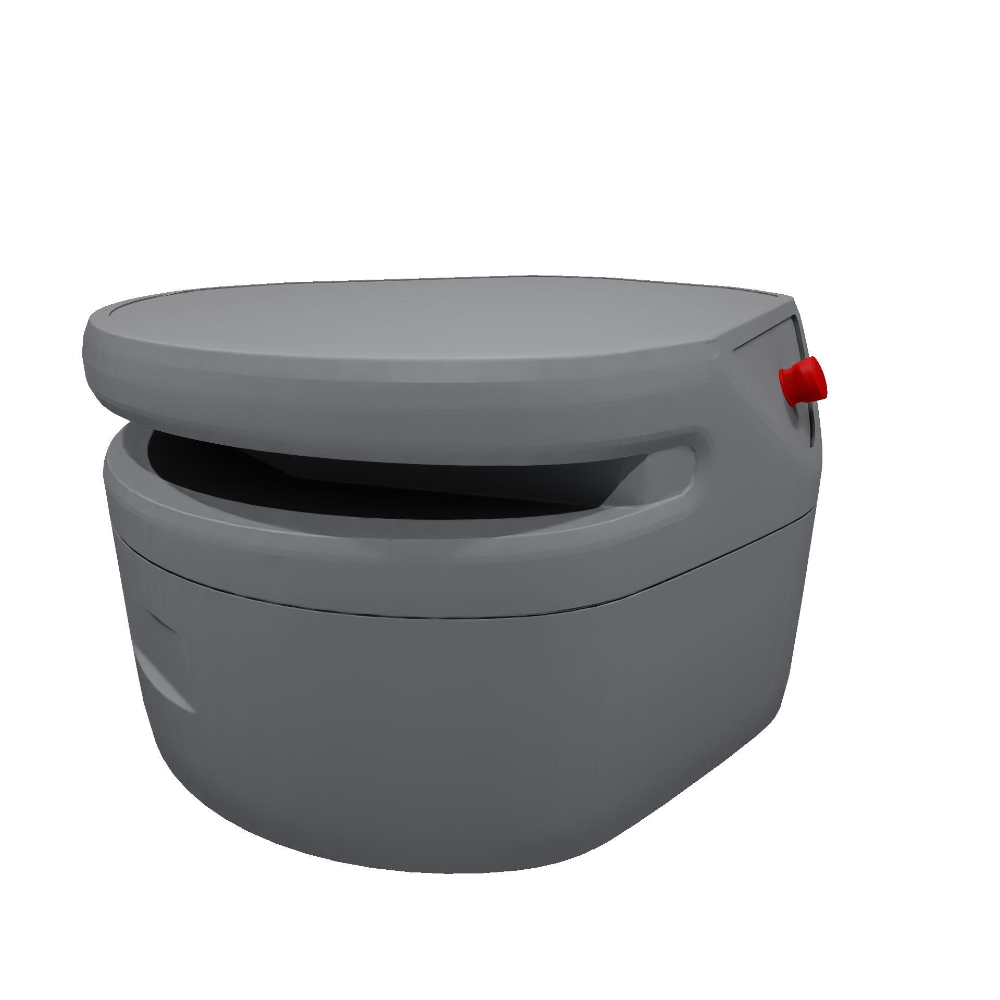
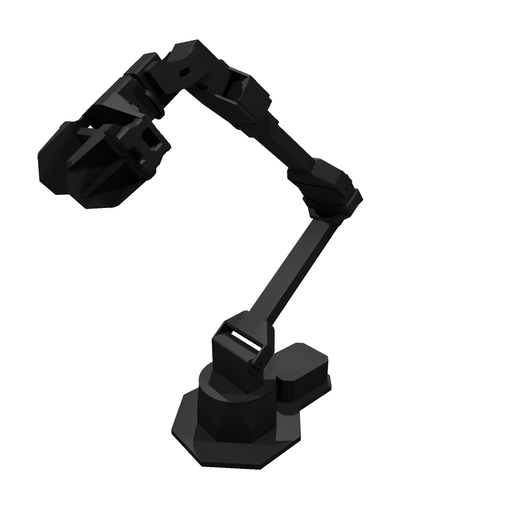
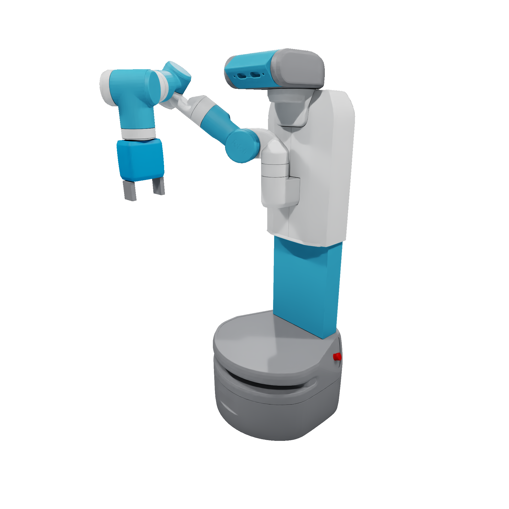
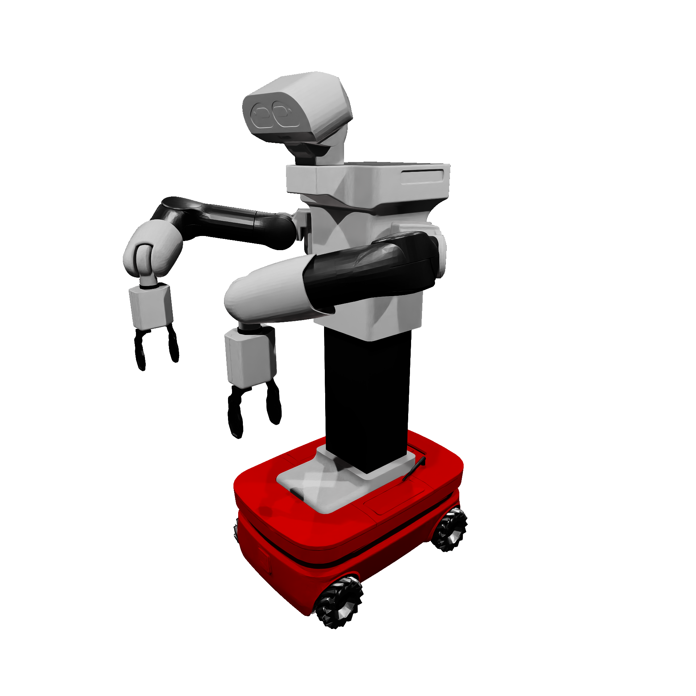
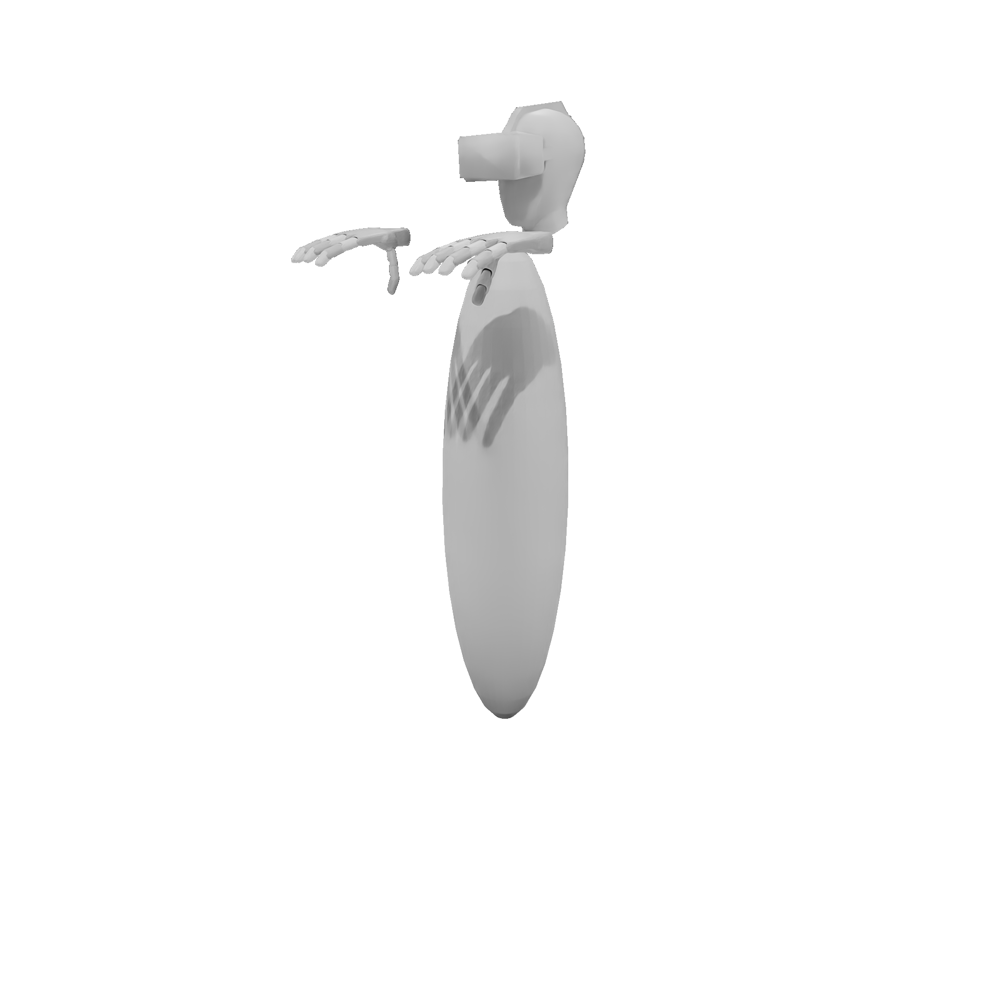

# 🤖 **Robots**

## Description

In **`OmniGibson`**, `Robot`s define agents that can interact with other objects in a given environment. Each robot can _interact_ by deploying joint
commands via its set of [`Controller`](./controllers.md)s, and can _perceive_ its surroundings via its set of [`Sensor`](./sensor.md)s. 

**`OmniGibson`** supports both navigation and manipulation robots, and allows for modular specification of individual controllers for controlling the different components of a given robot. For example, the `Fetch` robot is a mobile manipulator composed of a mobile (two-wheeled) base, two head joints, a trunk, seven arm joints, and two gripper finger joints. `Fetch` owns 4 controllers, one for controlling the base, the head, the trunk + arm, and the gripper. There are multiple options for each controller depending on the desired action space. For more information, check out our [robot examples](../getting_started/examples.md#robots).

It is important to note that robots are full-fledged `StatefulObject`s, and thus leverage the same APIs as normal scene objects and can be treated as such. Robots can be thought of as `StatefulObject`s that additionally own controllers (`robot.controllers`) and sensors (`robot.sensors`).

## Usage

### Importing

Robots can be added to a given `Environment` instance by specifying them in the config that is passed to the environment constructor via the `robots` key. This is expected to be a list of dictionaries, where each dictionary specifies the desired configuration for a single robot to be created. For each dict, the `type` key is required and specifies the desired robot class, and global `position` and `orientation` (in (x,y,z,w) quaternion form) can also be specified. Additional keys can be specified and will be passed directly to the specific robot class constructor. An example of a robot configuration is shown below in `.yaml` form:

??? code "single_fetch_config_example.yaml"
    ``` yaml linenums="1"
    robots:
      - type: Fetch
        position: [0, 0, 0]
        orientation: [0, 0, 0, 1]
        obs_modalities: [scan, rgb, depth]
        scale: 1.0
        self_collision: false
        action_normalize: true
        action_type: continuous
        grasping_mode: physical
        rigid_trunk: false
        default_trunk_offset: 0.365
        default_arm_pose: diagonal30
        reset_joint_pos: tuck
        sensor_config:
          VisionSensor:
            sensor_kwargs:
              image_height: 128
              image_width: 128
          ScanSensor:
              sensor_kwargs:
                min_range: 0.05
                max_range: 10.0
        controller_config:
          base:
            name: DifferentialDriveController
          arm_0:
            name: InverseKinematicsController
            kv: 2.0
          gripper_0:
            name: MultiFingerGripperController
            mode: binary
          camera:
            name: JointController
            use_delta_commands: False
    ```


### Runtime

Usually, actions are passed to robots and observations retrieved via the `obs, info, reward, done = env.step(action)`. However, actions can be directly deployed and observations retrieved from the robot using the following APIs:

<div class="annotate" markdown>
- **Applying actions**: `robot.apply_action(action)` (1)

- **Retrieving observations**: `obs, info = robot.get_obs()` (2)
</div>

1. `action` is a 1D-numpy array. For more information, please see the [Controller](./controllers.md) section!
2. `obs` is a dict mapping observation name to observation data, and `info` is a dict of relevant metadata about the observations. For more information, please see the [Sensor](./sensor.md) section!


Controllers and sensors can be accessed directly via the `controllers` and `sensors` properties, respectively. And, like all objects in **`OmniGibson`**, common information such as joint data and object states can also be directly accessed from the `robot` class.


## Models
**`OmniGibson`** currently supports 9 robots, consisting of 4 mobile robots, 2 manipulation robots, 2 mobile manipulation robots, and 1 anthropomorphic "robot" (a bimanual agent proxy used for VR teleoperation). Below, we provide a brief overview of each model:

### Mobile Robots
These are navigation-only robots (an instance of [`LocomotionRobot`](../reference/robots/locomotion_robot.html)) that solely consist of a base that can move.

<table markdown="span">
    <tr>
        <td valign="top" width="60%">
            [**`Turtlebot`**](../reference/robots/turtlebot.html)<br><br>  
            The two-wheeled <a href="https://www.turtlebot.com/turtlebot2/">Turtlebot 2</a> model with the Kobuki base.<br><br> 
            <ul>
                <li>_Controllers_: Base</li>
                <li>_Sensors_: Camera, LIDAR</li>
            </ul>
        </td>
        <td>
            
        </td>
    </tr>
    <tr>
        <td valign="top" width="60%">
            [**`Locobot`**](../reference/robots/locobot.html)<br><br>  
            The two-wheeled, open-source <a href="http://www.locobot.org/">LoCoBot</a> model.<br><br> Note that in our model the arm is disabled and is fixed to the base.<br><br>
            <ul>
                <li>_Controllers_: Base</li>
                <li>_Sensors_: Camera, LIDAR</li>
            </ul>
        </td>
        <td>
            
        </td>
    </tr>
    <tr>
        <td valign="top" width="60%">
            [**`Husky`**](../reference/robots/husky.html)<br><br>  
            The four-wheeled <a href="https://clearpathrobotics.com/husky-unmanned-ground-vehicle-robot/">Husky UAV</a> model from Clearpath Robotics.<br><br> 
            <ul>
                <li>_Controllers_: Base</li>
                <li>_Sensors_: Camera, LIDAR</li>
            </ul>
        </td>
        <td>
            
        </td>
    </tr>
    <tr>
        <td valign="top" width="60%">
            [**`Freight`**](../reference/robots/freight.html)<br><br>  
            The two-wheeled <a href="https://docs.fetchrobotics.com/">Freight</a> model which serves as the base for the Fetch robot.<br><br> 
            <ul>
                <li>_Controllers_: Base</li>
                <li>_Sensors_: Camera, LIDAR</li>
            </ul>
        </td>
        <td>
            
        </td>
    </tr>
</table>

### Manipulation Robots
These are manipulation-only robots (an instance of [`ManipulationRobot`](../reference/robots/manipulation_robot.html)) that cannot move and solely consist of an actuated arm with a gripper attached to its end effector.

<table markdown="span">
    <tr>
        <td valign="top" width="60%">
            [**`Franka`**](../reference/robots/franka.html)<br><br>  
            The popular 7-DOF <a href="https://franka.de/">Franka Research 3</a> model equipped with a parallel jaw gripper. Note that OmniGibson also includes two alternative versions of Franka: FrankaAllegro (equipped with an Allegro hand) and FrankaLeap (equipped with a Leap hand).<br><br>
            <ul>
                <li>_Controllers_: Arm, Gripper</li>
                <li>_Sensors_: Wrist Camera</li>
            </ul>
        </td>
        <td>
            
        </td>
    </tr>
    <tr>
        <td valign="top" width="60%">
            [**`VX300S`**](../reference/robots/vx300s.html)<br><br>  
            The 6-DOF <a href="https://www.trossenrobotics.com/viperx-300-robot-arm-6dof.aspx">ViperX 300 6DOF</a> model from Trossen Robotics equipped with a parallel jaw gripper.<br><br> 
            <ul>
                <li>_Controllers_: Arm, Gripper</li>
                <li>_Sensors_: Wrist Camera</li>
            </ul>
        </td>
        <td>
            
        </td>
    </tr>
</table>


### Mobile Manipulation Robots
These are robots that can both navigate and manipulate (and inherit from both [`LocomotionRobot`](../reference/robots/locomotion_robot.html) and [`ManipulationRobot`](../reference/robots/manipulation_robot.html)), and are equipped with both a base that can move as well as one or more gripper-equipped arms that can actuate.

<table markdown="span">
    <tr>
        <td valign="top" width="60%">
            [**`Fetch`**](../reference/robots/fetch.html)<br><br>  
            The <a href="https://docs.fetchrobotics.com/">Fetch</a> model, composed of a two-wheeled base, linear trunk, 2-DOF head, 7-DOF arm, and 2-DOF parallel jaw gripper.<br><br> 
            <ul>
                <li>_Controllers_: Base, Head, Arm, Gripper</li>
                <li>_Sensors_: Head Camera, LIDAR</li>
            </ul>
        </td>
        <td>
            
        </td>
    </tr>
    <tr>
        <td valign="top" width="60%">
            [**`Tiago`**](../reference/robots/tiago.html)<br><br>  
            The bimanual <a href="https://pal-robotics.com/robots/tiago/">Tiago</a> model from PAL robotics, composed of a holonomic base (which we model as a 3-DOF (x,y,rz) set of joints), linear trunk, 2-DOF head, x2 7-DOF arm, and x2 2-DOF parallel jaw grippers.<br><br> 
            <ul>
                <li>_Controllers_: Base, Head, Left Arm, Right Arm, Left Gripper, Right Gripper</li>
                <li>_Sensors_: Head Camera, Rear LIDAR, Front LIDAR</li>
            </ul>
        </td>
        <td>
            
        </td>
    </tr>
</table>

### Additional Robots
<table markdown="span">
    <tr>
        <td valign="top" width="60%">
            [**`BehaviorRobot`**](../reference/robots/behavior_robot.html#robots.behavior_robot.BehaviorRobot)<br><br>  
            A hand-designed model intended to be used exclusively for VR teleoperation.<br><br> 
            <ul>
                <li>_Controllers_: Base, Head, Left Arm, Right Arm, Left Gripper, Right Gripper</li>
                <li>_Sensors_: Head Camera</li>
            </ul>
        </td>
        <td>
            
        </td>
    </tr>
</table>
