# :material-thermometer: **Object States**

## Description

In **`OmniGibson`**, `ObjectState`s define kinematic (such as `OnTop`, or `Inside`) or semantic (such as `Temperature` or `Saturated`) states for a given `StatefulObject`. These states enable finer-grained description of the scene at hand not captured by the raw simulation state (such as object and joint poses).

Every `StatefulObject` owns its own dictionary of states `obj.states`, which maps the object state _class type_ to the object state _instance_ owned by the object.

Object states have a unified API interface: a getter `state.get_value(...)`, and a setter `state.set_value(...)`. Note that not all object states implement these functions:

- Some states such as `Temperature` implement both `get_value()` and `set_value()` as a simple R/W operation, as this is merely an internal variable that is tracked over time.
- Other states implement more complex behavior such as `OnTop`, which infers spatial relationships between different objects during `get_value()` and additional samples poses in `set_value()` such that the spatial relationship is true.
- Some states such as `NextTo` only implement `get_value()`, since setting these states are non-trivial and unclear to sample.
- Finally, `IntrinsicObjectState`s such as `ParticleApplier` (which describes an object that can generate particles, such as a spray bottle) describe an intrinsic semantic property of the object, and therefore do not implement `get_value` nor `set_value`.

**`OmniGibson`** supports a wide range of object state types, and provides an extensive example suite showcasing individual object states. For more information, check out our [object state examples](../getting_started/examples.md#object-states).

!!! info annotate "Object States must be enabled before usage!"

    To enable usage of object states, `gm.ENABLE_OBJECT_STATES` (1) must be set!

1. Access global macros via `from omnigibson.macros import gm`


## Usage

### Adding Object States

Object states are intended to be added when an object is instantiated, during its constructor call via the `abilities` kwarg. This is expected to be a dictionary mapping ability name to a dictionary of keyword-arguments that dictate the instantiated object state's behavior. Normally, this is simply the keyword-arguments to pass to the specific `ObjectState` constructor, but this can be different. Concretely, the raw values in the `abilities` value dictionary are postprocessed via the specific object state's `postprocess_ability_params` classmethod. This is to allow `abilities` to be fully exportable in .json format, without requiring complex datatypes (which may be required as part of an object state's actual constructor) to be stored.

By default, `abilities=None` results in an object's abilities directly being inferred from its `category` kwarg. **`OmniGibson`** leverages the crowdsourced [BEHAVIOR Knowledgebase](https://behavior.stanford.edu/knowledgebase/categories/index.html) to determine what abilities (or "properties" in the knowledgebase) a given entity (called "synset" in the knowledgebase) can have. Every category in **`OmniGibson`**'s asset dataset directly corresponds to a specific synset. By going to the knowledgebase and clicking on the corresponding synset, one can see the annotated abilities (properties) for that given synset, which will be applied to the object being created.

Alternatively, you can programmatically observe which abilities, with the exact default kwargs, correspond to a given category via:

```python3
from omnigibson.utils.bddl_utils import OBJECT_TAXONOMY
category = "apple"      # or any other category
synset = OBJECT_TAXONOMY.get_synset_from_category(category)
abilities = OBJECT_TAXONOMY.get_abilities(synset)
```

!!! info annotate "Follow our tutorial on BEHAVIOR knowledgebase!"
    To better understand how to use / visualize / modify BEHAVIOR knowledgebase, please read our [knowledgebase documentation](../behavior_components/behavior_knowledgebase.md)!

??? warning annotate "Not all object states are guaranteed to be created!"

    Some object states (such as `ParticleApplier` or `ToggledOn`) potentially require specific metadata to be defined for a given object model before the object state can be created. For example, `ToggledOn` represents a pressable virtual button, and requires this button to be defined a-priori in the raw object asset before it is imported. When parsing the `abilities` dictionary, each object state runs a compatibilty check via `state.is_compatible(obj, **kwargs)` before it is created, where `**kwargs` define any relevant keyword arguments that would be passed to the object state constructor. If the check fails, then the object state is **_not_** created!

### Runtime

As mentioned earlier, object states can be potentially read from via `get_state(...)` or written to via `set_state(...)`. The possibility of reading / writing, as well as the arguments expected and return value expected depends on the specific object state class type. For example, object states that inherit the `BooleanStateMixin` class expect `get_state(...)` to return and `set_state(...)` to receive a boolean. `AbsoluteObjectState`s are agnostic to any other object in the scene, and so `get_state()` takes no arguments. In contrast, `RelativeObjectState`s are computed with respect to another object, and so require `other_obj` to be passed into the getter and setter, e.g., `get_state(other_obj)` and `set_state(other_obj, ...)`. A `ValueError` will be raised if a `get_state(...)` or `set_state(...)` is called on an object that does not support that functionality. If `set_state()` is called and is successful, it will return `True`, otherwise, it will return `False`. For more information on specific object state types' behaviors, please see [Object State Types](#types).

It is important to note that object states are usually queried / computed _on demand_ and immediately cached until its value becomes stale (usually the immediately proceeding simulation step). This is done for efficiency reasons, and also means that object states are usually not automatically updated per-step unless absolutely necessary. Calling `state.clear_cache()` forces a clearing of an object state's internal cache.


## Types
**`OmniGibson`** currently supports 34 object states, consisting of 19 `AbsoluteObjectState`s, 11 `RelativeObjectState`s, and 4 `InstrinsicObjectState`s. Below, we provide a brief overview of each type:

### `AbsoluteObjectState`
These are object states that are agnostic to other objects in a given scene.

<table markdown="span">
    <tr>
        <td valign="top" width="60%">
            [**`AABB`**](../reference/object_states/aabb.md)<br><br>  
            The axis-aligned bounding box (AABB) of the object in the world frame.<br><br>
            <ul>
                <li>`get_value()`: returns `aabb_min`, `aabb_max`</li>
                <li>`set_value()`: Not supported.</li>
            </ul>
        </td>
        <td>
            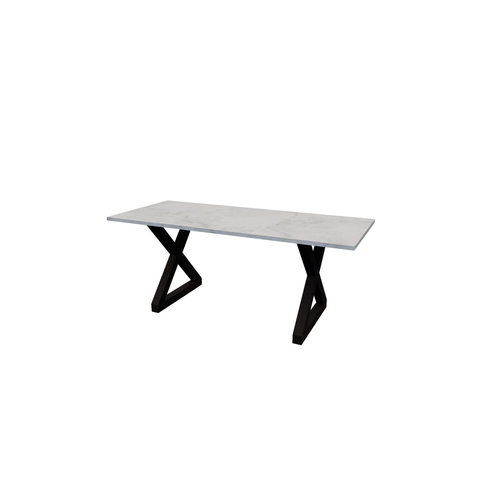
        </td>
    </tr>
    <tr>
        <td valign="top" width="60%">
            [**`VerticalAdjacency`** / **`HorizontalAdjacency`**](../reference/object_states/adjacency.md)<br><br>  
            The nearby objects that are considered adjacent to the object, either in the +/- global Z axis or +/- global XY plane.<br><br>
            <ul>
                <li>`get_value()`: returns `AxisAdjacencyList`, a namedtuple with `positive_neighbors` and `negative_neighbors` each of which are lists of nearby objects</li>
                <li>`set_value()`: Not supported.</li>
            </ul>
        </td>
        <td>
            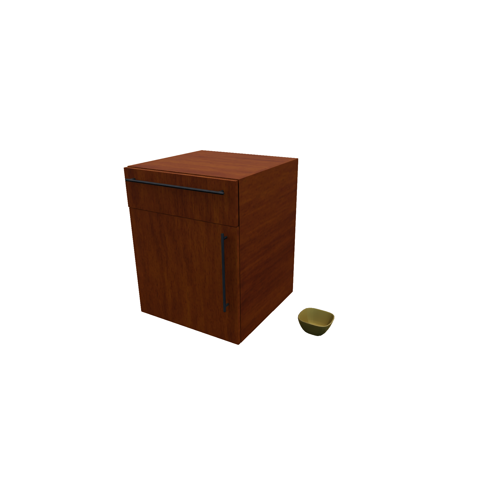
        </td>
    </tr>
    <tr>
        <td valign="top" width="60%">
            [**`Burnt`**](../reference/object_states/burnt.md)<br><br>  
            Whether the object is considered burnt or not. Note that if `True`, this object's visual appearance will also change accordingly. This corresponds to an object hitting some `MaxTemperature` threshold over the course of its lifetime.<br><br>
            <ul>
                <li>`get_value()`: returns `True / False`</li>
                <li>`set_value(new_value)`: expects `True / False`</li>
            </ul>
        </td>
        <td>
            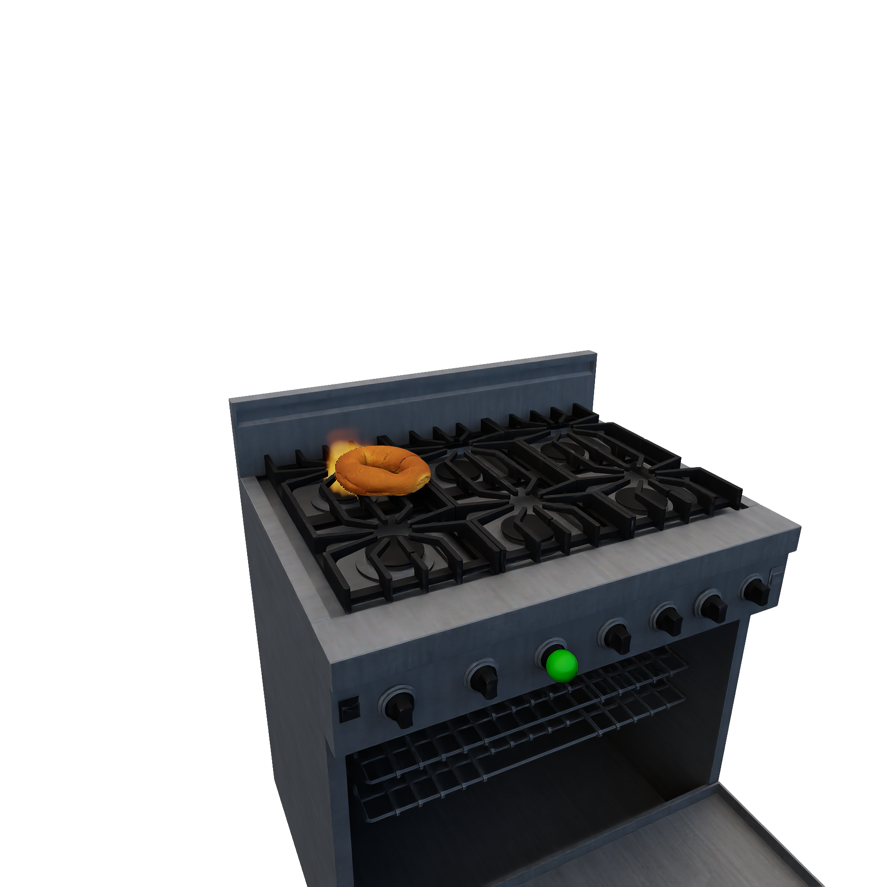
        </td>
    </tr>
    <tr>
        <td valign="top" width="60%">
            [**`ContactBodies`**](../reference/object_states/contact_bodies.md)<br><br>  
            The nearby rigid bodies that this object is currently in contact with.<br><br>
            <ul>
                <li>`get_value(ignore_objs=None)`: returns `rigid_prims`, a set of `RigidPrim`s the object is in contact with, optionally with `ignore_objs` filtered from the set</li>
                <li>`set_value(new_value)`: Not supported.</li>
            </ul>
        </td>
        <td>
            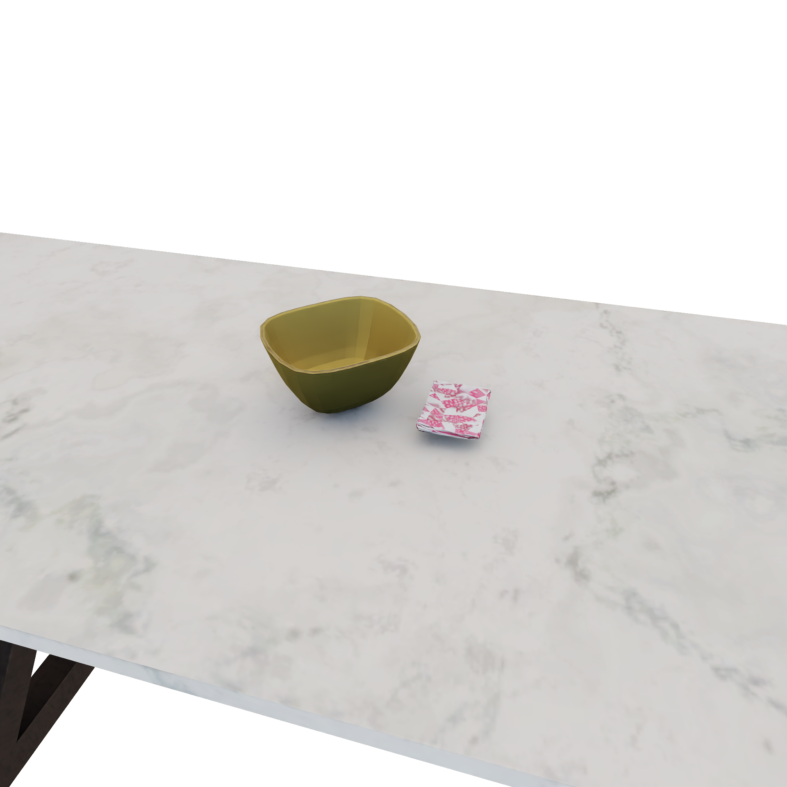
        </td>
    </tr>
    <tr>
        <td valign="top" width="60%">
            [**`Cooked`**](../reference/object_states/cooked.md)<br><br>  
            Whether the object is considered cooked or not. Note that if `True`, this object's visual appearance will also change accordingly. This corresponds to an object hitting some `MaxTemperature` threshold over the course of its lifetime.<br><br>
            <ul>
                <li>`get_value()`: returns `True / False`</li>
                <li>`set_value(new_value)`: expects `True / False`</li>
            </ul>
        </td>
        <td>
            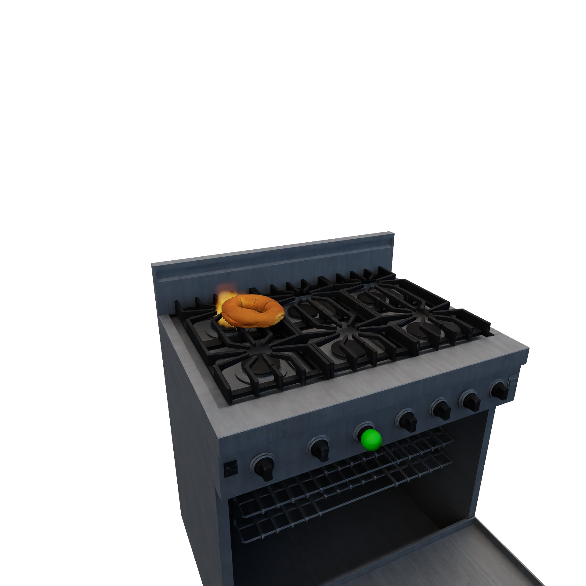
        </td>
    </tr>
    <tr>
        <td valign="top" width="60%">
            [**`Folded`** / **`Unfolded`**](../reference/object_states/folded.md)<br><br>  
            A cloth-specific state. Determines whether a cloth object is sufficiently un / folded or not. This is inferred as a function of its overall smoothness, total area to current area ratio, and total diagonal to current diagonal ratio.<br><br>
            <ul>
                <li>`get_value()`: returns `True / False`</li>
                <li>`set_value(new_value)`: Can only set `unfolded.set_value(True)`. All others are not supported.</li>
            </ul>
        </td>
        <td>
            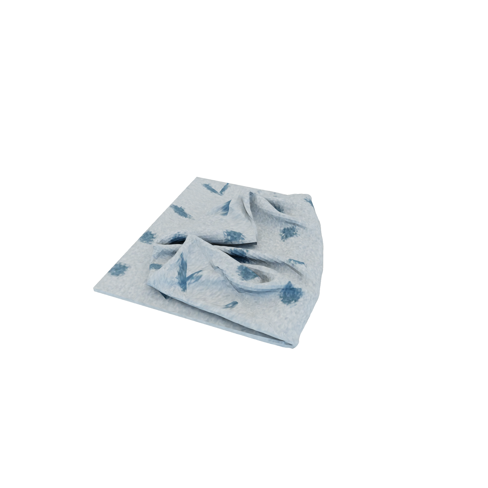
        </td>
    </tr>
    <tr>
        <td valign="top" width="60%">
            [**`Frozen`**](../reference/object_states/frozen.md)<br><br>  
            Whether the object is considered frozen or not. Note that if `True`, this object's visual appearance will also change accordingly. This corresponds to an object's `Temperature` value being under some threshold at the current timestep.<br><br>
            <ul>
                <li>`get_value()`: returns `True / False`</li>
                <li>`set_value(new_value)`: expects `True / False`</li>
            </ul>
        </td>
        <td>
            
        </td>
    </tr>
    <tr>
        <td valign="top" width="60%">
            [**`HeatSourceOrSink`**](../reference/object_states/heat_source_or_sink.md)<br><br>  
            Defines a heat source or sink which raises / lowers the temperature of nearby objects, if enabled. Use `state.affects_obj(obj)` to check whether the given heat source / sink is currently impacting `obj`'s temperature.<br><br>
            <ul>
                <li>`get_value()`: returns `True / False` (whether the source / sink is enabled or not)</li>
                <li>`set_value(new_value)`: Not supported.</li>
            </ul>
        </td>
        <td>
            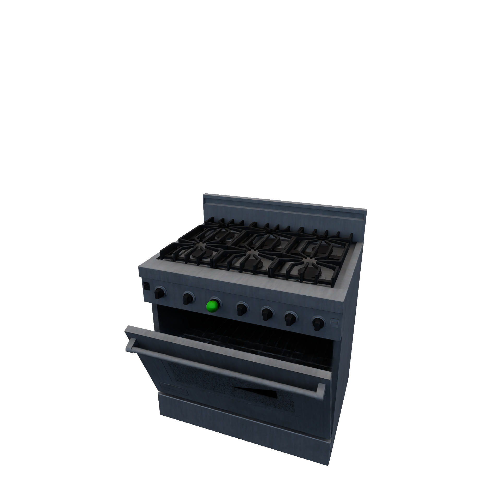
        </td>
    </tr>
    <tr>
        <td valign="top" width="60%">
            [**`Heated`**](../reference/object_states/heated.md)<br><br>  
            Whether the object is considered heated or not. Note that if `True`, this object's visual appearance will also change accordingly with steam actively coming off of the object. This corresponds to an object's `Temperature` value being above some threshold at the current timestep.<br><br>
            <ul>
                <li>`get_value()`: returns `True / False`</li>
                <li>`set_value(new_value)`: expects `True / False`</li>
            </ul>
        </td>
        <td>
            
        </td>
    </tr>
    <tr>
        <td valign="top" width="60%">
            [**`MaxTemperature`**](../reference/object_states/max_temperature.md)<br><br>  
            The object's max temperature over the course of its lifetime. This value gets automatically updated every simulation step and can be affected by nearby `HeatSourceOrSink`-enabled objects.<br><br>
            <ul>
                <li>`get_value()`: returns `float`</li>
                <li>`set_value(new_value)`: expects `float`</li>
            </ul>
        </td>
        <td>
            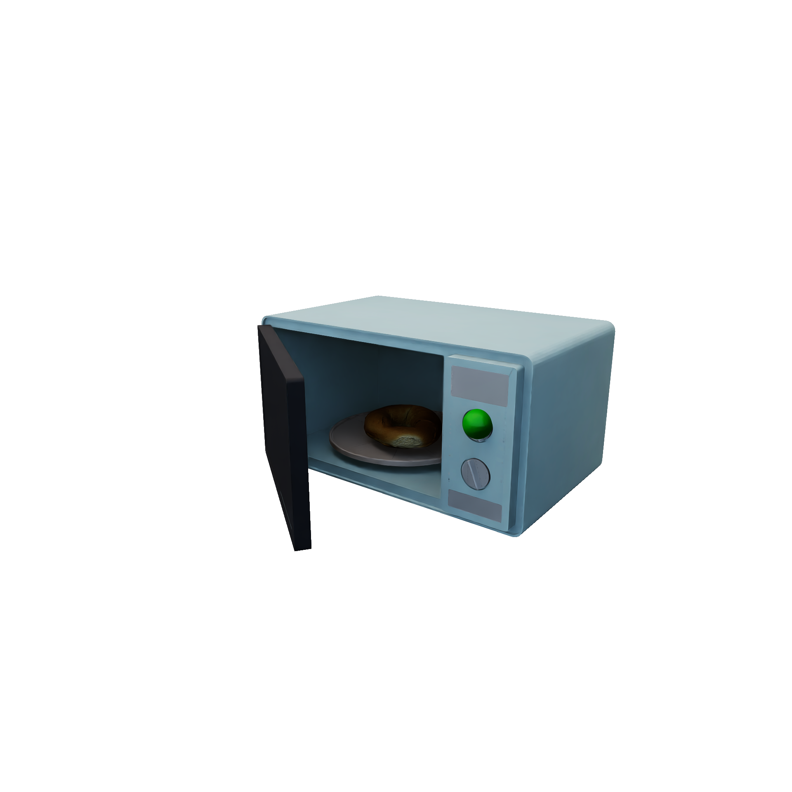
        </td>
    </tr>
    <tr>
        <td valign="top" width="60%">
            [**`OnFire`**](../reference/object_states/on_fire.md)<br><br>  
            Whether the object is lit on fire or not. Note that if `True`, this object's visual appearance will also change accordingly with fire actively coming off of the object. This corresponds to an object's `Temperature` value being above some threshold at the current timestep. Note that if `True`, this object becomes an active `HeatSourceOrSink`-enabled object that will raise the temperature of nearby objects.<br><br>
            <ul>
                <li>`get_value()`: returns `True / False`</li>
                <li>`set_value(new_value)`: expects `True / False`</li>
            </ul>
        </td>
        <td>
            
        </td>
    </tr>
        <tr>
        <td valign="top" width="60%">
            [**`ObjectsInFOVOfRobot`**](../reference/object_states/robot_related_states.md)<br><br>  
            A robot-specific state. Comptues the set of objects that are currently in the robot's field of view.<br><br>
            <ul>
                <li>`get_value()`: returns `obj_set`, the set of `BaseObject`s</li>
                <li>`set_value(new_value)`: Not supported</li>
            </ul>
        </td>
        <td>
            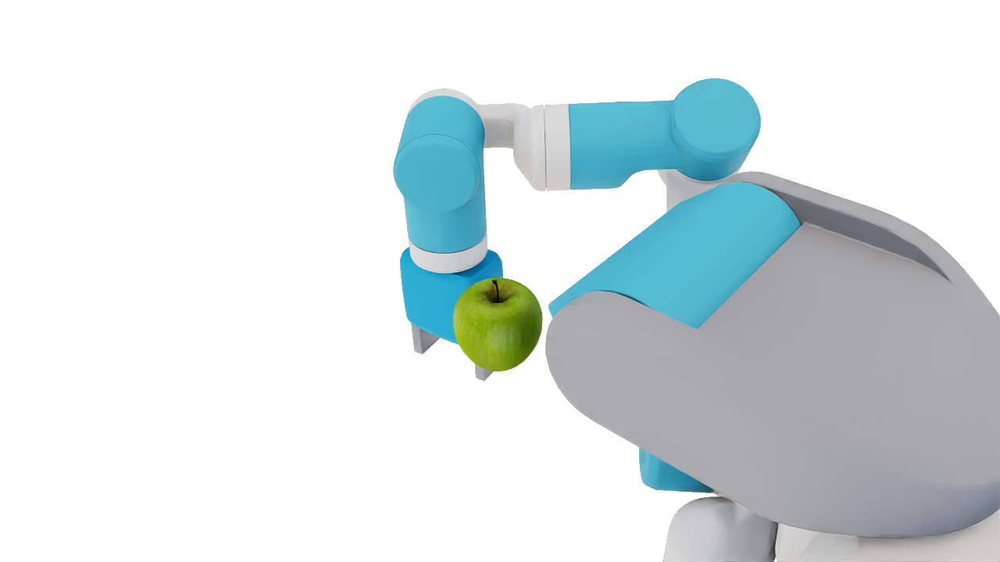
        </td>
    </tr>
    <tr>
        <td valign="top" width="60%">
            [**`Open`**](../reference/object_states/open_state.md)<br><br>  
            Whether the object's joint is considered open or not. This corresponds to at least one joint being above some threshold from its pre-defined annotated closed state.<br><br>
            <ul>
                <li>`get_value()`: returns `True / False`</li>
                <li>`set_value(new_value)`: expects `True / False`, randomly sampling a valid open / not open configuration unless `fully` is set</li>
            </ul>
        </td>
        <td>
            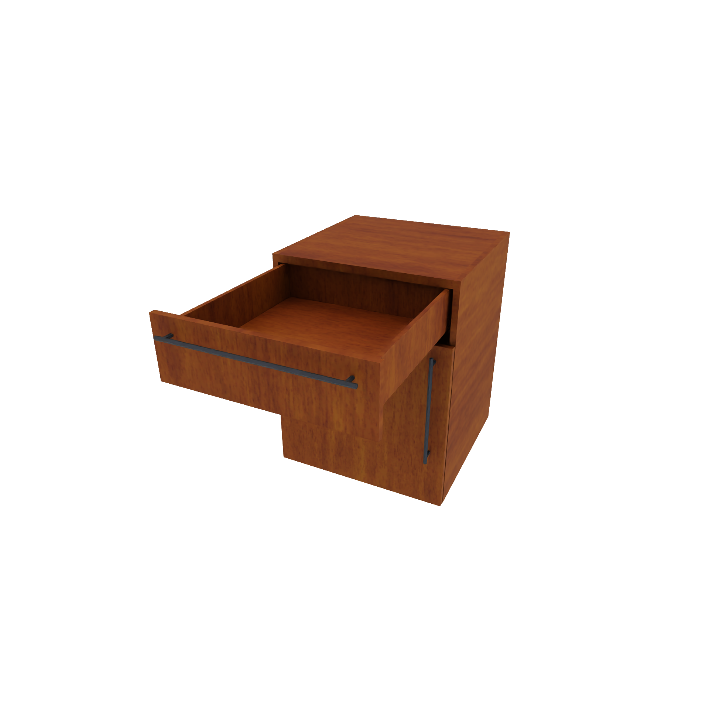
        </td>
    </tr>
    <tr>
        <td valign="top" width="60%">
            [**`Pose`**](../reference/object_states/pose.md)<br><br>  
            The object's current (position, orientation) expressed in (cartesian, quaternion) form in the global frame.<br><br>
            <ul>
                <li>`get_value()`: returns (`pos`, `quat`), with quat in (x,y,z,w) form</li>
                <li>`set_value(new_value)`: Not supported. Use `obj.set_position_orientation()` to directly modify an object's pose.</li>
            </ul>
        </td>
        <td>
            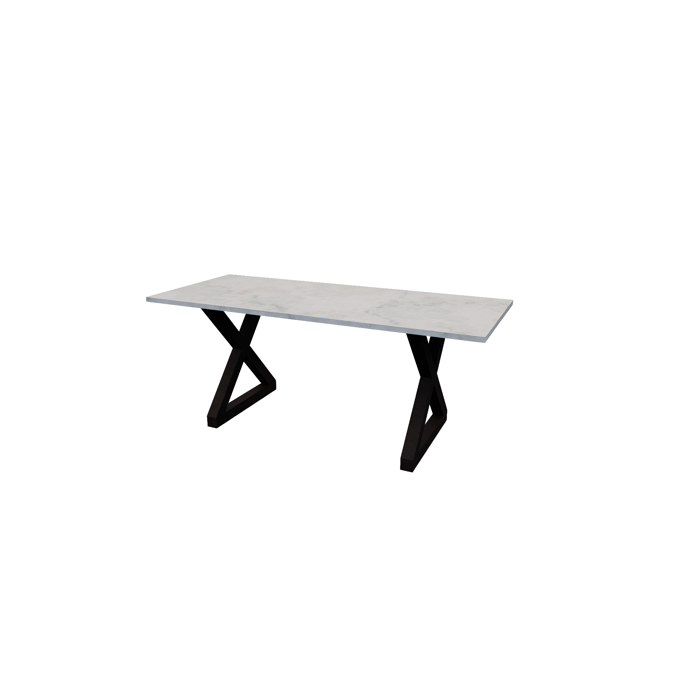
        </td>
    </tr>
    <tr>
        <td valign="top" width="60%">
            [**`Temperature`**](../reference/object_states/temperature.md)<br><br>  
            The object's current temperature. This value gets automatically updated every simulation step and can be affected by nearby `HeatSourceOrSink`-enabled objects.<br><br>
            <ul>
                <li>`get_value()`: returns `float`</li>
                <li>`set_value(new_value)`: expects `float`</li>
            </ul>
        </td>
        <td>
            
        </td>
    </tr>
    <tr>
        <td valign="top" width="60%">
            [**`ToggledOn`**](../reference/object_states/toggle.md)<br><br>  
            A virtual button that can be "pressed" by a robot's end-effector. Doing so will result in the state being toggled between `True` and `False`, and also corresponds to a visual change in the virtual button's appearance.<br><br>
            <ul>
                <li>`get_value()`: returns `True / False`</li>
                <li>`set_value(new_value)`: expects `True / False`</li>
            </ul>
        </td>
        <td>
            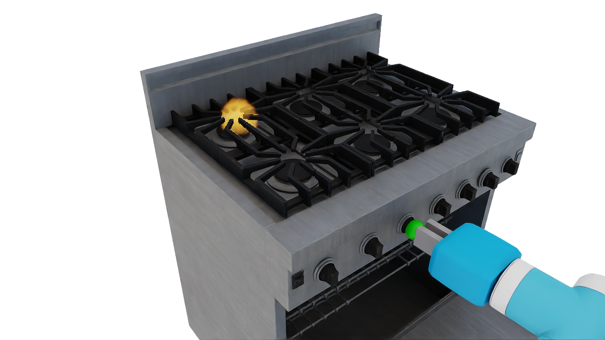
        </td>
    </tr>
</table>

### `RelativeObjectState`
These are object states that are computed with respect to other entities in the given scene, and therefore, both the `get_state(...)` and `set_state(...)` take in additional arguments. 

<table markdown=span>
    <tr>
        <td valign="top" width="60%">
            [**`AttachedTo`**](../reference/object_states/attached_to.md)<br><br>  
            Defines a rigid or flexible connection between this object and another object (parent). At any given moment, this object can only be attached to at most one parent, but the reverse is not true. That is,
        a parent can have multiple children, but a child can only have one parent. An attachment is triggered and created when the this object makes contact with a compatible parent and is aligned correctly.<br><br>
            <ul>
                <li>`get_value(other)`: returns `True / False`, whether this object is attached to `other`</li>
                <li>`set_value(other, new_value, bypass_alignment_checking=False)`: expects `True / False`, and optionally bypasses checking for object alignment with `other` if `bypass_alignment_checking` is set</li>
            </ul>
        </td>
        <td>
            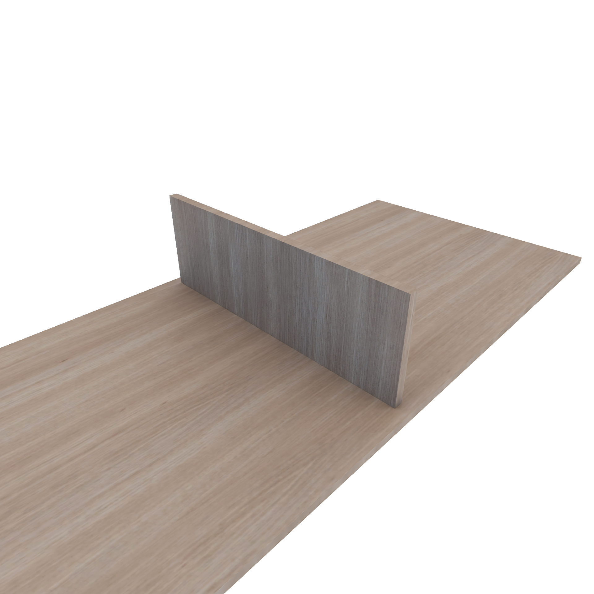
        </td>
    </tr>
    <tr>
        <td valign="top" width="60%">
            [**`Contains`**](../reference/object_states/contains.md)<br><br>  
            Defines whether this object currently contains any quantity of a specific particle system. Note that this state requires that a container virtual volume be pre-annotated in the underlying object asset for it to be created. Particles are considered contained if their position lies within the annotated volume.<br><br>
            <ul>
                <li>`get_value(system)`: returns `True / False`</li>
                <li>`set_value(system, new_value)`: Only supported for `new_value=False`, which will remove all contained particles</li>
            </ul>
        </td>
        <td>
            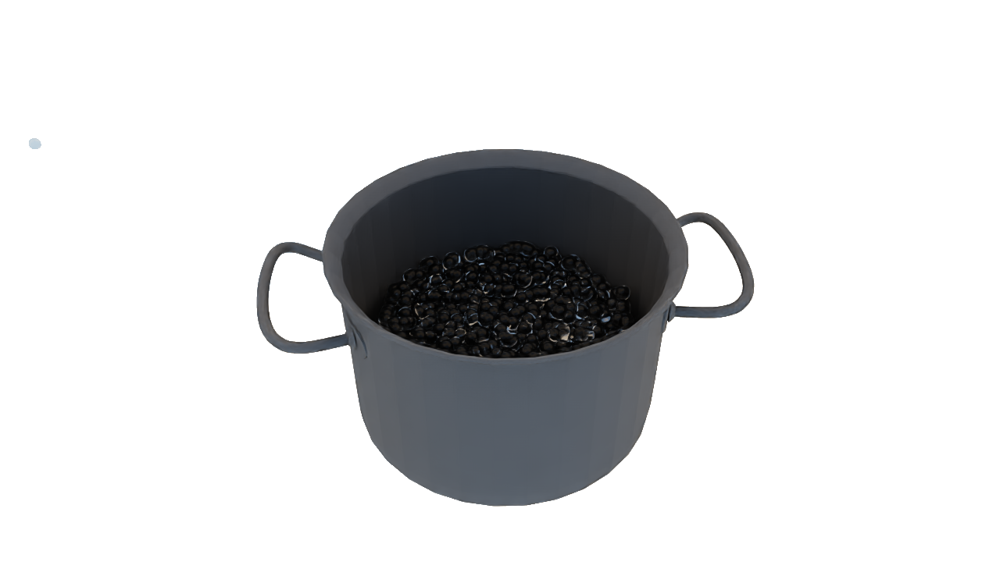
        </td>
    </tr>
    <tr>
        <td valign="top" width="60%">
            [**`Covered`**](../reference/object_states/covered.md)<br><br>  
            Defines whether this object is currently covered by a specific particle system. This corresponds to checking whether the number of particles either touching or attached to this object surpasses some minimum threshold.<br><br>
            <ul>
                <li>`get_value(system)`: returns `True / False`</li>
                <li>`set_value(system, new_value)`: If `True`, will sample particles from `system` on this object, otherwise, will remove all particles from `system` covering this object</li>
            </ul>
        </td>
        <td>
            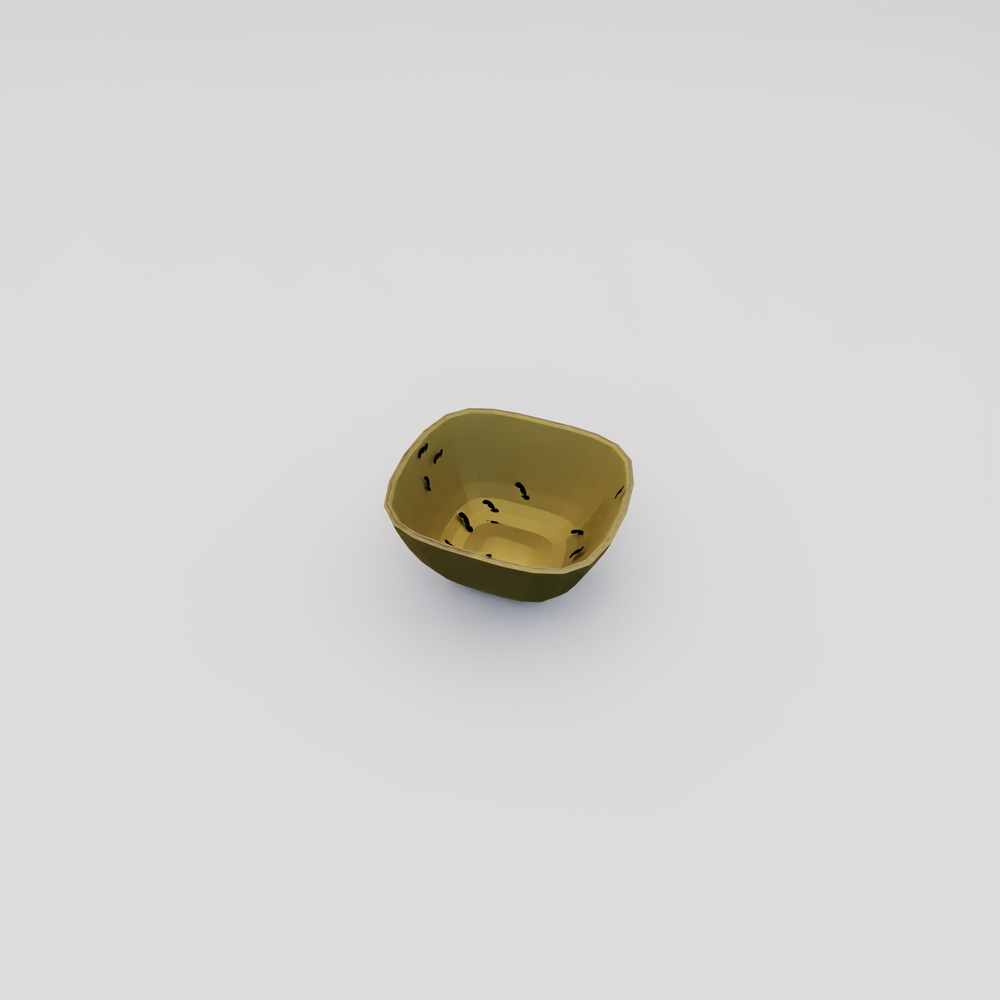
        </td>
    </tr>
    <tr>
        <td valign="top" width="60%">
            [**`Draped`**](../reference/object_states/draped.md)<br><br>  
            A cloth-specific state. Defines whether this cloth object is fully covering `other`, e.g., a tablecloth draped over a table. This object is considered draped if it is touching `other` and its center of mass is below the average position of the contact points.<br><br>
            <ul>
                <li>`get_value(other)`: returns `True / False`</li>
                <li>`set_value(other, new_value)`: Only supports `True`, which will try to sample this cloth object on top of `other` such that `draped.get_value(other)=True`</li>
            </ul>
        </td>
        <td>
            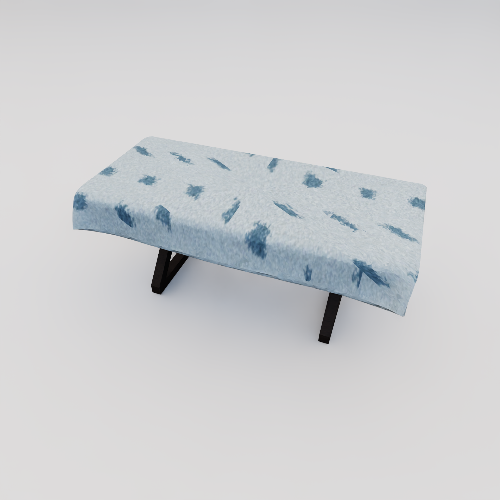
        </td>
    </tr>
    <tr>
        <td valign="top" width="60%">
            [**`Filled`**](../reference/object_states/filled.md)<br><br>  
            Defines whether this object is currently filled with a specific particle system. Note that this state requires that a container virtual volume be pre-annotated in the underlying object asset for it to be created. This state corresponds to checking whether the total volume of contained particles surpasses some minimum relative ratio with respect to its total annotated container volume.<br><br>
            <ul>
                <li>`get_value(system)`: returns `True / False`</li>
                <li>`set_value(system, new_value)`: If `True`, will sample particles from `system` to fill the container volume, otherwise, will remove all particles from `system` contained within this object</li>
            </ul>
        </td>
        <td>
            
        </td>
    </tr>
    <tr>
        <td valign="top" width="60%">
            [**`Inside`**](../reference/object_states/inside.md)<br><br>  
            Defines whether this object is considered inside of `other`. This does raycasting in all axes (x,y,z), and checks to make sure that rays shot in at least two of these axes hit `other`.<br><br>
            <ul>
                <li>`get_value(other)`: returns `True / False`</li>
                <li>`set_value(other, new_value)`: Only supported for `True`, which will sample poses for this object such that `get_value(other)=True`</li>
            </ul>
        </td>
        <td>
            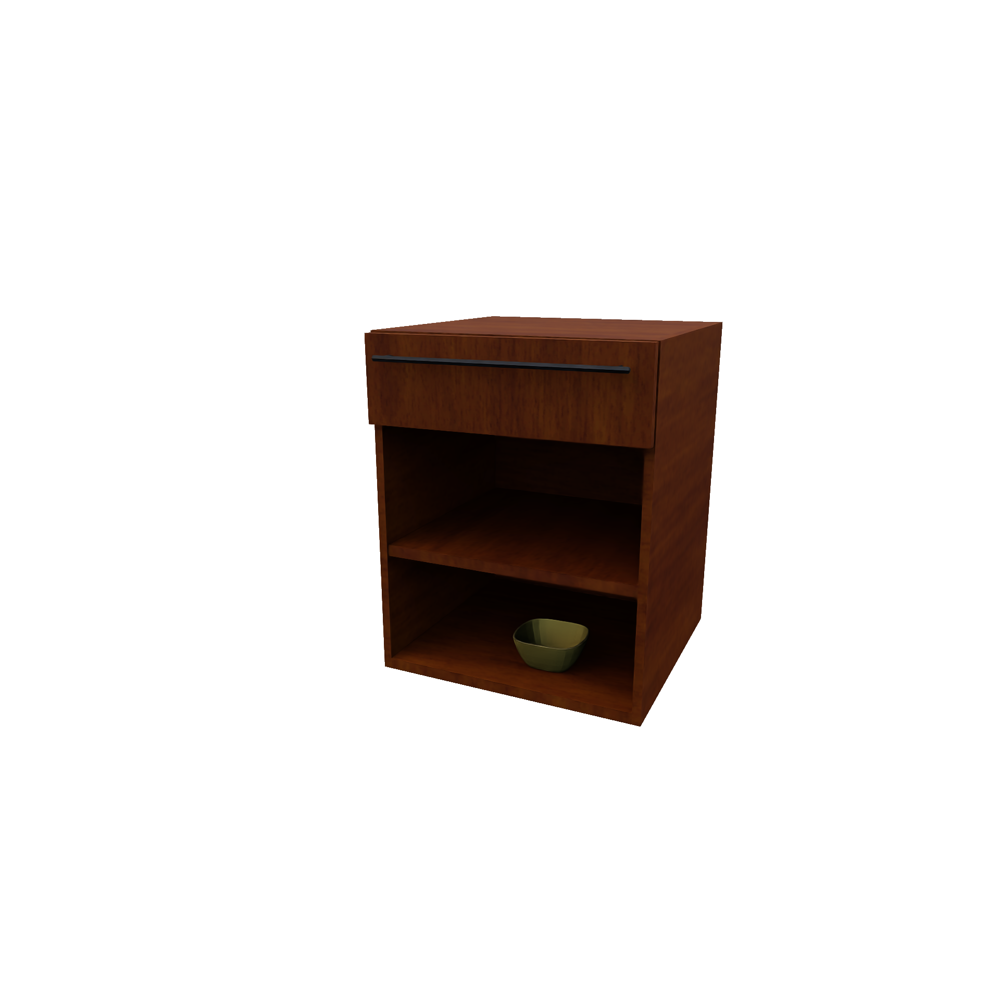
        </td>
    </tr>
    <tr>
        <td valign="top" width="60%">
            [**`IsGrasping`**](../reference/object_states/robot_related_states.md)<br><br> 
            A robot-specific state. Determines whether this robot is currently grasping `other`.<br><br>
            <ul>
                <li>`get_value(other)`: returns `True / False`</li>
                <li>`set_value(other, new_value)`: Not supported.</li>
            </ul>
        </td>
        <td>
            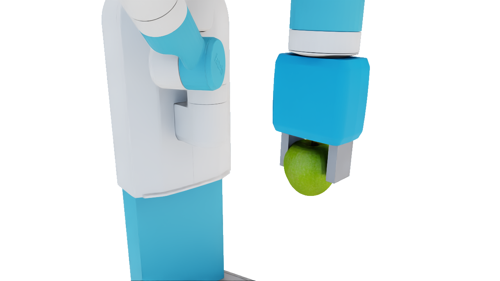
        </td>
    </tr>
    <tr>
        <td valign="top" width="60%">
            [**`NextTo`**](../reference/object_states/next_to.md)<br><br>  
            Defines whether this object is considered next to `other`. This checks to make sure this object is relatively close to `other` and that `other` is in either of this object's `HorizontalAdjacency` neighbor lists.<br><br>
            <ul>
                <li>`get_value(other)`: returns `True / False`</li>
                <li>`set_value(other, new_value)`: Not supported.</li>
            </ul>
        </td>
        <td>
            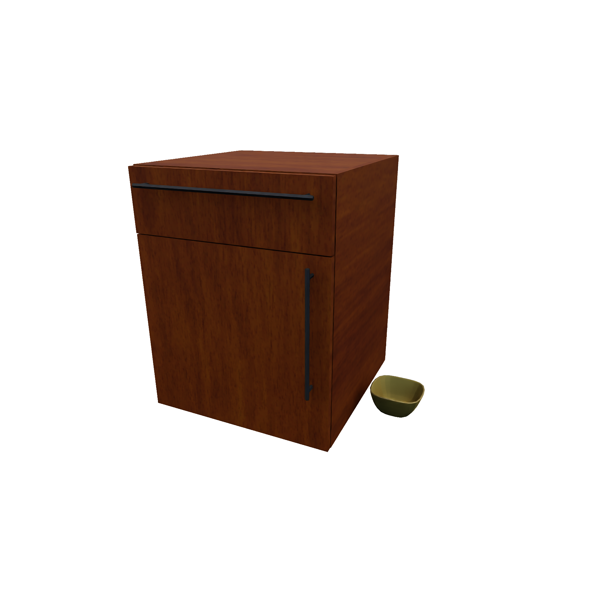
        </td>
    </tr>
    <tr>
        <td valign="top" width="60%">
            [**`OnTop`**](../reference/object_states/on_top.md)<br><br>  
            Defines whether this object is considered on top of `other`. This checks to make sure that this object is touching `other` and that `other` is in this object's `VerticalAdjacency` `negative_neighbors` list.<br><br>
            <ul>
                <li>`get_value(other)`: returns `True / False`</li>
                <li>`set_value(other, new_value)`: Only supported for `True`, which will sample poses for this object such that `get_value(other)=True`</li>
            </ul>
        </td>
        <td>
            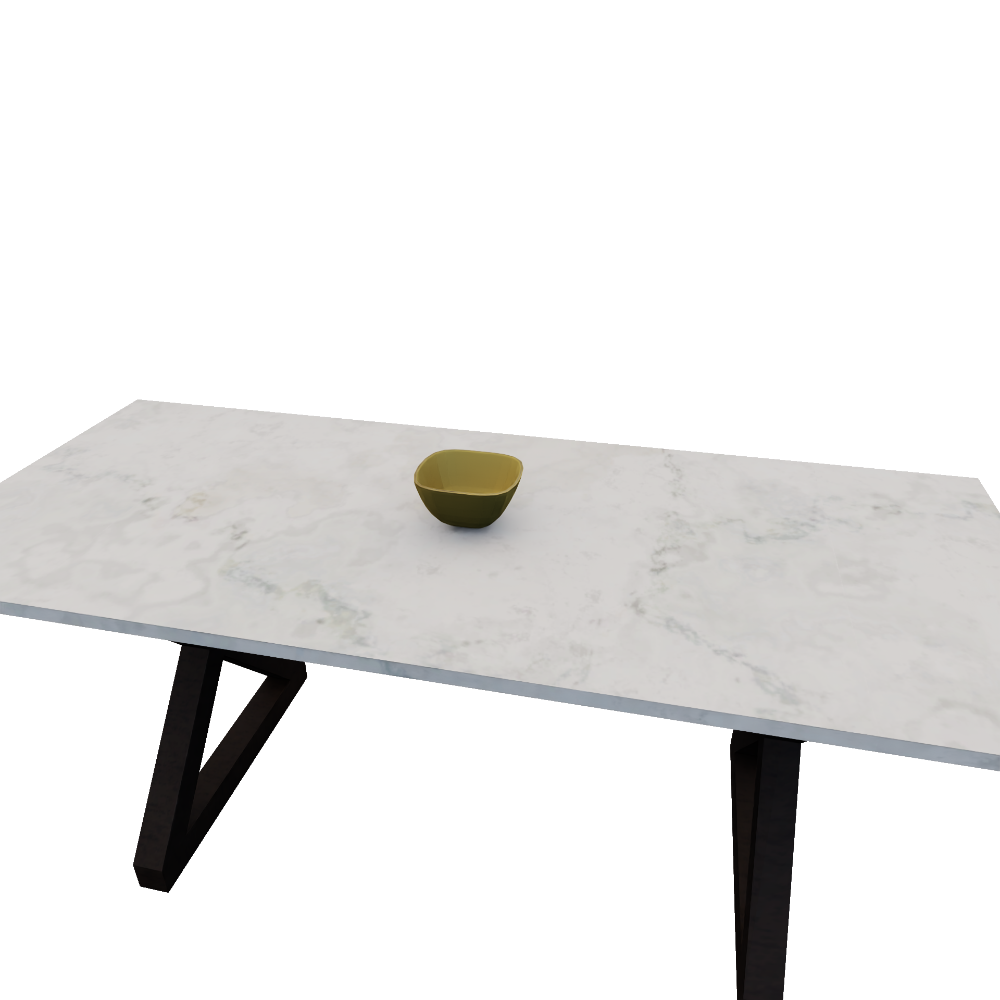
        </td>
    </tr>
    <tr>
        <td valign="top" width="60%">
            [**`Overlaid`**](../reference/object_states/overlaid.md)<br><br>  
            A cloth-specific state. Defines whether this object is overlaid over `other`, e.g., a t-shirt overlaid over a table. This checks to make sure that the ratio of this cloth object's XY-projection of its convex hull to `other`'s XY-area of its bounding box surpasses some threshold.<br><br>
            <ul>
                <li>`get_value(other)`: returns `True / False`</li>
                <li>`set_value(other, new_value)`: Only supports `True`, which will try to sample this cloth object on top of `other` such that `overlaid.get_value(other)=True`</li>
            </ul>
        </td>
        <td>
            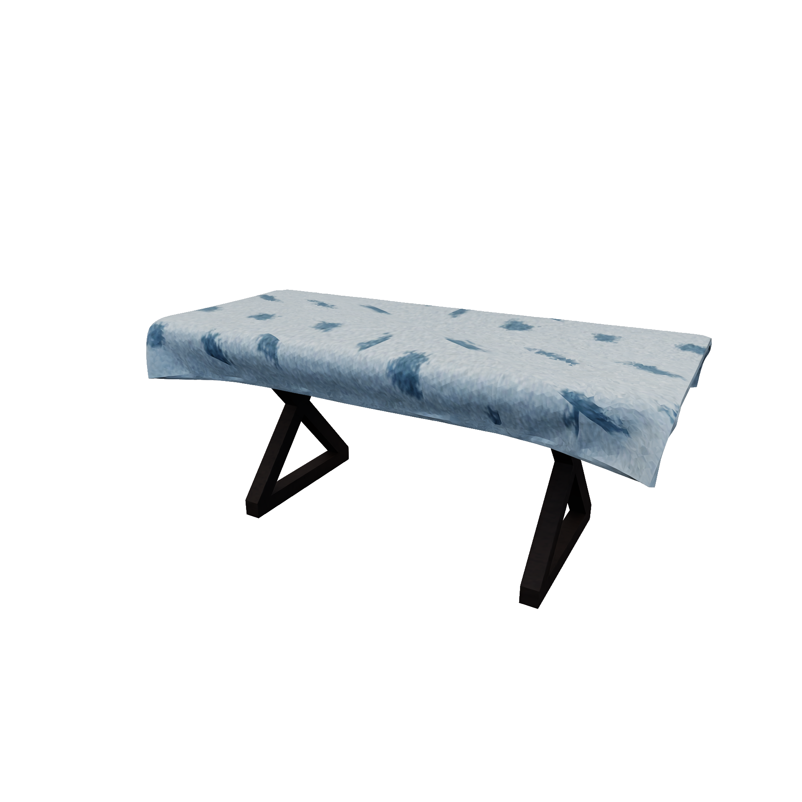
        </td>
    </tr>
    <tr>
        <td valign="top" width="60%">
            [**`Saturated`**](../reference/object_states/saturated.md)<br><br>  
            Defines whether this object has reached the maximum with respect to a specific particle system, e.g., a sponge fully absorbed with water, or a spray bottle fully emptied of cleaner fluid. This keeps a reference to this object's modified particle count for `system`, and checks whether the current value surpasses a desired limit. Specific limits can be queried via `get_limit(system)` and set via `set_limit(system, limit)`. Note that if `True`, this object's visual appearance will also change accordingly. <br><br>
            <ul>
                <li>`get_value(system)`: returns `True / False`</li>
                <li>`set_value(system, new_value)`: If `True`, will set the internal modified particle count to exactly to the limit, otherwise, will set to 0.</li>
            </ul>
        </td>
        <td>
            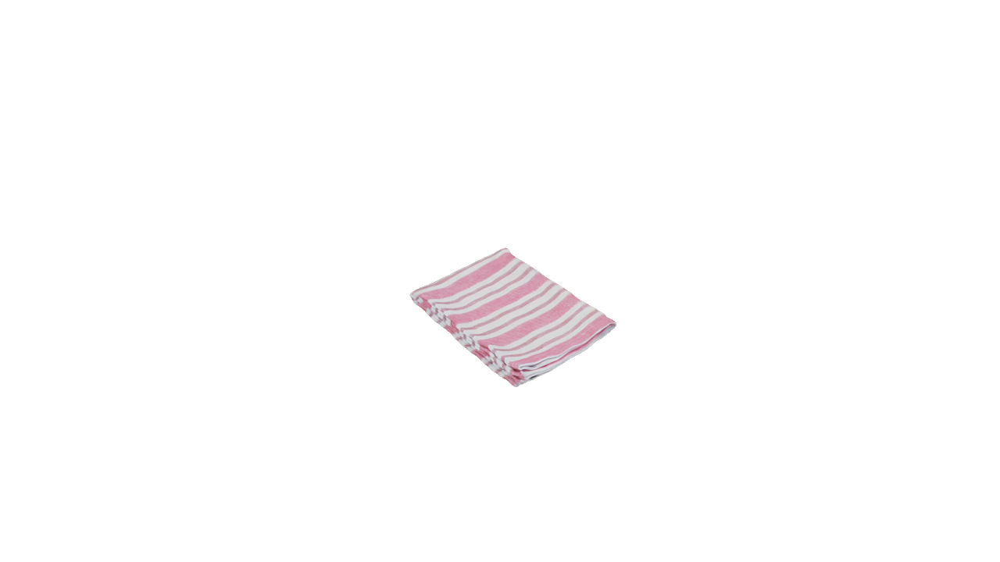
        </td>
    </tr>
    <tr>
        <td valign="top" width="60%">
            [**`Touching`**](../reference/object_states/touching.md)<br><br>  
            Defines whether this object is in contact with `other`.<br><br>
            <ul>
                <li>`get_value(system)`: returns `True / False`</li>
                <li>`set_value(system, new_value)`: Not supported.</li>
            </ul>
        </td>
        <td>
            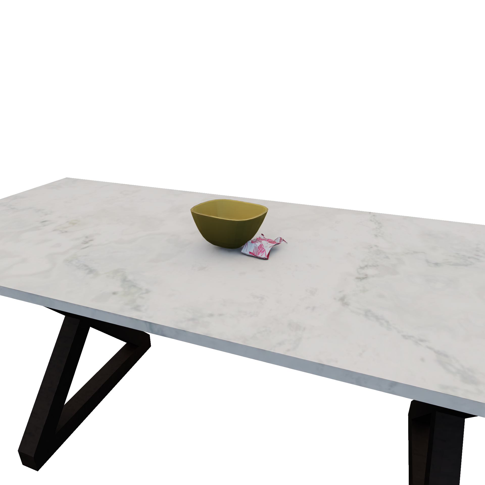
        </td>
    </tr>
    <tr>
        <td valign="top" width="60%">
            [**`Under`**](../reference/object_states/under.md)<br><br>  
            Defines whether this object is considered under `other`. This checks to make sure that this object is touching `other` and that `other` is in this object's `VerticalAdjacency` `positive_neighbors` list.<br><br>
            <ul>
                <li>`get_value(other)`: returns `True / False`</li>
                <li>`set_value(other, new_value)`: Only supported for `True`, which will sample poses for this object such that `get_value(other)=True`</li>
            </ul>
        </td>
        <td>
            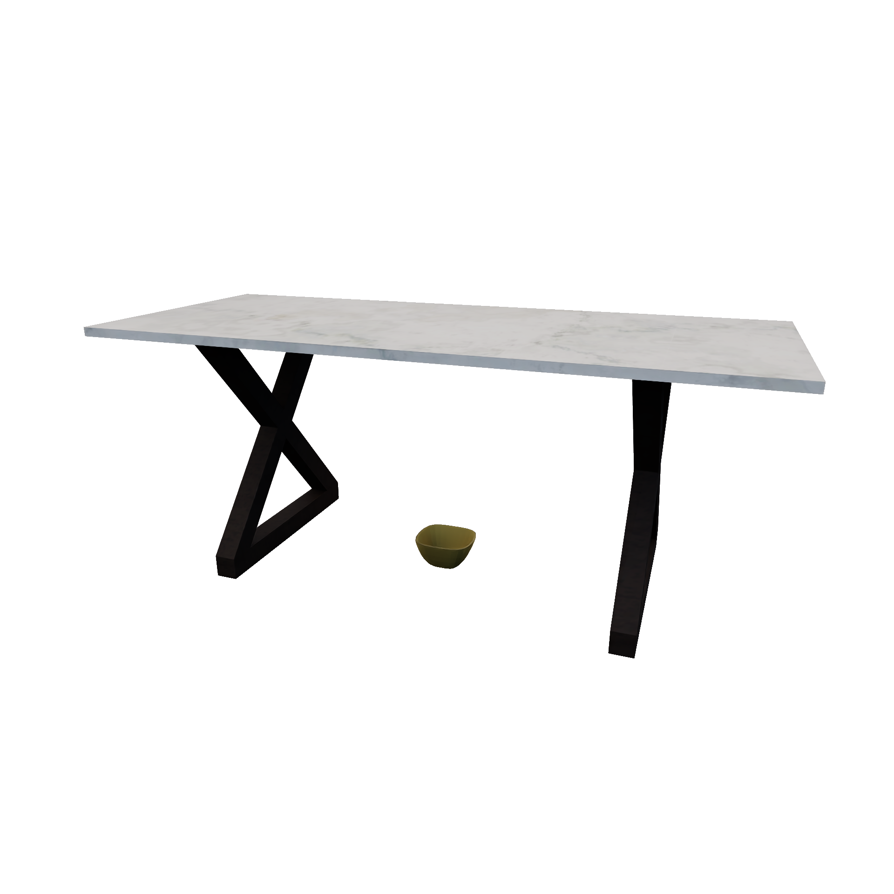
        </td>
    </tr>
</table>

### `IntrinsicObjectState`
These are object states that that define intrinsic properties of the object and therefore do not implement `get_state(...)` nor `set_state(...)`. 

<table markdown="span">
    <tr>
        <td valign="top" width="60%">
            [**`ParticleApplier` / `ParticleRemover`**](../reference/object_states/particle_modifier.md)<br><br>  
            Defines an object that has the ability to apply (spawn) or remove (absorb) particles from specific particle systems. This state's `conditions` property defines the per-particle system requirements in order for the applier / remover to be active for that specific system. For example, a spray bottle that is a `ParticleApplier` may require `toggled_on.get_value()` to be `True` in order to allow `cleaning_fluid` particles to be sprayed, simulating a "press" of the nozzle trigger. The `method` flag in the constructor determines the applier / removal behavior, which is triggered **_only_** by direct contact with the object (`ParticleModifyMethod.ADJACENCY`) or contact with a virtual volume (`ParticleModifyMethod.PROJECTION`). The former captures objects such as sponges, while the latter captures objects such as vacuum cleaners or spray bottles. This object state is updated at each simulation step such that particles are automatically added / removed as needed.<br><br>
            <ul>
                <li>`get_value()`: Not supported.</li>
                <li>`set_value()`: Not supported.</li>
            </ul>
        </td>
        <td>
            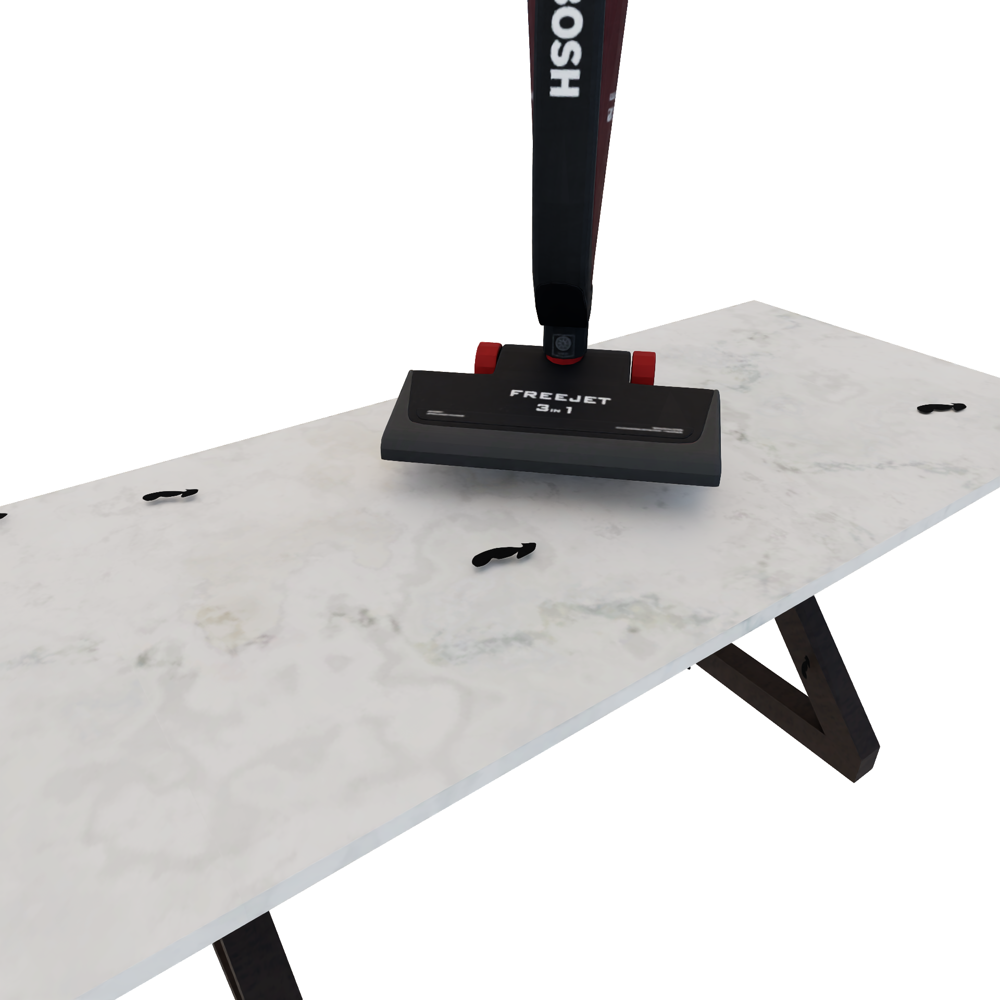
        </td>
    </tr>
    <tr>
        <td valign="top" width="60%">
            [**`ParticleSource` / `ParticleSink`**](../reference/object_states/particle_source_or_sink.md)<br><br>  
            Defines an object that has the ability to apply (spawn) or remove (absorb) particles from specific particle systems. The behavior is nearly identical to **`ParticleApplier` / `ParticleRemover`**, with the exception that contact is not strictly necessary to add / remove particles. This is to provide the distinction between, e.g., a particle _source_ such as a sink, which always spawns water every timestep irregardless of whether its faucet volume is in contact with a surface, vs. a particle _applier_ such as a spray bottle, which (for efficiency reasons) only spawns water if its virtual spray cone is overlapping with a surface.<br><br>
            <ul>
                <li>`get_value()`: Not supported.</li>
                <li>`set_value()`: Not supported.</li>
            </ul>
        </td>
        <td>
            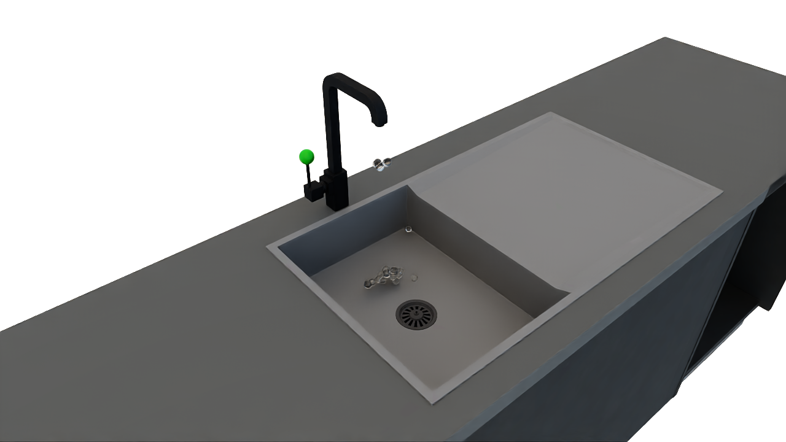
        </td>
    </tr>
</table>
