# :material-camera-outline: **Sensor**

## Description

Sensors play a crucial role in OmniGibson, as they facilitate the robots' observation of their environment. We offer two main classes of sensors:

 - `ScanSensor`: This includes a 2D LiDAR range sensor and an occupancy grid sensor.
 - `VisionSensor`: This sensor type features a camera equipped with various modalities, including RGB, depth, normals, three types of segmentation, optical flow, 2D and 3D bounding boxes.

## Usage

To obtain sensor readings, the `get_obs()` function can be invoked at multiple levels within our hierarchy:

 - From `Environment`: Provides
    1. All observations from all robots
    2. All task-related observations
    3. Observations from external sensors, if available
 - From `Robot`: Provides
    1. Readings from all sensors associated with the robot
    2. Proprioceptive observations for the robot (e.g., base pose, joint position, joint velocity)
 - From `Sensor`: Delivers all sensor readings based on the sensor's modalities. Additionally, our API allows for the simulation of real-world sensor behaviors by:
    1. Adding noise
    2. Dropping out sensor values to emulate missing data in sensor readings

Besides the actual data, `get_obs()` also returns a secondary dictionary containing information about the data, such as segmentation labels for vision sensors.

For instance, calling `get_obs()` on an environment with a single robot, which has all modalities enabled, might produce results similar to this:

Example observations

<pre><code>
data: 
{
    "robot0": {
        "robot0:laser_link:Lidar:0": {
            "scan": np.array(...),
            "occupancy_grid": np.array(...)
        },
        "robot0:eyes:Camera:0": {
            "rgb": np.array(...),
            "depth": np.array(...),
            "depth_linear": np.array(...),
            "normal": np.array(...),
            "flow": np.array(...),
            "bbox_2d_tight": np.array(...),
            "bbox_2d_loose": np.array(...),
            "bbox_3d": np.array(...),
            "seg_semantic": np.array(...),
            "seg_instance": np.array(...),
            "seg_instance_id": np.array(...)
        },
        "proprio": np.array(...)
    }
    "task": {
        "low_dim": np.array(...)
    }
}

info:
{
    'robot0': {
        'robot0:laser_link:Lidar:0': {}, 
        'robot0:eyes:Camera:0': {
            'seg_semantic': {'298104422': 'object', '764121901': 'background', '2814990211': 'agent'}, 
            'seg_instance': {...}, 
            'seg_instance_id': {...}
        }, 
        'proprio': {}
    }
}
</code></pre>

## Types
**`OmniGibson`** currently supports two types of sensors (`VisionSensor`, `ScanSensor`), and three types of observations(vision, scan, low-dimensional). Below, we describe each of the types of observations:

### Vision

Vision observations are captured by the [`VisionSensor`](../reference/sensors/vision_sensor.md) class, which encapsulates a virtual pinhole camera sensor equipped with various modalities, including RGB, depth, normals, three types of segmentation, optical flow, 2D and 3D bounding boxes, shown below:

<table markdown="span">
    <tr>
        <td valign="top" width="60%">
            <strong>RGB</strong>    
            RGB image of the scene from the camera perspective.   
            Size: (height, width, 4), numpy.uint8  
        </td>
        <td>
            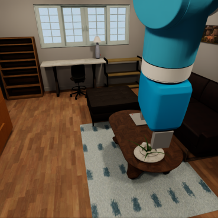
        </td>
    </tr>
    <tr>
        <td valign="top" width="60%">
            <strong>Depth</strong>    
            Distance between the camera and everything else in the scene.  
            Size: (height, width), numpy.float32  
        </td>
        <td>
            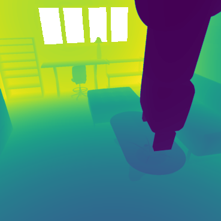
        </td>
    </tr>
    <tr>
        <td valign="top" width="60%">
            <strong>Depth Linear</strong>    
            Distance between the camera and everything else in the scene, where distance measurement is linearly proportional to the actual distance.  
            Size: (height, width), numpy.float32  
        </td>
        <td>
            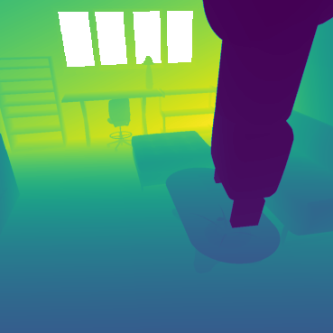
        </td>
    </tr>
    <tr>
        <td valign="top" width="60%">
            <strong>Normal</strong>    
            Surface normals - vectors perpendicular to the surface of objects in the scene.  
            Size: (height, width, 4), numpy.float32  
        </td>
        <td>
            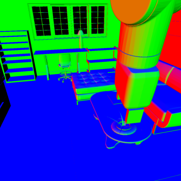
        </td>
    </tr>
    <tr>
        <td valign="top" width="60%">
            <strong>Semantic Segmentation</strong>    
            Each pixel is assigned a label, indicating the object category it belongs to (e.g., table, chair).  
            Size: (height, width), numpy.uint32  
            We also provide a dictionary containing the mapping of semantic IDs to object categories. You can get this here:   
                from omnigibson.utils.constants import semantic_class_id_to_name
        </td>
        <td>
            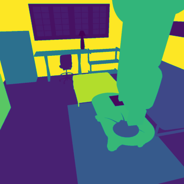
        </td>
    </tr>
    <tr>
        <td valign="top" width="60%">
            <strong>Instance Segmentation</strong>    
            Each pixel is assigned a label, indicating the specific object instance it belongs to (e.g., table1, chair2).  
            Size: (height, width), numpy.uint32  
        </td>
        <td>
            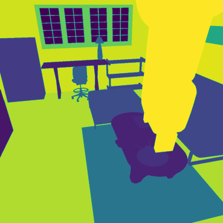
        </td>
    </tr>
    <tr>
        <td valign="top" width="60%">
            <strong>Instance Segmentation ID</strong>    
            Each pixel is assigned a label, indicating the specific object instance it belongs to (e.g., /World/table1/visuals, /World/chair2/visuals).  
            Size: (height, width), numpy.uint32  
        </td>
        <td>
            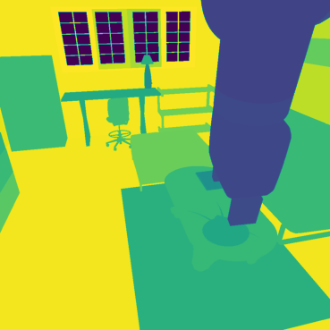
        </td>
    </tr>
    <tr>
        <td valign="top" width="60%">
            <strong>Optical Flow</strong>    
            Optical flow - motion of pixels belonging to objects caused by the relative motion between the camera and the scene.  
            Size: (height, width, 4), numpy.float32  
        </td>
        <td>
            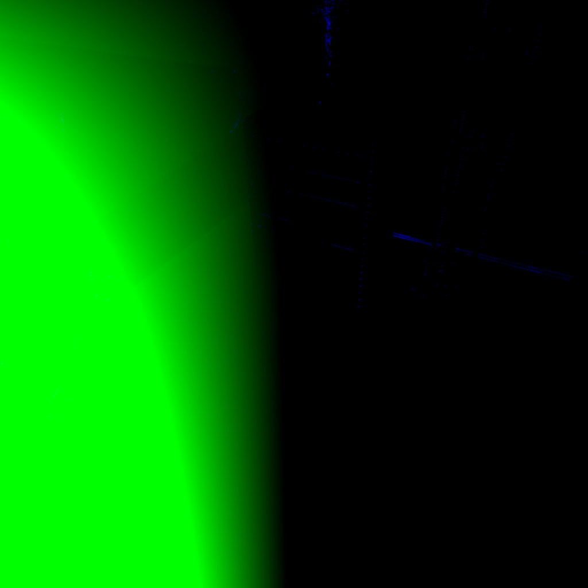
        </td>
    </tr>
    <tr>
        <td valign="top" width="60%">
            <strong>2D Bounding Box Tight</strong>    
            2D bounding boxes wrapping individual objects, excluding occluded parts.  
            Size: a list of  
            semanticID, numpy.uint32;  
            x_min, numpy.int32;  
            y_min, numpy.int32;   
            x_max, numpy.int32;  
            y_max, numpy.int32;  
            occlusion_ratio, numpy.float32  
        </td>
        <td>
            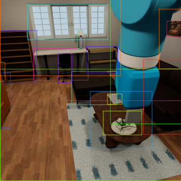
        </td>
    </tr>
    <tr>
        <td valign="top" width="60%">
            <strong>2D Bounding Box Loose</strong>    
            2D bounding boxes wrapping individual objects, including occluded parts.  
            Size: a list of  
            semanticID, numpy.uint32;  
            x_min, numpy.int32;  
            y_min, numpy.int32;   
            x_max, numpy.int32;  
            y_max, numpy.int32;  
            occlusion_ratio, numpy.float32  
        </td>
        <td>
            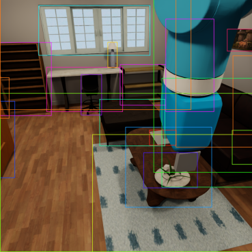
        </td>
    </tr>
    <tr>
        <td valign="top" width="60%">
            <strong>3D Bounding Box</strong>    
            3D bounding boxes wrapping individual objects.  
            Size: a list of  
            semanticID, numpy.uint32;  
            x_min, numpy.float32; 
            y_min, numpy.float32; 
            z_min, numpy.float32; 
            x_max, numpy.float32; 
            y_max, numpy.float32; 
            z_max, numpy.float32; 
            transform (4x4), numpy.float32; 
            occlusion_ratio, numpy.float32  
        </td>
        <td>
            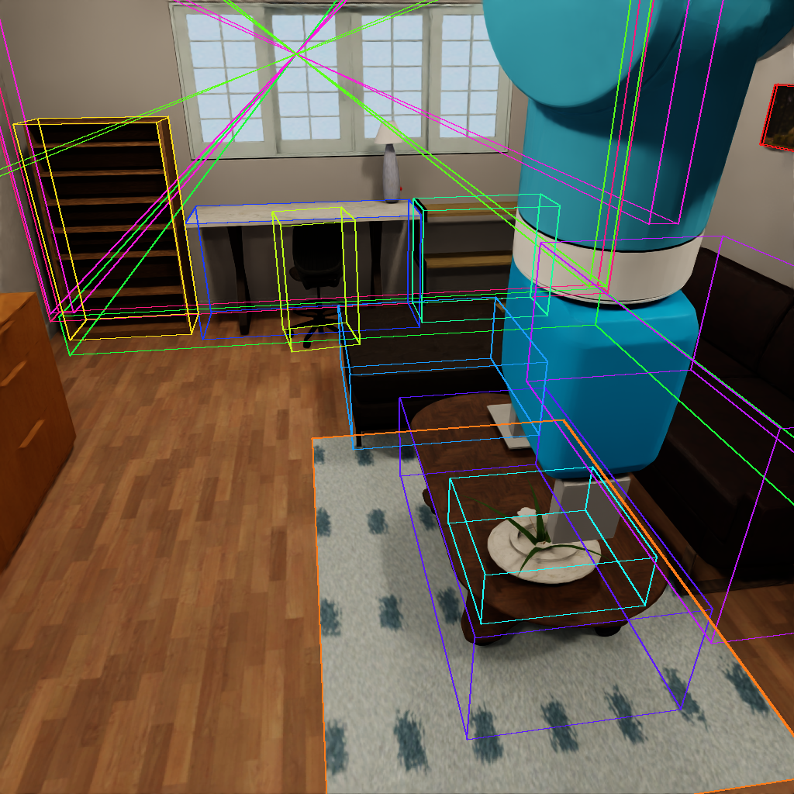
        </td>
    </tr>
</table>

### Range
Range observations are captured by the [`ScanSensor`](../reference/sensors/scan_sensor.md) class, which encapsulates a virtual 2D LiDAR range sensor with the following observations:

<table markdown="span">
    <tr>
        <td valign="top" width="60%">
            <strong>2D LiDAR</strong>    
            Distances to surrounding objects by emitting laser beams and detecting the reflected light.  
            Size: # of rays, numpy.float32  
        </td>
        <td>
            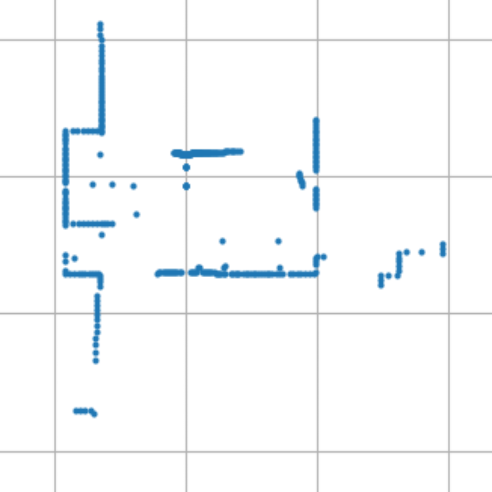
        </td>
    </tr>
    <tr>
        <td valign="top" width="60%">
            <strong>Occupancy Grid</strong>    
            A representation of the environment as a 2D grid where each cell indicates the presence (or absence) of an obstacle.  
            Size: (grid resolution, grid resolution), numpy.float32  
        </td>
        <td>
            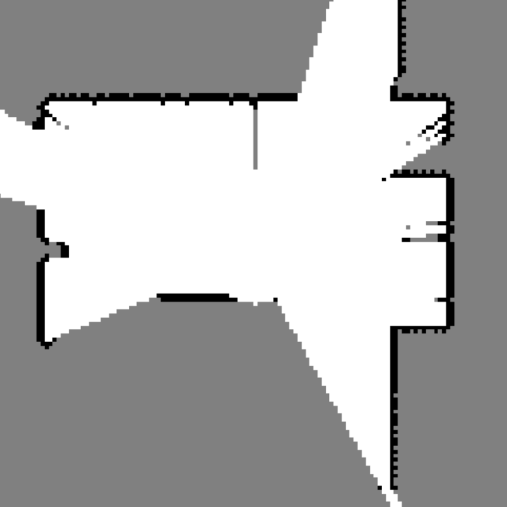
        </td>
    </tr>
</table>

### Low-Dimensional
Low-dimensional observations are not captured by any specific sensor, but are simply an aggregation of the underlying simulator state. There are two main types of low-dimensional observations: proprioception and task-relevant:

#### Proprioception
The following proprioceptive observations are supported off-the-shelf in **`OmniGibson`** (though additional ones may arbitrarily be added):

<table markdown="span">
    <tr>
        <td valign="top" width="100%">
            <strong>Joint Positions</strong>    
            Joint positions.  
            Size: # of joints, numpy.float64  
        </td>
        <td>
        </td>
    </tr>
    <tr>
        <td valign="top" width="100%">
            <strong>Joint Velocities</strong>    
            Joint velocities.  
            Size: # of joints, numpy.float64  
        </td>
        <td>
        </td>
    </tr>
    <tr>
        <td valign="top" width="100%">
            <strong>Joint Efforts</strong>    
            Torque measured at each joint.  
            Size: # of joints, numpy.float64  
        </td>
        <td>
        </td>
    </tr>
    <tr>
        <td valign="top" width="100%">
            <strong>Robot Position</strong>    
            Robot position in the world frame.  
            Size: (x, y, z), numpy.float64  
        </td>
        <td>
        </td>
    </tr>
    <tr>
        <td valign="top" width="100%">
            <strong>Robot Orientation</strong>    
            Robot global euler orientation.  
            Size: (roll, pitch, yaw), numpy.float64  
        </td>
        <td>
        </td>
    </tr>
    <tr>
        <td>
            <strong>Robot 2D Orientation</strong>    
            Robot orientation on the XY plane of the world frame.  
            Size: angle, numpy.float64  
        </td>
        <td>
        </td>
    </tr>
    <tr>
        <td valign="top" width="100%">
            <strong>Robot Linear Velocity</strong>    
            Robot linear velocity.  
            Size: (x_vel, y_vel, z_vel), numpy.float64  
        </td>
    </tr>
    <tr>
        <td valign="top" width="100%">
            <strong>Robot Angular Velocity</strong>    
            Robot angular velocity.  
            Size: (x_vel, y_vel, z_vel), numpy.float64  
        </td>
        <td>
        </td>
    </tr>
</table>

#### Task-Relevant
Each task implements its own set of relevant observations:

<table markdown="span" style="width: 100%;">
    <tr>
        <td valign="top" width="100%">
            <strong>Low-dim task observation</strong>    
            Task-specific observation, e.g. navigation goal position.  
            Size: # of low-dim observation, numpy.float64  
        </td>
        <td>
        </td>
    </tr>
</table>

