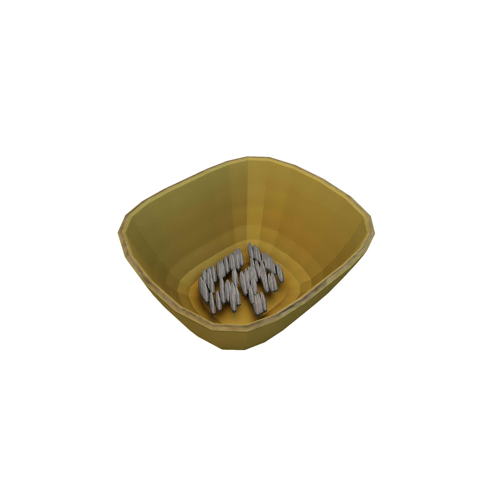
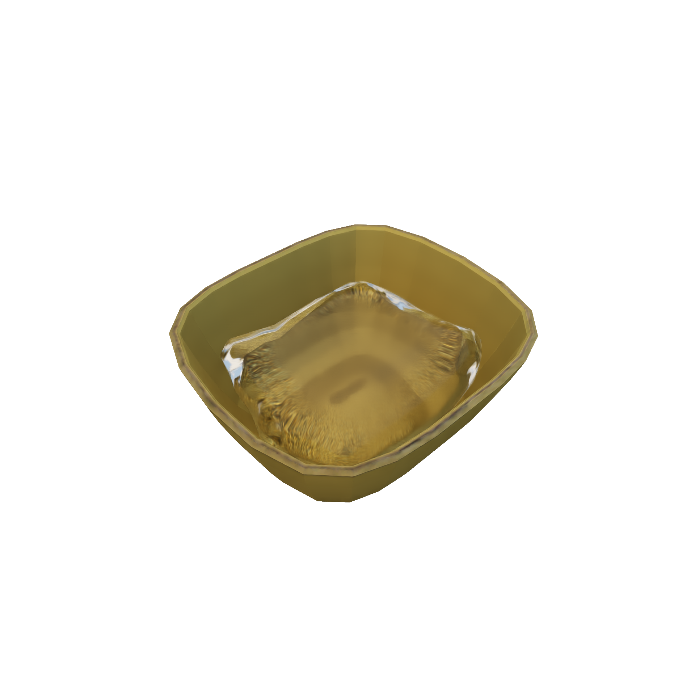
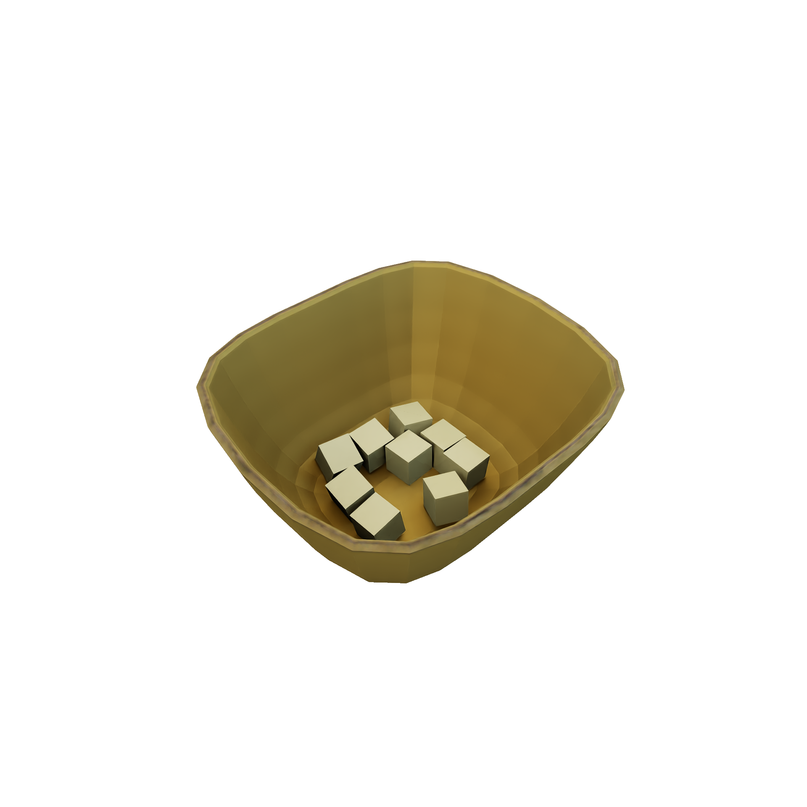
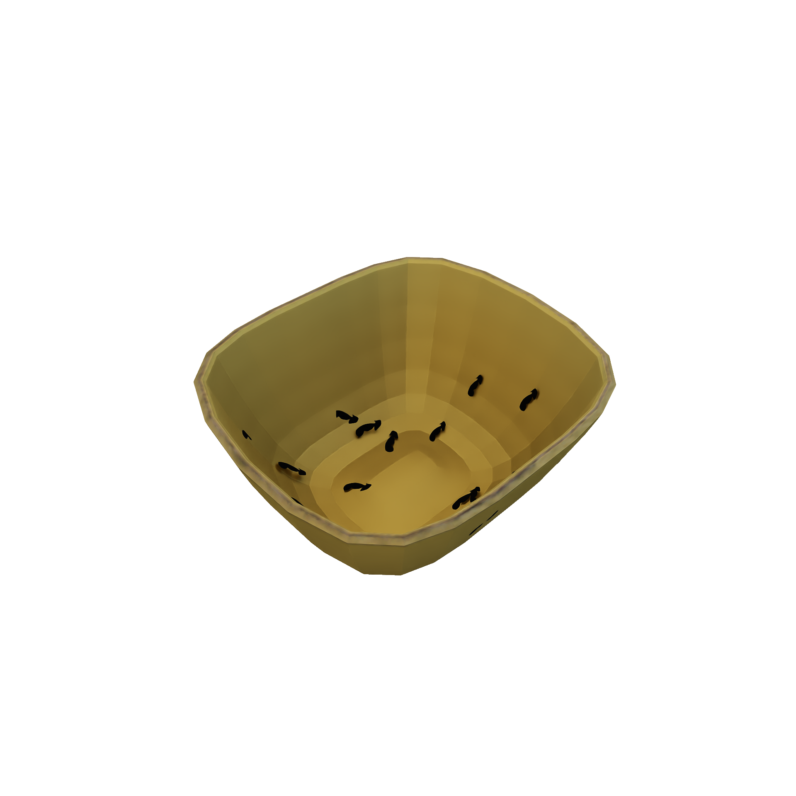

# :material-water-outline: **Systems**

## Description

**`OmniGibson`**'s [`System`](../reference/systems/system_base.md)s represents scene singletons that encapsulate a single particle type. These systems provide functionality for generating, tracking, and removing any number of particles arbitrarily located throughout the current scene.

## Usage

### Creating
For efficiency reasons, systems are created dynamically on an as-needed basis.  A system can be dynamically created (or referenced, if it already exists) via `scene.get_system(name)`, where `name` defines the name of the system. If you do not wish to initialize a system when refrencing it, e.g. for performance reasons, use the `force_init` flag: `scene.get_system(name, force_init=False)`. For a list of all possible system names, see `scene.available_systems.keys()`. 

### Runtime
A given system can be accessed at any time via `scene.get_system(...)`. Systems can generate particles via `system.generate_particles(...)`, track their states via `system.get_particles_position_orientation()`, and remove them via `system.remove_particles(...)`. Please refer to the [`System`'s API Reference](../reference/systems/system_base.md) for specific information regarding arguments. Moreover, specific subclasses may implement more complex generation behavior, such as `VisualParticleSystem`s `generate_group_particles(...)` which spawn visual (non-collidable) particles that are attached to a specific object.

## Types

**`OmniGibson`** currently supports 4 types of systems, each representing a different particle concept:

<table markdown="span">
    <tr>
        <td valign="top" width="60%">
            [**`GranularSystem`**](../reference/systems/micro_particle_system.md#systems.micro_particle_system.GranularSystem)    
            Represents particles that are fine-grained and are generally less than a centimeter in size, such as brown rice, black pepper, and chia seeds. These are particles subject to physics.  **Collides with...**
            <ul>
                <li>_Rigid bodies_: Yes</li>
                <li>_Cloth_: No</li>
                <li>_Other system particles_: No</li>
                <li>_Own system particles_: No (for stability reasons)</li>
            </ul>
        </td>
        <td>
            
        </td>
    </tr>
    <tr>
        <td valign="top" width="60%">
            [**`FluidSystem`**](../reference/systems/micro_particle_system.md#systems.micro_particle_system.FluidSystem)    
            Represents particles that are relatively homogeneous and liquid (though potentially viscous) in nature, such as water, baby oil, and hummus. These are particles subject to physics.  **Collides with...**
            <ul>
                <li>_Rigid bodies_: Yes</li>
                <li>_Cloth_: No</li>
                <li>_Other system particles_: No</li>
                <li>_Own system particles_: Yes</li>
            </ul>
        </td>
        <td>
            
        </td>
    </tr>
    <tr>
        <td valign="top" width="60%">
            [**`MacroPhysicalParticleSystem`**](../reference/systems/macro_particle_system.md#systems.macro_particle_system.MacroPhysicalParticleSystem)    
            Represents particles that are small but replicable, such as pills, diced fruit, and hair. These are particles subject to physics.  **Collides with...**
            <ul>
                <li>_Rigid bodies_: Yes</li>
                <li>_Cloth_: Yes</li>
                <li>_Other system particles_: Yes</li>
                <li>_Own system particles_: Yes</li>
            </ul>
        </td>
        <td>
            
        </td>
    </tr>
    <tr>
        <td valign="top" width="60%">
            [**`MacroVisualParticleSystem`**](../reference/systems/macro_particle_system.md#systems.macro_particle_system.MacroVisualParticleSystem)    
            Represents particles that are usually flat and varied, such as stains, lint, and moss. These are particles not subject to physics, and are attached rigidly to specific objects in the scene.  **Collides with...**
            <ul>
                <li>_Rigid bodies_: No</li>
                <li>_Cloth_: No</li>
                <li>_Other system particles_: No</li>
                <li>_Own system particles_: No</li>
            </ul>
        </td>
        <td>
            
        </td>
    </tr>
</table>

