# :material-magic-staff: **Transition Rules**

## Description

Transition rules are **`OmniGibson`**'s method for simulating complex physical phenomena not directly supported by the underlying omniverse physics engine, such as slicing, blending, and cooking. A given [`TransitionRule`](../reference/transition_rules.md#transition_rules.BaseTransitionRule) dynamically checks for its internal sets of conditions, and, if validated, executes its corresponding `transition`.

!!! info annotate "Transition Rules must be enabled before usage!"

    To enable usage of transition rules, `gm.ENABLE_TRANSITION_RULES` (1) must be set!

1. Access global macros via `from omnigibson.macros import gm`

## Usage

### Creating
Because `TransitionRule`s are monolithic classes, these should be defined _before_ **`OmniGibson`** is launched. A rule can be easily extended by subclassing the `BaseTransitionRule` class and implementing the necessary functions. For a simple example, please see the [`SlicingRule`](../reference/transition_rules.md#transition_rules.SlicingRule) class.

### Runtime
At runtime, each scene owns a [`TransitionRuleAPI`](../reference/transition_rules.md#transition_rules.TransitionRuleAPI) instance, which automatically handles the stepping and processing of all defined transition rule classes. For efficiency reasons, rules are dynamically loaded and checked based on the object / system set currently active in the scene. A rule will only be checked if there is at least one valid candidate combination amongst the current object / system set. For example, if there is no sliceable object present in this scene, then `SlicingRule` will not be active. Every time an object / system is added / removed from the scene, all rules are refreshed so that the current active transition rule set is always accurate.

In general, you should not need to interface with the `TransitionRuleAPI` class at all -- if your rule implementation is correct, then the API will automatically handle the transition when the appropriate conditions are met!

## Types

**`OmniGibson`** currently supports _ types of diverse transition rules, each representing a different complex physical phenomena:

<table markdown="span">
    <tr>
        <td valign="top" width="60%">
            [**`SlicingRule`**](../reference/transition_rules.md#transition_rules.SlicingRule)    
            Encapsulates slicing an object into halves (e.g.: slicing an apple).  **Required Candidates**
            <ul>
                <li>1+ sliceable objects</li>
                <li>1+ slicer objects</li>
            </ul>  **Conditions**
            <ul>
                <li>slicer is touching sliceable object</li>
                <li>slicer is active</li>
            </ul>  **Transition**
            <ul>
                <li>sliceable object is removed</li>
                <li>x2 sliceable half objects are spawned where the original object was</li>
            </ul>
        </td>
        <td>
            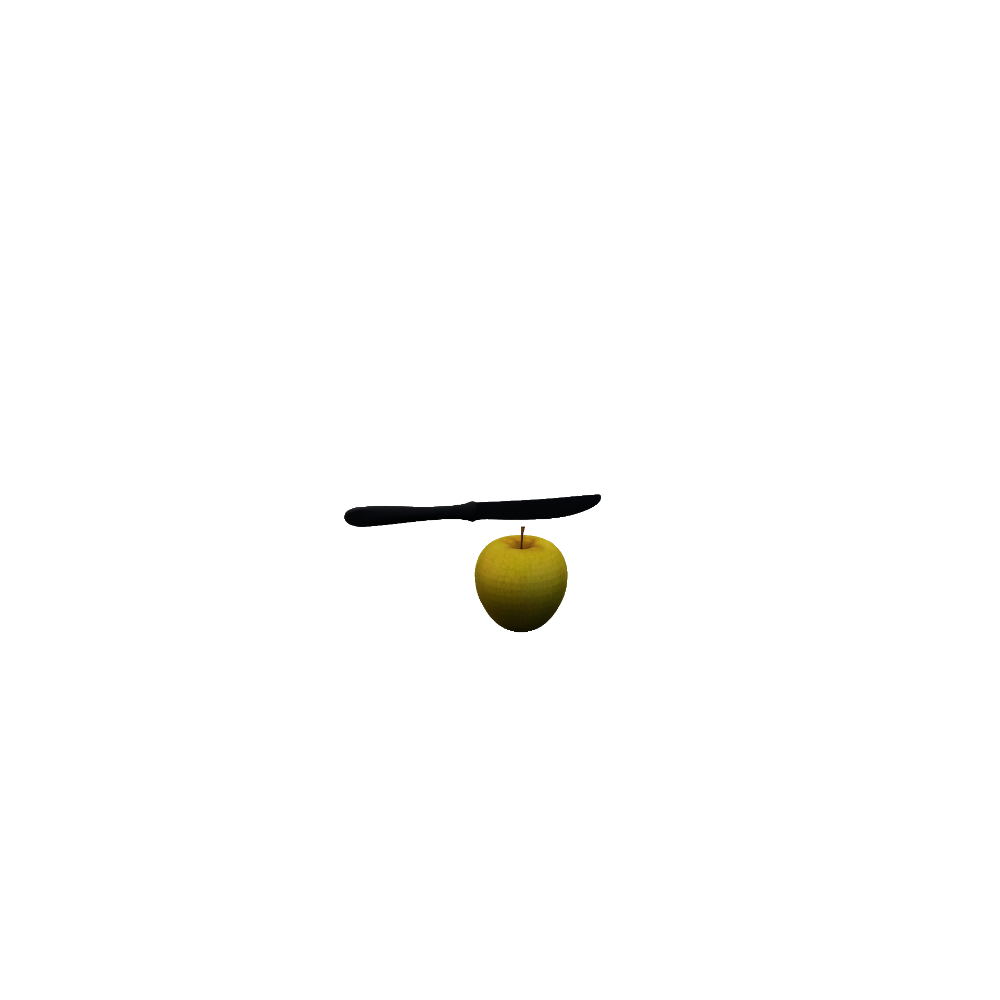
            
        </td>
    </tr>
    <tr>
        <td valign="top" width="60%">
            [**`DicingRule`**](../reference/transition_rules.md#transition_rules.DicingRule)    
            Encapsulates dicing a diceable into small chunks (e.g.: dicing an apple).  **Required Candidates**
            <ul>
                <li>1+ diceable objects</li>
                <li>1+ slicer objects</li>
            </ul>  **Conditions**
            <ul>
                <li>slicer is touching diceable object</li>
                <li>slicer is active</li>
            </ul>  **Transition**
            <ul>
                <li>sliceable object is removed</li>
                <li>diceable physical particles are spawned where the original object was</li>
            </ul>
        </td>
        <td>
            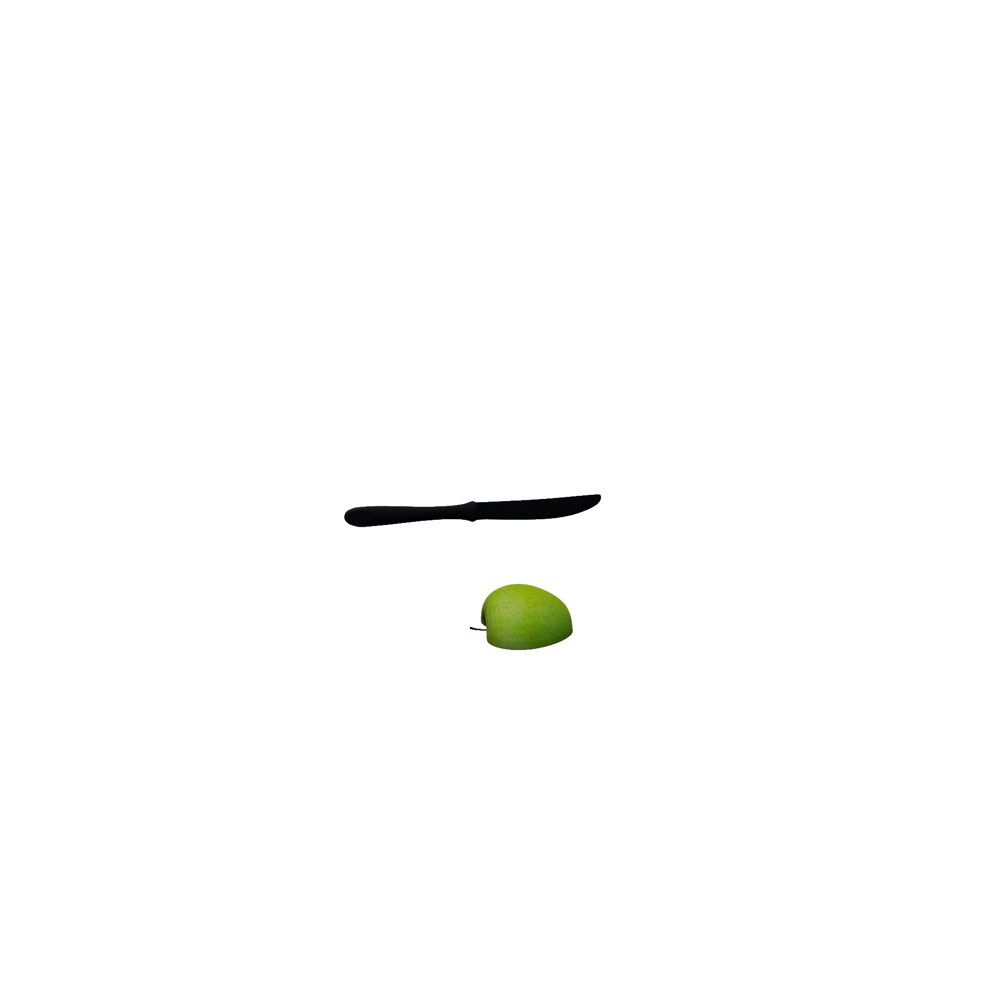
            
        </td>
    </tr>
    <tr>
        <td valign="top" width="60%">
            [**`MeltingRule`**](../reference/transition_rules.md#transition_rules.MeltingRule)    
            Encapsulates melting an object into liquid (e.g.: melting chocolate).  **Required Candidates**
            <ul>
                <li>1+ meltable objects</li>
            </ul>  **Conditions**
            <ul>
                <li>meltable object's max temperature > melting temperature</li>
            </ul>  **Transition**
            <ul>
                <li>meltable object is removed</li>
                <li>`melted__&lt;category&gt;` fluid particles are spawned where the original object was</li>
            </ul>
        </td>
        <td>
            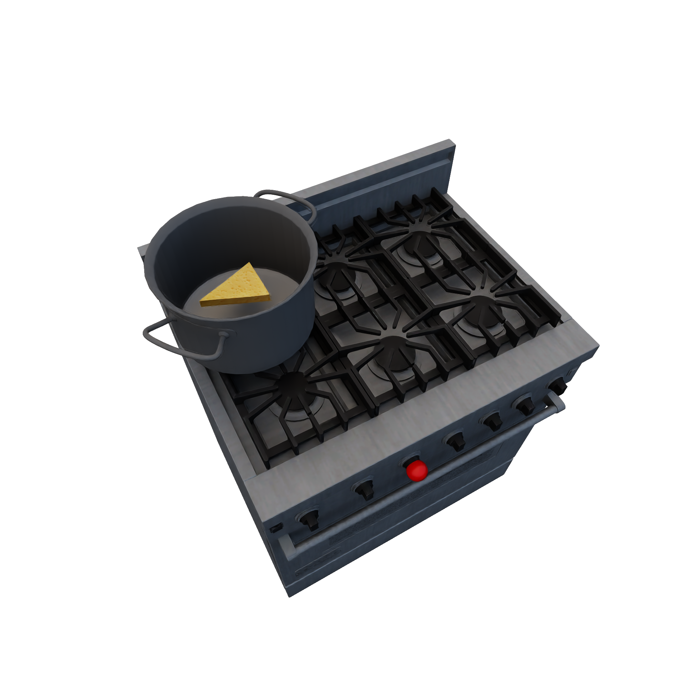
            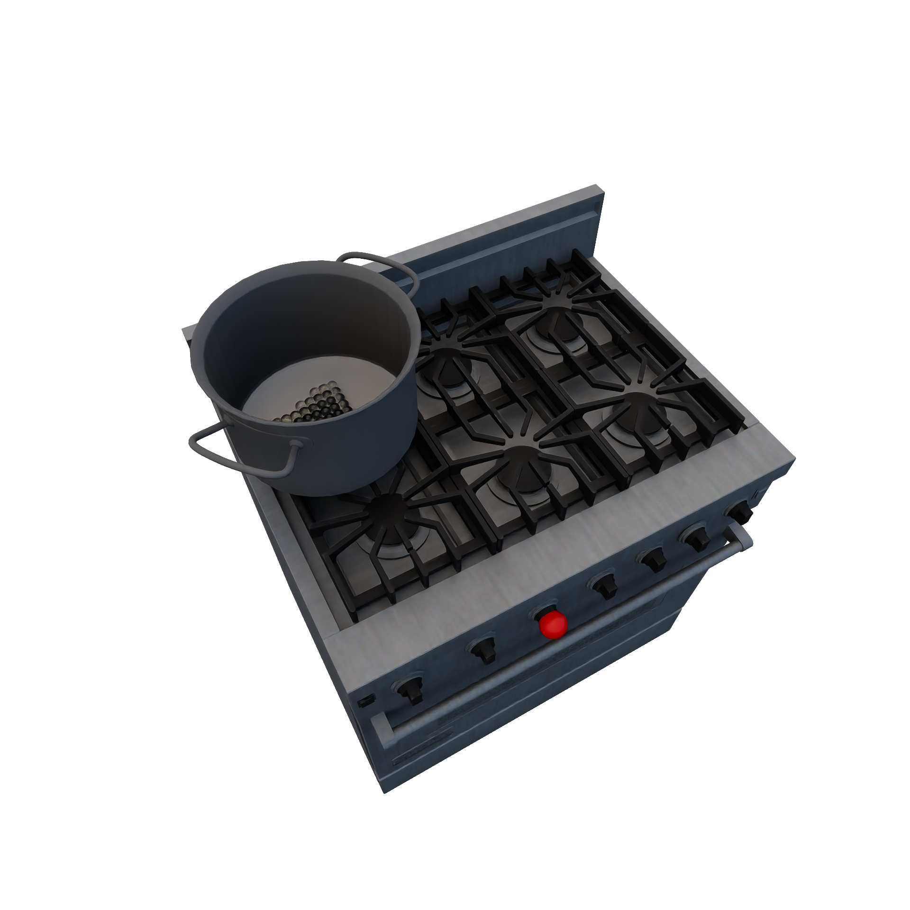
        </td>
    </tr>
    <tr>
        <td valign="top" width="60%">
            [**`CookingPhysicalParticleRule`**](../reference/transition_rules.md#transition_rules.CookingPhysicalParticleRule)    
            Encapsulates cooking physical particles (e.g.: boiling water).  **Required Candidates**
            <ul>
                <li>1+ fillable and heatable objects</li>
            </ul>  **Conditions**
            <ul>
                <li>fillable object is heated</li>
            </ul>  **Transition**
            <ul>
                <li>particles within the fillable object are removed</li>
                <li>`cooked__&lt;category&gt;` particles are spawned where the original particles were</li>
            </ul>
        </td>
        <td>
            
            
        </td>
    </tr>
    <tr>
        <td valign="top" width="60%">
            [**`ToggleableMachineRule`**](../reference/transition_rules.md#transition_rules.ToggleableMachineRule)    
            Encapsulates transformative changes when a button is pressed (e.g.: blending a smoothie). Valid transitions are defined by a pre-defined set of "recipes" (input / output combinations).  **Required Candidates**
            <ul>
                <li>1+ fillable and toggleable objects</li>
            </ul>  **Conditions**
            <ul>
                <li>fillable object has just been toggled on</li>
            </ul>  **Transition**
            <ul>
                <li>all objects and particles within the fillable object are removed</li>
                <li>if relevant recipe is found given inputs, relevant output is spawned in the fillable object, otherwise "sludge" is spawned instead</li>
            </ul>
        </td>
        <td>
            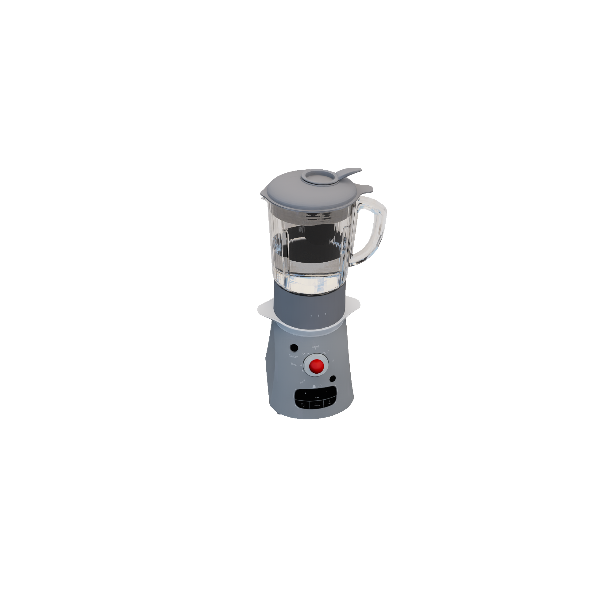
            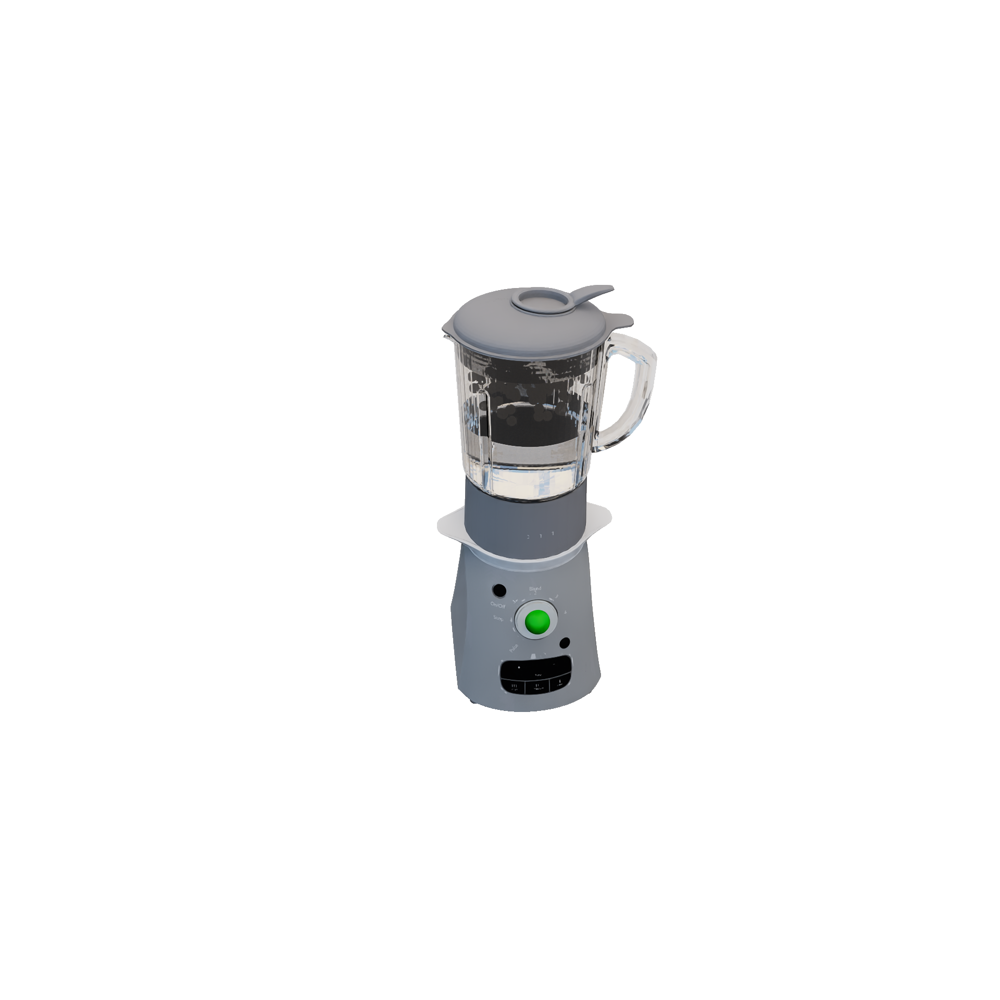
        </td>
    </tr>
    <tr>
        <td valign="top" width="60%">
            [**`MixingToolRule`**](../reference/transition_rules.md#transition_rules.MixingToolRule)    
            Encapsulates transformative changes during tool-driven mixing (e.g.: mixing a drink with a stirrer). Valid transitions are defined by a pre-defined set of "recipes" (input / output combinations).  **Required Candidates**
            <ul>
                <li>1+ fillable objects</li>
                <li>1+ mixingTool objects</li>
            </ul>  **Conditions**
            <ul>
                <li>mixingTool object has just touched fillable object</li>
                <li>valid recipe is found</li>
            </ul>  **Transition**
            <ul>
                <li>recipe-relevant objects and particles within the fillable object are removed</li>
                <li>relevant recipe output is spawned in the fillable object</li>
            </ul>
        </td>
        <td>
            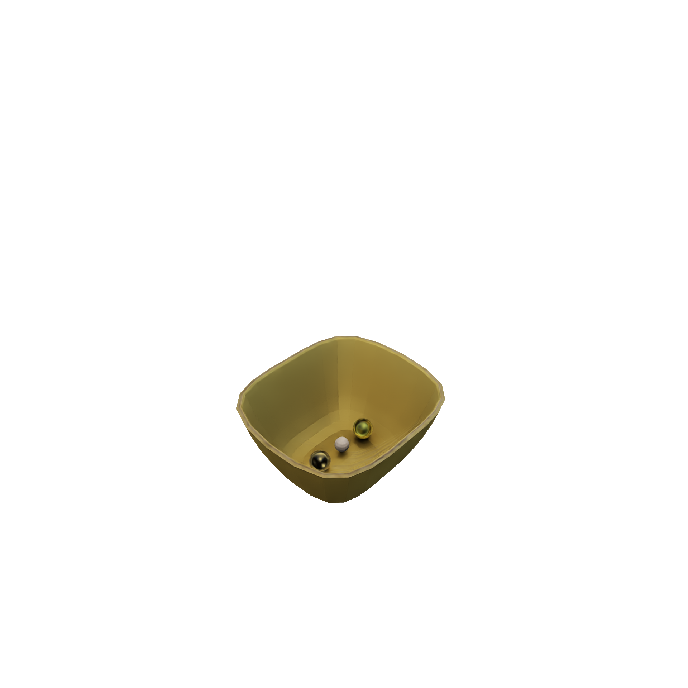
            
        </td>
    </tr>
    <tr>
        <td valign="top" width="60%">
            [**`CookingRule`**](../reference/transition_rules.md#transition_rules.CookingRule)    
            Encapsulates transformative changes during cooking (e.g.: baking a cake). Valid transitions are defined by a pre-defined set of "recipes" (input / output combinations).  **Required Candidates**
            <ul>
                <li>1+ fillable objects</li>
                <li>1+ heatSource objects</li>
            </ul>  **Conditions**
            <ul>
                <li>heatSource object is on and affecting fillable object</li>
                <li>a certain amount of time has passed</li>
            </ul>  **Transition**
            <ul>
                <li>recipe-relevant objects and particles within the fillable object are removed</li>
                <li>relevant recipe output is spawned in the fillable object</li>
            </ul>
        </td>
        <td>
            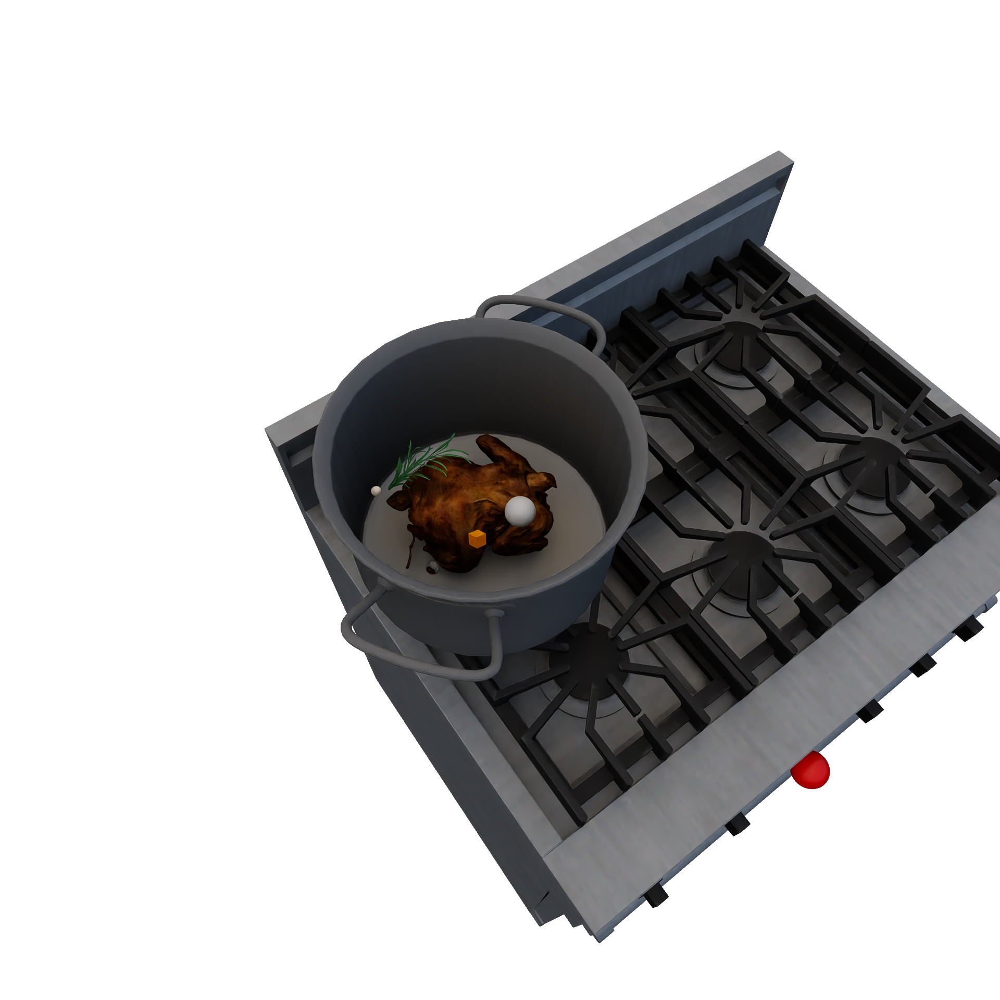
            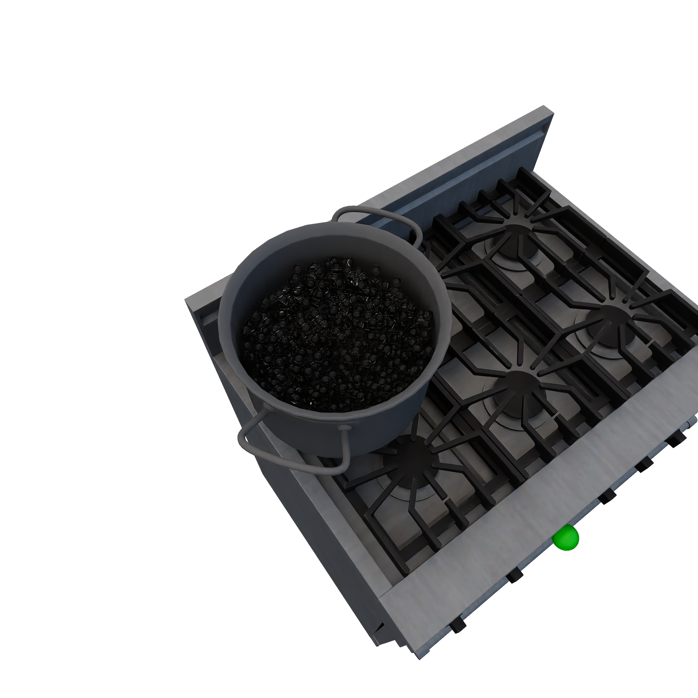
        </td>
    </tr>
    <tr>
        <td valign="top" width="60%">
            [**`WasherRule`**](../reference/transition_rules.md#transition_rules.WasherRule)    
            Encapsulates washing mechanism (e.g.: cleaning clothes in the washing machine with detergent). Washing behavior (i.e.: what types of particles are removed from clothes during washing) is predefined.  **Required Candidates**
            <ul>
                <li>1+ washer objects</li>
            </ul>  **Conditions**
            <ul>
                <li>washer object is closed</li>
                <li>washer object has just been toggled on</li>
            </ul>  **Transition**
            <ul>
                <li>all "stain"-type particles within the washer object are removed</li>
                <li>all objects within the washer object are covered and saturated with water</li>
            </ul>
        </td>
        <td>
            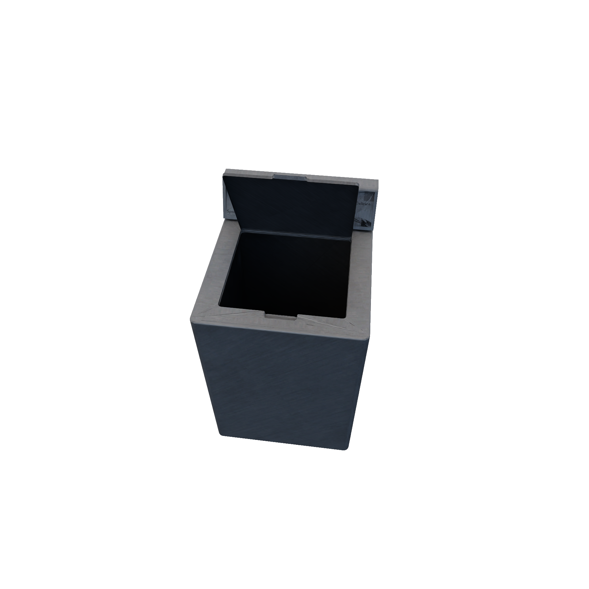
            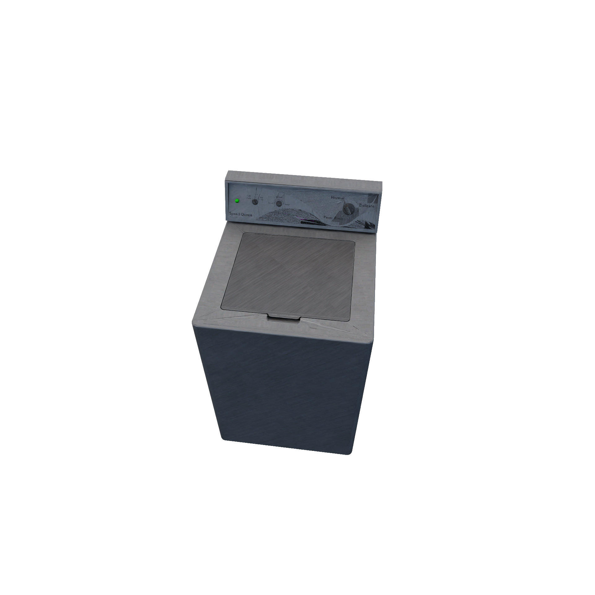
        </td>
    </tr>
    <tr>
        <td valign="top" width="60%">
            [**`DryerRule`**](../reference/transition_rules.md#transition_rules.DryerRule)    
            Encapsulates drying mechanism (e.g.: drying clothes in the drying machine).  **Required Candidates**
            <ul>
                <li>1+ clothes_dryer objects</li>
            </ul>  **Conditions**
            <ul>
                <li>washer object is closed</li>
                <li>washer object has just been toggled on</li>
            </ul>  **Transition**
            <ul>
                <li>all water particles within the washer object are removed</li>
                <li>all objects within the washer object are no longer saturated with water</li>
            </ul>
        </td>
        <td>
            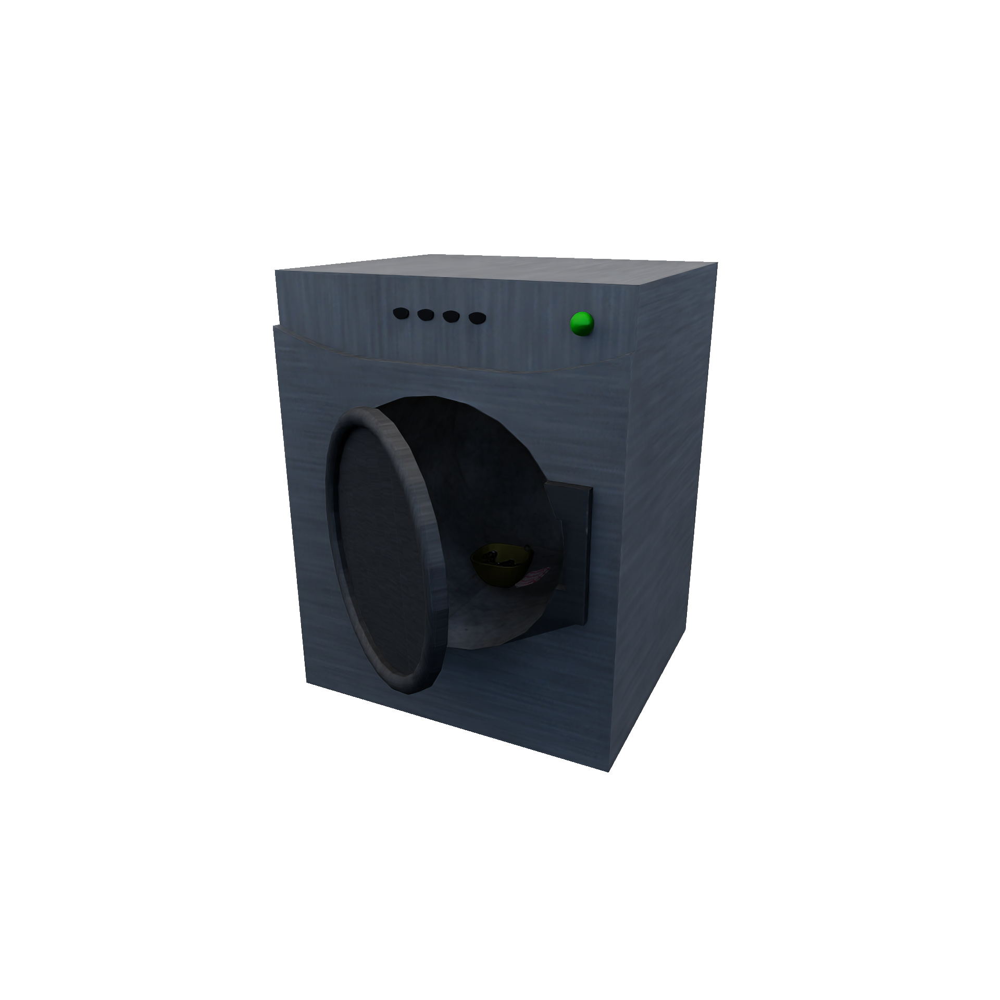
            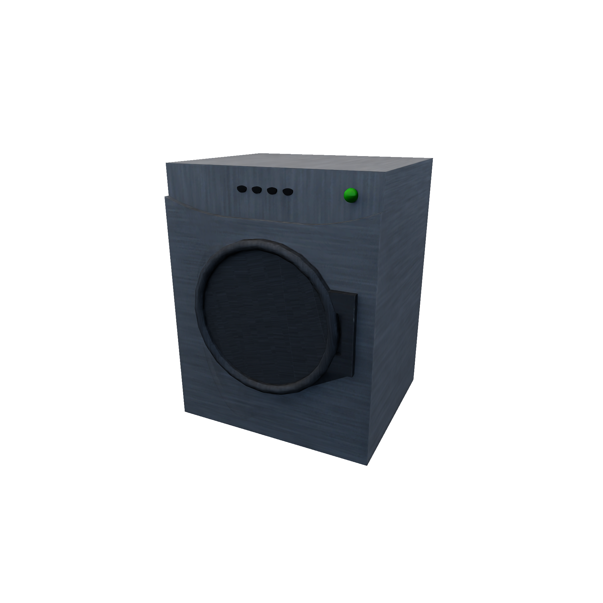
        </td>
    </tr>
</table>

