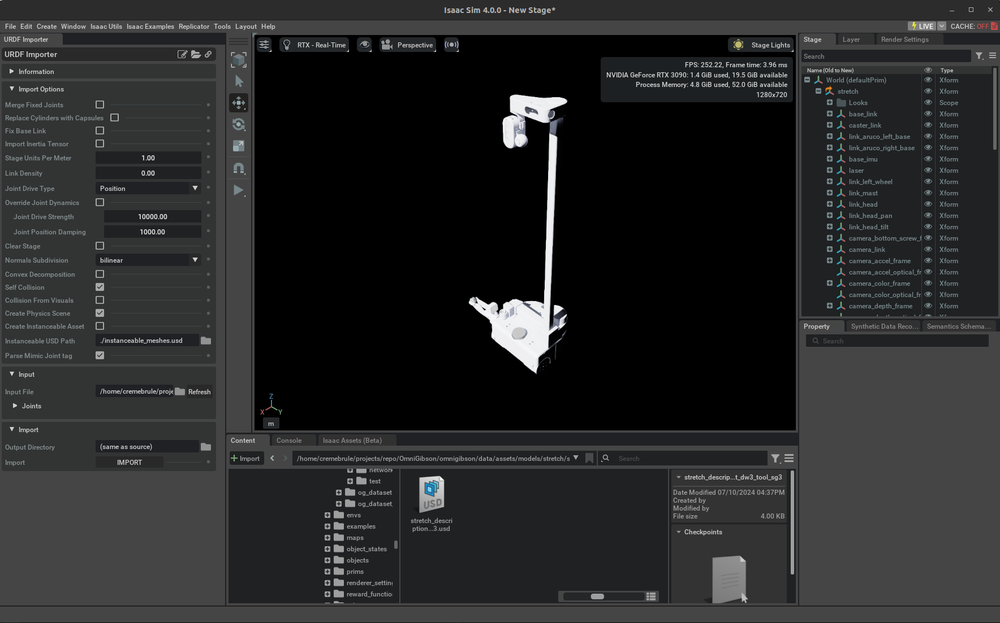
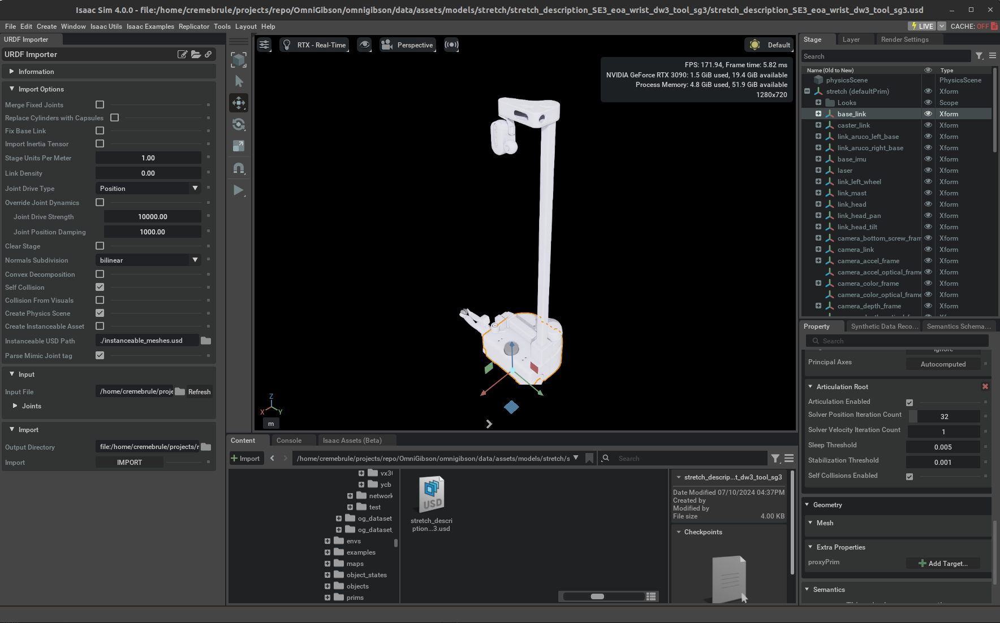
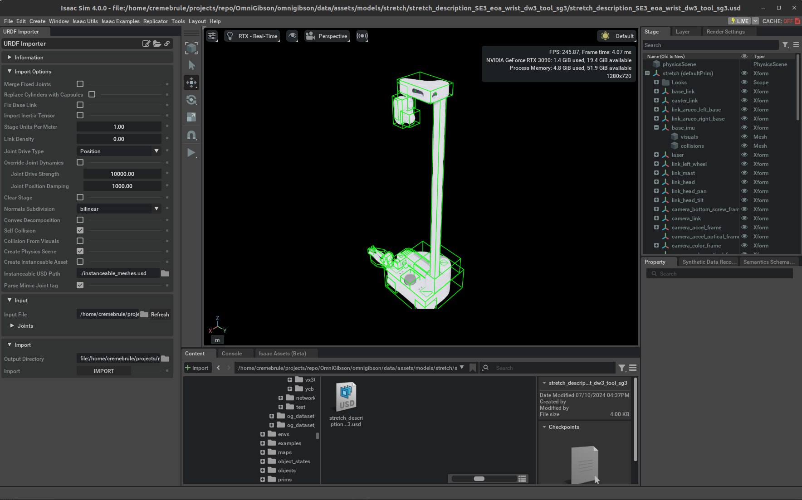
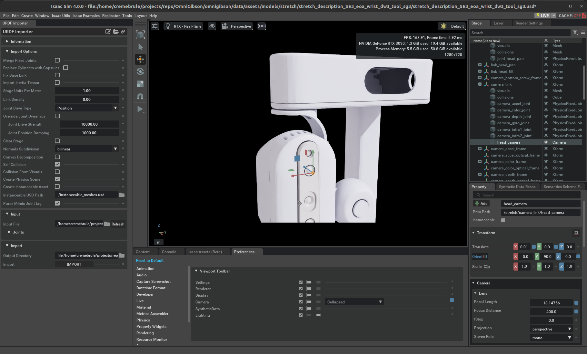
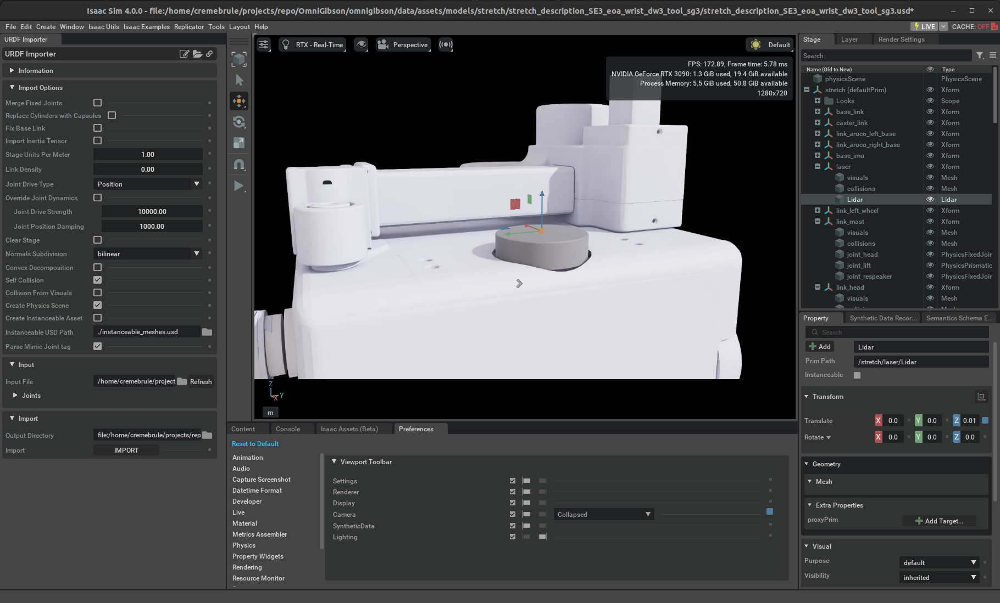
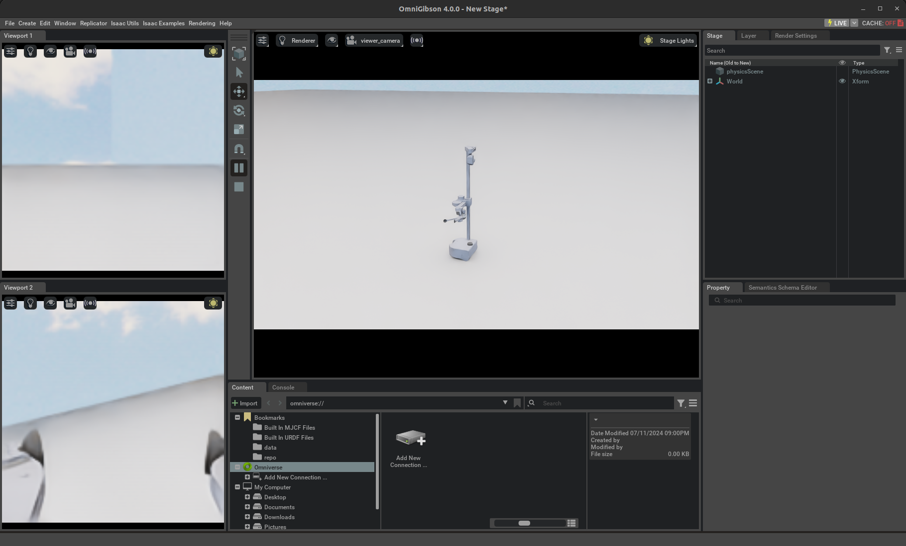

# :material-robot-industrial: **Importing a Custom Robot**

While OmniGibson assets includes a set of commonly-used robots, users might still want to import robot model of there own. This tutorial introduces users 

## Preparation

In order to import a custom robot, You will need to first prepare your robot model file. For the next section we will assume you have the URDF file for the robots ready with all the corresponding meshes and textures. If your robot file is in another format (e.g. MCJF), please convert it to URDF format. If you already have the robot model USD file, feel free to skip the next section and move onto [Create the Robot Class](#create-the-robot-class).

Below, we will walk through each step for importing a new custom robot into **OmniGibson**. We use [Hello Robotic](https://hello-robot.com/)'s [Stretch](https://hello-robot.com/stretch-3-product) robot as an example, taken directly from their [official repo](https://github.com/hello-robot/stretch_urdf).

## Convert from URDF to USD
There are two ways to convert our raw robot URDF into an OmniGibson-compatible USD file. The first is by using our integrated script, while the other method is using IsaacSim's native URDF-to-USD converter via the GUI. We highly recommend our script version, as it both wraps the same functionality from the underlying IsaacSim converter as well as providing useful features such as automatic convex decomposition of collision meshes, programmatic adding of sensors, etc.

### Option 1: Using Our 1-Liner Script (Recommended)
Our custom robot importer [`import_custom_robot.py`](https://github.com/StanfordVL/OmniGibson/tree/main/omnigibson/examples/robots/import_custom_robot.py) wraps the native URDF Importer from Isaac Sim to convert our robot URDF model into USD format. Please see the following steps for running this script:

1. All that is required is a single source config yaml file that dictates how the URDF should be post-processed when being converted into a USD. You can run `import_custom_robot.py --help` to see a detailed example configuration used, which is also shown below (`r1_pro_source_config.yaml`) for your convenience.
2. All output files are written to `<gm.CUSTOM_DATASET_PATH>/objects/robot/<name>`. Please move this directory to `<gm.ASSET_PATH>/objects/<name>` so it can be imported into **OmniGibson**.

Some notes about the importing script:

- The importing procedure can be summarized as follows:

  1. Copy the raw URDF file + any dependencies into the `gm.CUSTOM_DATASET_PATH` directory
  2. Updates the URDF + meshes to ensure all scaling is positive
  3. Generates collision meshes for each robot link (as specified by the source config)
  4. Generates metadata necessary for **OmniGibson**
  5. Converts the post-processed URDF into USD (technically, USDA) format
  6. Generates relevant semantic metadata for the given object, given its category
  7. Generates visual spheres, cameras, and lidars (in that order, as specified by the source config)
  8. Updates wheel approximations (as specified by the source config)
  9. Generates holonomic base joints (as specified by the source config)
  10. Generates configuration files needed for CuRobo motion planning (as specified by the source config)

- If `merge_fixed_joints=true`, all robot links that are connected to a parent link via a fixed joint will be merged directly into the parent joint. This means that the USD will _not_ contain these links! However, this collapsing occurs during the final URDF to USD conversion, meaning that these links _can_ be referenced beforehand (e.g.: when specifying desired per-link collision decomposition behavior)
- [CuRobo](https://curobo.org/index.html) is a highly performant motion planner that is used in **OmniGibson** for specific use-cases, such as skills. However, CuRobo requires a manually-specified sphere representation of the robot to be defined. These values can be generated using [IsaacSim's interactive GUI](https://curobo.org/tutorials/1_robot_configuration.html#robot-collision-representation), and should be exported and copied into the robot source config yaml file used for importing into **OmniGibson**. You can see the set of values used for the R1 robot below. For more information regarding specific keys specified, please see CuRobo's [Configuring a New Robot](https://curobo.org/tutorials/1_robot_configuration.html) tutorial.

??? code "r1_pro_source_config.yaml"
    ``` yaml linenums="1"

    urdf_path: r1_pro_source.urdf       # (str) Absolute path to robot URDF to import
    name: r1                            # (str) Name to assign to robot
    headless: false                     # (bool) if set, run without GUI
    overwrite: true                     # (bool) if set, overwrite any existing files
    merge_fixed_joints: false           # (bool) whether to merge fixed joints in the robot hierarchy or not
    base_motion:
      wheel_links:                      # (list of str): links corresponding to wheels
        - wheel_link1
        - wheel_link2
        - wheel_link3
      wheel_joints:                     # (list of str): joints corresponding to wheel motion
        - servo_joint1
        - servo_joint2
        - servo_joint3
        - wheel_joint1
        - wheel_joint2
        - wheel_joint3
      use_sphere_wheels: true           # (bool) whether to use sphere approximation for wheels (better stability)
      use_holonomic_joints: true        # (bool) whether to use joints to approximate a holonomic base. In this case, all
                                        #       wheel-related joints will be made into fixed joints, and 6 additional
                                        #       "virtual" joints will be added to the robot's base capturing 6DOF movement,
                                        #       with the (x,y,rz) joints being controllable by motors
    collision:
      decompose_method: coacd           # (str) [coacd, convex, or null] collision decomposition method
      hull_count: 8                     # (int) per-mesh max hull count to use during decomposition, only relevant for coacd
      coacd_links: []                   # (list of str): links that should use CoACD to decompose collision meshes
      convex_links:                     # (list of str): links that should use convex hull to decompose collision meshes
        - base_link
        - wheel_link1
        - wheel_link2
        - wheel_link3
        - torso_link1
        - torso_link2
        - torso_link3
        - torso_link4
        - left_arm_link1
        - left_arm_link4
        - left_arm_link5
        - right_arm_link1
        - right_arm_link4
        - right_arm_link5
      no_decompose_links: []            # (list of str): links that should not have any post-processing done to them
      no_collision_links:               # (list of str) links that will have any associated collision meshes removed
        - servo_link1
        - servo_link2
        - servo_link3
    eef_vis_links:                      # (list of dict) information for adding cameras to robot
      - link: left_eef_link             # same format as @camera_links
        parent_link: left_arm_link6
        offset:
          position: [0, 0, 0.06]
          orientation: [0, 0, 0, 1]
      - link: right_eef_link            # same format as @camera_links
        parent_link: right_arm_link6
        offset:
          position: [0, 0, 0.06]
          orientation: [0, 0, 0, 1]
    camera_links:                       # (list of dict) information for adding cameras to robot
      - link: eyes                      # (str) link name to add camera. Must exist if @parent_link is null, else will be
                                        #       added as a child of the parent
        parent_link: torso_link4        # (str) optional parent link to use if adding new link
        offset:                         # (dict) local pos,ori offset values. if @parent_link is specified, defines offset
                                        #       between @parent_link and @link specified in @parent_link's frame.
                                        #       Otherwise, specifies offset of generated prim relative to @link's frame
          position: [0.0732, 0, 0.4525]                     # (3-tuple) (x,y,z) offset -- this is done BEFORE the rotation
          orientation: [0.4056, -0.4056, -0.5792, 0.5792]   # (4-tuple) (x,y,z,w) offset
      - link: left_eef_link
        parent_link: null
        offset:
          position: [0.05, 0, -0.05]
          orientation: [-0.7011, -0.7011, -0.0923, -0.0923]
      - link: right_eef_link
        parent_link: null
        offset:
          position: [0.05, 0, -0.05]
          orientation: [-0.7011, -0.7011, -0.0923, -0.0923]
    lidar_links: []                     # (list of dict) information for adding cameras to robot
    curobo:
      eef_to_gripper_info:              # (dict) Maps EEF link name to corresponding gripper links / joints
        right_eef_link:
          links: ["right_gripper_link1", "right_gripper_link2"]
          joints: ["right_gripper_axis1", "right_gripper_axis2"]
        left_eef_link:
          links: ["left_gripper_link1", "left_gripper_link2"]
          joints: ["left_gripper_axis1", "left_gripper_axis2"]
      flip_joint_limits: []             # (list of str) any joints that have a negative axis specified in the
                                        #       source URDF
      lock_joints: {}                   # (dict) Maps joint name to "locked" joint configuration. Any joints
                                        #       specified here will not be considered active when motion planning
                                        #       NOTE: All gripper joints and non-controllable holonomic joints
                                        #       will automatically be added here
      self_collision_ignore:            # (dict) Maps link name to list of other ignore links to ignore collisions
                                        #       with. Note that bi-directional specification is not necessary,
                                        #       e.g.: "torso_link1" does not need to be specified in
                                        #       "torso_link2"'s list if "torso_link2" is already specified in
                                        #       "torso_link1"'s list
        base_link: ["torso_link1", "wheel_link1", "wheel_link2", "wheel_link3"]
        torso_link1: ["torso_link2"]
        torso_link2: ["torso_link3", "torso_link4"]
        torso_link3: ["torso_link4"]
        torso_link4: ["left_arm_link1", "right_arm_link1", "left_arm_link2", "right_arm_link2"]
        left_arm_link1: ["left_arm_link2"]
        left_arm_link2: ["left_arm_link3"]
        left_arm_link3: ["left_arm_link4"]
        left_arm_link4: ["left_arm_link5"]
        left_arm_link5: ["left_arm_link6"]
        left_arm_link6: ["left_gripper_link1", "left_gripper_link2"]
        right_arm_link1: ["right_arm_link2"]
        right_arm_link2: ["right_arm_link3"]
        right_arm_link3: ["right_arm_link4"]
        right_arm_link4: ["right_arm_link5"]
        right_arm_link5: ["right_arm_link6"]
        right_arm_link6: ["right_gripper_link1", "right_gripper_link2"]
        left_gripper_link1: ["left_gripper_link2"]
        right_gripper_link1: ["right_gripper_link2"]
      collision_spheres:                # (dict) Maps link name to list of collision sphere representations,
                                        #       where each sphere is defined by its (x,y,z) "center" and "radius"
                                        #       values. This defines the collision geometry during motion planning
        base_link:
          - "center": [-0.009, -0.094, 0.131]
            "radius": 0.09128
          - "center": [-0.021, 0.087, 0.121]
            "radius": 0.0906
          - "center": [0.019, 0.137, 0.198]
            "radius": 0.07971
          - "center": [0.019, -0.14, 0.209]
            "radius": 0.07563
          - "center": [0.007, -0.018, 0.115]
            "radius": 0.08448
          - "center": [0.119, -0.176, 0.209]
            "radius": 0.05998
          - "center": [0.137, 0.118, 0.208]
            "radius": 0.05862
          - "center": [-0.152, -0.049, 0.204]
            "radius": 0.05454
        torso_link1:
          - "center": [-0.001, -0.014, -0.057]
            "radius": 0.1
          - "center": [-0.001, -0.127, -0.064]
            "radius": 0.07
          - "center": [-0.001, -0.219, -0.064]
            "radius": 0.07
          - "center": [-0.001, -0.29, -0.064]
            "radius": 0.07
          - "center": [-0.001, -0.375, -0.064]
            "radius": 0.07
          - "center": [-0.001, -0.419, -0.064]
            "radius": 0.07
        torso_link2:
          - "center": [-0.001, -0.086, -0.064]
            "radius": 0.07
          - "center": [-0.001, -0.194, -0.064]
            "radius": 0.07
          - "center": [-0.001, -0.31, -0.064]
            "radius": 0.07
        torso_link4:
          - "center": [0.005, -0.001, 0.062]
            "radius": 0.1
          - "center": [0.005, -0.001, 0.245]
            "radius": 0.15
          - "center": [0.005, -0.001, 0.458]
            "radius": 0.1
          - "center": [0.002, 0.126, 0.305]
            "radius": 0.08
          - "center": [0.002, -0.126, 0.305]
            "radius": 0.08
        left_arm_link1:
          - "center": [0.001, 0.0, 0.069]
            "radius": 0.06
        left_arm_link2:
          - "center": [-0.062, -0.016, -0.03]
            "radius": 0.06
          - "center": [-0.135, -0.019, -0.03]
            "radius": 0.06
          - "center": [-0.224, -0.019, -0.03]
            "radius": 0.06
          - "center": [-0.31, -0.022, -0.03]
            "radius": 0.06
          - "center": [-0.34, -0.027, -0.03]
            "radius": 0.06
        left_arm_link3:
          - "center": [0.037, -0.058, -0.044]
            "radius": 0.05
          - "center": [0.095, -0.08, -0.044]
            "radius": 0.03
          - "center": [0.135, -0.08, -0.043]
            "radius": 0.03
          - "center": [0.176, -0.08, -0.043]
            "radius": 0.03
          - "center": [0.22, -0.077, -0.043]
            "radius": 0.03
        left_arm_link4:
          - "center": [-0.002, 0.0, 0.276]
            "radius": 0.04
        left_arm_link5:
          - "center": [0.059, -0.001, -0.021]
            "radius": 0.035
        left_arm_link6:
          - "center": [0.0, 0.0, 0.04]
            "radius": 0.04
        right_arm_link1:
          - "center": [0.001, 0.0, 0.069]
            "radius": 0.06
        right_arm_link2:
          - "center": [-0.062, -0.016, -0.03]
            "radius": 0.06
          - "center": [-0.135, -0.019, -0.03]
            "radius": 0.06
          - "center": [-0.224, -0.019, -0.03]
            "radius": 0.06
          - "center": [-0.31, -0.022, -0.03]
            "radius": 0.06
          - "center": [-0.34, -0.027, -0.03]
            "radius": 0.06
        right_arm_link3:
          - "center": [0.037, -0.058, -0.044]
            "radius": 0.05
          - "center": [0.095, -0.08, -0.044]
            "radius": 0.03
          - "center": [0.135, -0.08, -0.043]
            "radius": 0.03
          - "center": [0.176, -0.08, -0.043]
            "radius": 0.03
          - "center": [0.22, -0.077, -0.043]
            "radius": 0.03
        right_arm_link4:
          - "center": [-0.002, 0.0, 0.276]
            "radius": 0.04
        right_arm_link5:
          - "center": [0.059, -0.001, -0.021]
            "radius": 0.035
        right_arm_link6:
          - "center": [-0.0, 0.0, 0.04]
            "radius": 0.035
        wheel_link1:
          - "center": [-0.0, 0.0, -0.03]
            "radius": 0.06
        wheel_link2:
          - "center": [0.0, 0.0, 0.03]
            "radius": 0.06
        wheel_link3:
          - "center": [0.0, 0.0, -0.03]
            "radius": 0.06
        left_gripper_link1:
          - "center": [-0.03, 0.0, -0.002]
            "radius": 0.008
          - "center": [-0.01, 0.0, -0.003]
            "radius": 0.007
          - "center": [0.005, 0.0, -0.005]
            "radius": 0.005
          - "center": [0.02, 0.0, -0.007]
            "radius": 0.003
        left_gripper_link2:
          - "center": [-0.03, 0.0, -0.002]
            "radius": 0.008
          - "center": [-0.01, 0.0, -0.003]
            "radius": 0.007
          - "center": [0.005, 0.0, -0.005]
            "radius": 0.005
          - "center": [0.02, 0.0, -0.007]
            "radius": 0.003
        right_gripper_link1:
          - "center": [-0.03, 0.0, -0.002]
            "radius": 0.008
          - "center": [-0.01, -0.0, -0.003]
            "radius": 0.007
          - "center": [0.005, -0.0, -0.005]
            "radius": 0.005
          - "center": [0.02, -0.0, -0.007]
            "radius": 0.003
        right_gripper_link2:
          - "center": [-0.03, 0.0, -0.002]
            "radius": 0.008
          - "center": [-0.01, 0.0, -0.003]
            "radius": 0.007
          - "center": [0.005, 0.0, -0.005]
            "radius": 0.005
          - "center": [0.02, 0.0, -0.007]
            "radius": 0.003
      default_qpos:                               # (list of float): Default joint configuration
        - 0.0
        - 0.0
        - 0.0
        - 0.0
        - 0.0
        - 0.0
        - 1.906
        - 1.906
        - -0.991
        - -0.991
        - 1.571
        - 1.571
        - 0.915
        - 0.915
        - -1.571
        - -1.571
        - 0.03
        - 0.03
        - 0.03
        - 0.03

        ```


### Option 2: Using IsaacSim's Native URDF-to-USD Converter
In this section, we will be using the URDF Importer in native Isaac Sim to convert our robot URDF model into USD format. Before we get started, it is strongly recommended that you read through the official [URDF Importer Tutorial](https://docs.omniverse.nvidia.com/isaacsim/latest/features/environment_setup/ext_omni_isaac_urdf.html). 

1. Create a directory with the name of the new robot under `<PATH_TO_OG_ASSET_DIR>/models`. This is where all of our robot models live. In our case, we created a directory named `stretch`.

2. Put your URDF file under this directory. Additional asset files such as STL, obj, mtl, and texture files should be placed under a `meshes` directory (see our `stretch` directory as an example).

3. Launch Isaac Sim from the Omniverse Launcher. In an empty stage, open the URDF Importer via `Isaac Utils` -> `Workflows` -> `URDF Importer`.

4. In the `Import Options`, uncheck `Fix Base Link` (we will have a parameter for this in OmniGibson). We also recommend that you check the `Self Collision` flag. You can leave the rest unchanged.

5. In the `Import` section, choose the URDF file that you moved in Step 1. You can leave the Output Directory as it is (same as source). Press import to finish the conversion. If all goes well, you should see the imported robot model in the current stage. In our case, the Stretch robot model looks like the following:





## Process USD Model

Now that we have the USD model, let's open it up in Isaac Sim and inspect it.

1. In IsaacSim, begin by first Opening a New Stage. Then, Open the newly imported robot model USD file.

2. Make sure the default prim or root link of the robot has `Articulation Root` property

    Select the default prim in `Stage` panel on the top right, go to the `Property` section at the bottom right, scroll down to the `Physics` section, you should see the `Articulation Root` section. Make sure the `Articulation Enabled` is checked. If you don't see the section, scroll to top of the `Property` section, and `Add` -> `Physics` -> `Articulation Root`
   
    

3. Make sure every link has visual mesh and collision mesh in the correct shape. You can visually inspect this by clicking on every link in the `Stage` panel and view the highlighted visual mesh in orange. To visualize all collision meshes, click on the Eye Icon at the top and select `Show By Type` -> `Physics` -> `Colliders` -> `All`. This will outline all the collision meshes in green. If any collision meshes do not look as expected, please inspect the original collision mesh referenced in the URDF. Note that IsaacSim cannot import a pre-convex-decomposed collision mesh, and so such a collision mesh must be manually split and explicitly defined as individual sub-meshes in the URDF before importing. In our case, the Stretch robot model already comes with rough cubic approximations of its meshes.

    

4. Make sure the physics is stable:

    - Create a fixed joint in the base: select the base link of the robot, then right click -> `Create` -> `Physics` -> `Joint` -> `Fixed Joint`
    
    - Click on the play button on the left toolbar, you should see the robot either standing still or falling down due to gravity, but there should be no abrupt movements.

    - If you observe the robot moving strangely, this suggests that there is something wrong with the robot physics. Some common issues we've observed are:
    
        - Self-collision is enabled, but the collision meshes are badly modeled and there are collision between robot links.

        - Some joints have bad damping/stiffness, max effort, friction, etc.

        - One or more of the robot links have off-the-scale mass values. 

    At this point, there is unfortunately no better way then to manually go through each of the individual links and joints in the Stage and examine / tune the parameters to determine which aspect of the model is causing physics problems. If you experience significant difficulties, please post on our [Discord channel](https://discord.gg/bccR5vGFEx).

5. The robot additionally needs to be equipped with sensors, such as cameras and / or LIDARs. To add a sensor to the robot, select the link under which the sensor should be attached, and select the appropriate sensor:

    - **LIDAR**: From the top taskbar, select `Create` -> `Isaac` -> `Sensors` -> `PhysX Lidar` -> `Rotating`
    - **Camera**: From the top taskbar, select `Create` -> `Camera`

    You can rename the generated sensors as needed. Note that it may be necessary to rotate / offset the sensors so that the pose is unobstructed and the orientation is correct. This can be achieved by modifying the `Translate` and `Rotate` properties in the `Lidar` sensor, or the `Translate` and `Orient` properties in the `Camera` sensor. Note that the local camera convention is z-backwards, y-up. Additional default values can be specified in each sensor's respective properties, such as `Clipping Range` and `Focal Length` in the `Camera` sensor.

    In our case, we created a LIDAR at the `laser` link (offset by 0.01m in the z direction), and cameras at the `camera_link` link (offset by 0.005m in the x direction and -90 degrees about the y-axis) and `gripper_camera_link` link (offset by 0.01m in the x direction and 90 / -90 degrees about the x-axis / y-axis). 

    
    
    

6. Finally, save your USD (as a USDA file)! Note that you need to remove the fixed link created at step 4 before saving. Please save the file to `<gm.ASSET_PATH>/models/<name>/usd/<name>.usda`.

## Create the Robot Class
Now that we have the USD file for the robot, let's write our own robot class. For more information please refer to the [Robot module](../omnigibson/robots.md).

1. Create a new python file named after your robot. In our case, our file exists under `omnigibson/robots` and is named `stretch.py`.

2. Determine which robot interfaces it should inherit. We currently support three modular interfaces that can be used together: [`LocomotionRobot`](../reference/robots/locomotion_robot.md) for robots whose bases can move (and a more specific [`TwoWheelRobot`](../reference/robots/two_wheel_robot.md) for locomotive robots that only have two wheels), [`ManipulationRobot`](../reference/robots/manipulation_robot.md) for robots equipped with one or more arms and grippers, and [`ActiveCameraRobot`](../reference/robots/active_camera_robot.md) for robots with a controllable head or camera mount. In our case, our robot is a mobile manipulator with a moveable camera mount, so our Python class inherits all three interfaces.

3. You must implement all required abstract properties defined by each respective inherited robot interface. In the most simple case, this is usually simply defining relevant metadata from the original robot source files, such as relevant joint / link names and absolute paths to the corresponding robot URDF and USD files. Please see our annotated `stretch.py` module below which serves as a good starting point that you can modify. Note that **OmniGibson** automatically looks for your robot file at `<gm.ASSET_PATH>/models/<name>/usd/<name>.usda`, so if it exists elsewhere please specify the path via the `usd_path` property in the robot class.

    ??? note "Optional properties"
     
        We offer a more in-depth description of a couple of more advanced properties for ManipulationRobots below:

        - `assisted_grasp_start_points`, `assisted_grasp_end_points`: you need to implement this if you want to use sticky grasp/assisted grasp on the new robot.
    
            These points are `omnigibson.robots.manipulation_robot.GraspingPoint` that is defined by the end effector link name and the relative position of the point w.r.t. to the pose of the link. Basically when the gripper receives a close command and OmniGibson tries to perform assisted grasping, it will cast rays from every start point to every end point, and if there is one object that is hit by any rays, then we consider the object is grasped by the robot. 
            
            In practice, for parallel grippers, naturally the start and end points should be uniformally sampled on the inner surface of the two fingers. You can refer to the Fetch class for an example of this case. For more complicated end effectors like dexterous hands, it's usually best practice to have start points at palm center and lower center, and thumb tip, and end points at each every other finger tips. You can refer to the Franka class for examples of this case.
    
            Best practise of setting these points is to load the robot into Isaac Sim, and create a small sphere under the target link of the end effector. Then drag the sphere to the desired location (which should be just right outside the mesh of the link) or by setting the position in the `Property` tab. After you get a desired relative pose to the link, write down the link name and position in the robot class. 

4. If your robot is a manipulation robot, you must additionally define a description .yaml file in order to use our CuRobo solver for end-effector motion planning. Our example description file is shown below for our R1 robot, which you can modify as needed. (Note that if you import your robot URDF using our import script, these files are automatically generated for you!). Place the curobo file under `<PATH_TO_OG_ASSET_DIR>/models/<YOUR_MODEL>/curobo`.

5. In order for **OmniGibson** to register your new robot class internally, you must import the robot class before running the simulation. If your python module exists under `omnigibson/robots`, you can simply add an additional import line in `omnigibson/robots/__init__.py`. Otherwise, in any end use-case script, you can simply import your robot class from your python module at the top of the file.


??? code "stretch.py"
    ``` python linenums="1"
    import os
    import math
    import torch as th
    from omnigibson.macros import gm
    from omnigibson.robots.active_camera_robot import ActiveCameraRobot
    from omnigibson.robots.manipulation_robot import GraspingPoint, ManipulationRobot
    from omnigibson.robots.two_wheel_robot import TwoWheelRobot
    
    
    class Stretch(ManipulationRobot, TwoWheelRobot, ActiveCameraRobot):
        """
        Strech Robot from Hello Robotics
        Reference: https://hello-robot.com/stretch-3-product
        """
    
        @property
        def discrete_action_list(self):
            raise NotImplementedError()
    
        def _create_discrete_action_space(self):
            raise ValueError("Stretch does not support discrete actions!")
    
        @property
        def _raw_controller_order(self):
            # Ordered by general robot kinematics chain
            return ["base", "camera", f"arm_{self.default_arm}", f"gripper_{self.default_arm}"]
    
        @property
        def _default_controllers(self):
            # Always call super first
            controllers = super()._default_controllers
    
            # We use multi finger gripper, differential drive, and IK controllers as default
            controllers["base"] = "DifferentialDriveController"
            controllers["camera"] = "JointController"
            controllers[f"arm_{self.default_arm}"] = "JointController"
            controllers[f"gripper_{self.default_arm}"] = "MultiFingerGripperController"
    
            return controllers
    
        @property
        def _default_joint_pos(self):
            return th.tensor([0, 0, 0.5, 0, 0, 0, 0, 0, 0, 0.0, 0, 0, math.pi / 8, math.pi / 8])
    
        @property
        def wheel_radius(self):
            return 0.050
    
        @property
        def wheel_axle_length(self):
            return 0.330
    
        @property
        def disabled_collision_pairs(self):
            return [
                ["link_lift", "link_arm_l3"],
                ["link_lift", "link_arm_l2"],
                ["link_lift", "link_arm_l1"],
                ["link_lift", "link_arm_l0"],
                ["link_arm_l3", "link_arm_l1"],
                ["link_arm_l0", "link_arm_l1"],
                ["link_arm_l0", "link_arm_l2"],
                ["link_arm_l0", "link_arm_l3"],
            ]
    
        @property
        def base_joint_names(self):
            return ["joint_left_wheel", "joint_right_wheel"]
    
        @property
        def camera_joint_names(self):
            return ["joint_head_pan", "joint_head_tilt"]
    
        @property
        def arm_link_names(self):
            return {
                self.default_arm: [
                    "link_lift",
                    "link_arm_l3",
                    "link_arm_l2",
                    "link_arm_l1",
                    "link_arm_l0",
                    "link_wrist_yaw",
                    "link_wrist_pitch",
                    "link_wrist_roll",
                ]
            }
    
        @property
        def arm_joint_names(self):
            return {
                self.default_arm: [
                    "joint_lift",
                    "joint_arm_l3",
                    "joint_arm_l2",
                    "joint_arm_l1",
                    "joint_arm_l0",
                    "joint_wrist_yaw",
                    "joint_wrist_pitch",
                    "joint_wrist_roll",
                ]
            }
    
        @property
        def eef_link_names(self):
            return {self.default_arm: "eef_link"}
    
        @property
        def finger_link_names(self):
            return {
                self.default_arm: [
                    "link_gripper_finger_left",
                    "link_gripper_finger_right",
                ]
            }
    
        @property
        def finger_joint_names(self):
            return {self.default_arm: ["joint_gripper_finger_right", "joint_gripper_finger_left"]}

    ```

??? code "r1_description_curobo_default.yaml"
    ``` yaml linenums="1"

    robot_cfg:
      base_link: base_footprint_x
      collision_link_names:
      - base_link
      - torso_link1
      - torso_link2
      - torso_link4
      - left_arm_link1
      - left_arm_link2
      - left_arm_link3
      - left_arm_link4
      - left_arm_link5
      - left_arm_link6
      - right_arm_link1
      - right_arm_link2
      - right_arm_link3
      - right_arm_link4
      - right_arm_link5
      - right_arm_link6
      - wheel_link1
      - wheel_link2
      - wheel_link3
      - left_gripper_link1
      - left_gripper_link2
      - right_gripper_link1
      - right_gripper_link2
      - attached_object_right_eef_link
      - attached_object_left_eef_link
      collision_sphere_buffer: 0.002
      collision_spheres:
        base_link:
        - center:
          - -0.009
          - -0.094
          - 0.131
          radius: 0.09128
        - center:
          - -0.021
          - 0.087
          - 0.121
          radius: 0.0906
        - center:
          - 0.019
          - 0.137
          - 0.198
          radius: 0.07971
        - center:
          - 0.019
          - -0.14
          - 0.209
          radius: 0.07563
        - center:
          - 0.007
          - -0.018
          - 0.115
          radius: 0.08448
        - center:
          - 0.119
          - -0.176
          - 0.209
          radius: 0.05998
        - center:
          - 0.137
          - 0.118
          - 0.208
          radius: 0.05862
        - center:
          - -0.152
          - -0.049
          - 0.204
          radius: 0.05454
        left_arm_link1:
        - center:
          - 0.001
          - 0.0
          - 0.069
          radius: 0.06
        left_arm_link2:
        - center:
          - -0.062
          - -0.016
          - -0.03
          radius: 0.06
        - center:
          - -0.135
          - -0.019
          - -0.03
          radius: 0.06
        - center:
          - -0.224
          - -0.019
          - -0.03
          radius: 0.06
        - center:
          - -0.31
          - -0.022
          - -0.03
          radius: 0.06
        - center:
          - -0.34
          - -0.027
          - -0.03
          radius: 0.06
        left_arm_link3:
        - center:
          - 0.037
          - -0.058
          - -0.044
          radius: 0.05
        - center:
          - 0.095
          - -0.08
          - -0.044
          radius: 0.03
        - center:
          - 0.135
          - -0.08
          - -0.043
          radius: 0.03
        - center:
          - 0.176
          - -0.08
          - -0.043
          radius: 0.03
        - center:
          - 0.22
          - -0.077
          - -0.043
          radius: 0.03
        left_arm_link4:
        - center:
          - -0.002
          - 0.0
          - 0.276
          radius: 0.04
        left_arm_link5:
        - center:
          - 0.059
          - -0.001
          - -0.021
          radius: 0.035
        left_arm_link6:
        - center:
          - 0.0
          - 0.0
          - 0.04
          radius: 0.04
        left_gripper_link1:
        - center:
          - -0.03
          - 0.0
          - -0.002
          radius: 0.008
        - center:
          - -0.01
          - 0.0
          - -0.003
          radius: 0.007
        - center:
          - 0.005
          - 0.0
          - -0.005
          radius: 0.005
        - center:
          - 0.02
          - 0.0
          - -0.007
          radius: 0.003
        left_gripper_link2:
        - center:
          - -0.03
          - 0.0
          - -0.002
          radius: 0.008
        - center:
          - -0.01
          - 0.0
          - -0.003
          radius: 0.007
        - center:
          - 0.005
          - 0.0
          - -0.005
          radius: 0.005
        - center:
          - 0.02
          - 0.0
          - -0.007
          radius: 0.003
        right_arm_link1:
        - center:
          - 0.001
          - 0.0
          - 0.069
          radius: 0.06
        right_arm_link2:
        - center:
          - -0.062
          - -0.016
          - -0.03
          radius: 0.06
        - center:
          - -0.135
          - -0.019
          - -0.03
          radius: 0.06
        - center:
          - -0.224
          - -0.019
          - -0.03
          radius: 0.06
        - center:
          - -0.31
          - -0.022
          - -0.03
          radius: 0.06
        - center:
          - -0.34
          - -0.027
          - -0.03
          radius: 0.06
        right_arm_link3:
        - center:
          - 0.037
          - -0.058
          - -0.044
          radius: 0.05
        - center:
          - 0.095
          - -0.08
          - -0.044
          radius: 0.03
        - center:
          - 0.135
          - -0.08
          - -0.043
          radius: 0.03
        - center:
          - 0.176
          - -0.08
          - -0.043
          radius: 0.03
        - center:
          - 0.22
          - -0.077
          - -0.043
          radius: 0.03
        right_arm_link4:
        - center:
          - -0.002
          - 0.0
          - 0.276
          radius: 0.04
        right_arm_link5:
        - center:
          - 0.059
          - -0.001
          - -0.021
          radius: 0.035
        right_arm_link6:
        - center:
          - -0.0
          - 0.0
          - 0.04
          radius: 0.035
        right_gripper_link1:
        - center:
          - -0.03
          - 0.0
          - -0.002
          radius: 0.008
        - center:
          - -0.01
          - -0.0
          - -0.003
          radius: 0.007
        - center:
          - 0.005
          - -0.0
          - -0.005
          radius: 0.005
        - center:
          - 0.02
          - -0.0
          - -0.007
          radius: 0.003
        right_gripper_link2:
        - center:
          - -0.03
          - 0.0
          - -0.002
          radius: 0.008
        - center:
          - -0.01
          - 0.0
          - -0.003
          radius: 0.007
        - center:
          - 0.005
          - 0.0
          - -0.005
          radius: 0.005
        - center:
          - 0.02
          - 0.0
          - -0.007
          radius: 0.003
        torso_link1:
        - center:
          - -0.001
          - -0.014
          - -0.057
          radius: 0.1
        - center:
          - -0.001
          - -0.127
          - -0.064
          radius: 0.07
        - center:
          - -0.001
          - -0.219
          - -0.064
          radius: 0.07
        - center:
          - -0.001
          - -0.29
          - -0.064
          radius: 0.07
        - center:
          - -0.001
          - -0.375
          - -0.064
          radius: 0.07
        - center:
          - -0.001
          - -0.419
          - -0.064
          radius: 0.07
        torso_link2:
        - center:
          - -0.001
          - -0.086
          - -0.064
          radius: 0.07
        - center:
          - -0.001
          - -0.194
          - -0.064
          radius: 0.07
        - center:
          - -0.001
          - -0.31
          - -0.064
          radius: 0.07
        torso_link4:
        - center:
          - 0.005
          - -0.001
          - 0.062
          radius: 0.1
        - center:
          - 0.005
          - -0.001
          - 0.245
          radius: 0.15
        - center:
          - 0.005
          - -0.001
          - 0.458
          radius: 0.1
        - center:
          - 0.002
          - 0.126
          - 0.305
          radius: 0.08
        - center:
          - 0.002
          - -0.126
          - 0.305
          radius: 0.08
        wheel_link1:
        - center:
          - -0.0
          - 0.0
          - -0.03
          radius: 0.06
        wheel_link2:
        - center:
          - 0.0
          - 0.0
          - 0.03
          radius: 0.06
        wheel_link3:
        - center:
          - 0.0
          - 0.0
          - -0.03
          radius: 0.06
      cspace:
      - base_footprint_x_joint
      - base_footprint_y_joint
      - base_footprint_z_joint
      - base_footprint_rx_joint
      - base_footprint_ry_joint
      - base_footprint_rz_joint
      - torso_joint1
      - torso_joint2
      - torso_joint3
      - torso_joint4
      - left_arm_joint1
      - right_arm_joint1
      - left_arm_joint2
      - left_arm_joint3
      - left_arm_joint4
      - left_arm_joint5
      - left_arm_joint6
      - left_gripper_axis1
      - left_gripper_axis2
      - right_arm_joint2
      - right_arm_joint3
      - right_arm_joint4
      - right_arm_joint5
      - right_arm_joint6
      - right_gripper_axis1
      - right_gripper_axis2
      cspace_distance_weight:
      - 1
      - 1
      - 1
      - 1
      - 1
      - 1
      - 1
      - 1
      - 1
      - 1
      - 1
      - 1
      - 1
      - 1
      - 1
      - 1
      - 1
      - 1
      - 1
      - 1
      - 1
      - 1
      - 1
      - 1
      - 1
      - 1
      ee_link: right_eef_link
      external_asset_path: null
      extra_collision_spheres:
        attached_object_left_eef_link: 32
        attached_object_right_eef_link: 32
      extra_links:
        attached_object_left_eef_link:
          fixed_transform:
          - 0
          - 0
          - 0
          - 1
          - 0
          - 0
          - 0
          joint_name: attached_object_left_eef_link_joint
          joint_type: FIXED
          link_name: attached_object_left_eef_link
          parent_link_name: left_eef_link
        attached_object_right_eef_link:
          fixed_transform:
          - 0
          - 0
          - 0
          - 1
          - 0
          - 0
          - 0
          joint_name: attached_object_right_eef_link_joint
          joint_type: FIXED
          link_name: attached_object_right_eef_link
          parent_link_name: right_eef_link
      link_names:
      - left_eef_link
      lock_joints:
        base_footprint_rx_joint: 0.0
        base_footprint_ry_joint: 0.0
        base_footprint_z_joint: 0.0
        left_gripper_axis1: 0.05000000074505806
        left_gripper_axis2: 0.05000000074505806
        right_gripper_axis1: 0.05000000074505806
        right_gripper_axis2: 0.05000000074505806
      max_acceleration: 15.0
      max_jerk: 500.0
      mesh_link_names:
      - base_link
      - torso_link1
      - torso_link2
      - torso_link4
      - left_arm_link1
      - left_arm_link2
      - left_arm_link3
      - left_arm_link4
      - left_arm_link5
      - left_arm_link6
      - right_arm_link1
      - right_arm_link2
      - right_arm_link3
      - right_arm_link4
      - right_arm_link5
      - right_arm_link6
      - wheel_link1
      - wheel_link2
      - wheel_link3
      - left_gripper_link1
      - left_gripper_link2
      - right_gripper_link1
      - right_gripper_link2
      - attached_object_right_eef_link
      - attached_object_left_eef_link
      null_space_weight:
      - 1
      - 1
      - 1
      - 1
      - 1
      - 1
      - 1
      - 1
      - 1
      - 1
      - 1
      - 1
      - 1
      - 1
      - 1
      - 1
      - 1
      - 1
      - 1
      - 1
      - 1
      - 1
      - 1
      - 1
      - 1
      - 1
      retract_config:
      - 0
      - 0
      - 0
      - 0
      - 0
      - 0
      - 0.0
      - 0.0
      - 0.0
      - 0.0
      - 0.0
      - 0.0
      - 1.906
      - 1.906
      - -0.991
      - -0.991
      - 1.571
      - 1.571
      - 0.915
      - 0.915
      - -1.571
      - -1.571
      - 0.03
      - 0.03
      - 0.03
      - 0.03
      self_collision_buffer:
        base_link: 0.02
      self_collision_ignore:
        base_link:
        - torso_link1
        - wheel_link1
        - wheel_link2
        - wheel_link3
        left_arm_link1:
        - left_arm_link2
        left_arm_link2:
        - left_arm_link3
        left_arm_link3:
        - left_arm_link4
        left_arm_link4:
        - left_arm_link5
        left_arm_link5:
        - left_arm_link6
        left_arm_link6:
        - left_gripper_link1
        - left_gripper_link2
        left_gripper_link1:
        - left_gripper_link2
        - attached_object_left_eef_link
        left_gripper_link2:
        - attached_object_left_eef_link
        right_arm_link1:
        - right_arm_link2
        right_arm_link2:
        - right_arm_link3
        right_arm_link3:
        - right_arm_link4
        right_arm_link4:
        - right_arm_link5
        right_arm_link5:
        - right_arm_link6
        right_arm_link6:
        - right_gripper_link1
        - right_gripper_link2
        right_gripper_link1:
        - right_gripper_link2
        - attached_object_right_eef_link
        right_gripper_link2:
        - attached_object_right_eef_link
        torso_link1:
        - torso_link2
        torso_link2:
        - torso_link3
        - torso_link4
        torso_link3:
        - torso_link4
        torso_link4:
        - left_arm_link1
        - right_arm_link1
        - left_arm_link2
        - right_arm_link2
      usd_flip_joint_limits: []
      usd_flip_joints: {}
      usd_robot_root: /r1
      use_global_cumul: true
    ```


## Deploy Your Robot!

You can now try testing your custom robot! Import and control the robot by launching `python omnigibson/examples/robot/robot_control_examples.py`! Try different controller options and teleop the robot with your keyboard, If you observe poor joint behavior, you can inspect and tune relevant joint parameters as needed. This test also exposes other bugs that may have occurred along the way, such as missing / bad joint limits, collisions, etc. Please refer to the Franka or Fetch robots as a baseline for a common set of joint parameters that work well. This is what our newly imported Stretch robot looks like in action:

 


